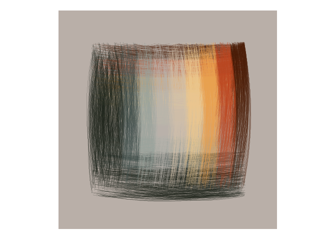
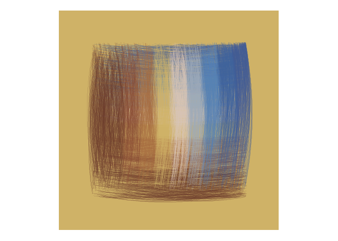
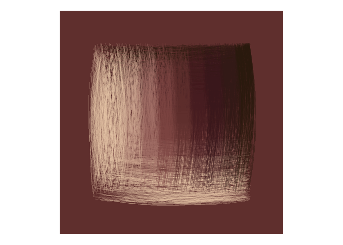

<!-- README.md is generated from README.Rmd. Please edit that file -->

# 10,000 of something

<!-- badges: start -->
<!-- badges: end -->

My first contribution to [genuary](https://genuary.art) is drawing
10,000 of something. I am fairly new at generative art, so I will try
something simple to play with my new {MexBrewer} palettes.

For this I will use {MexBrewer} and {tidiverse}:

``` r
library(MexBrewer)
library(tidyverse)
#> -- Attaching packages --------------------------------------- tidyverse 1.3.1 --
#> v ggplot2 3.3.5     v purrr   0.3.4
#> v tibble  3.1.6     v dplyr   1.0.7
#> v tidyr   1.1.4     v stringr 1.4.0
#> v readr   2.1.1     v forcats 0.5.1
#> -- Conflicts ------------------------------------------ tidyverse_conflicts() --
#> x dplyr::filter() masks stats::filter()
#> x dplyr::lag()    masks stats::lag()
```

## Generate the 10,000 objects

I will make 10,000 lines: 5,000 lines are horizontal and of random
length in a square with sides measuring 1000 units of length.

First I will generate the horizontal lines. For this, I will sample
randomly from the uniform distribution in the interval \[10, 990\] for
the starting points of the lines. Next, I randomly draw 5,000 values
from the uniform distribution, within the interval \[x, 1000\] for the
ending points of the lines (the lines are horizontal, so the y
coordinate is a constant). I use the coordinates to define a categorical
variable that I can use to assign colors:

``` r
df_h <- data.frame(x = runif(5000, 
                             min = 10, 
                             max = 950),
                   y = runif(5000, 
                             min = 10, 
                             max = 990)) %>%
  mutate(xend = runif(5000, 
                      min = x, 
                      max = 1000),
         yend = y,
         c = case_when(y < 200 ~ "1",
                       y >= 200 & y < 300 ~ "2",
                       y >= 300 & y < 400 ~ "3",
                       y >= 400 & y < 500 ~ "4",
                       y >= 500 & y < 600 ~ "5",
                       y >= 600 & y < 700 ~ "6",
                       y >= 700 & y < 800 ~ "7",
                       y >= 800 & y < 900 ~ "8",
                       y >= 900 ~ "9"))
```

I repeat the same process, but now for 5,000 vertical lines:

``` r
df_v <- data.frame(x = runif(5000, min = 10, max = 990),
                   y = runif(5000, min = 50, max = 950)) %>%
  mutate(xend = x,
         yend = runif(5000, 
                      min = x, 
                      max = 1000),
         c = case_when(x < 200 ~ "1",
                       x >= 200 & x < 300 ~ "2",
                       x >= 300 & x < 400 ~ "3",
                       x >= 400 & x < 500 ~ "4",
                       x >= 500 & x < 600 ~ "5",
                       x >= 600 & x < 700 ~ "6",
                       x >= 700 & x < 800 ~ "7",
                       x >= 800 & x < 900 ~ "8",
                       x >= 900 ~ "9"))
```

This gives me 10,000 lines split equally between horizontal and vertical
lines. For convenience, I bind the two data frames:

``` r
df <- rbind(df_h,
            df_v)
```

I will render the lines using `geom_curve` with a small curvature so the
lines are not straight. The palettes come from the
[{MexBrewer}](https://paezha.github.io/MexBrewer/) package.

## Atentado

``` r
ggplot(df,
       aes(x = x, 
           xend = xend, 
           y = y, 
           yend = yend)) +
  geom_rect(aes(xmin = -200, 
                xmax = 1200, 
                ymin = -200,
                ymax = 1200),
            size = 2.5,
            color = NA,
            fill = mex.brewer("Atentado")[4]) +
  geom_curve(aes(color = c),
             curvature = 0.1,
             size = 0.01,
             alpha = 0.2) +
  coord_equal() +
  scale_color_manual(values = mex.brewer("Atentado", n = 9)) +
  theme_void() +
  theme(legend.position = "none")
```

<!-- -->

## Alacena

``` r
ggplot(df,
       aes(x = x, 
           xend = xend, 
           y = y, 
           yend = yend)) +
  geom_rect(aes(xmin = -200, 
                xmax = 1200, 
                ymin = -200,
                ymax = 1200),
            size = 2.5,
            color = NA,
            fill = mex.brewer("Alacena")[4]) +
  geom_curve(aes(color = c),
             curvature = 0.1,
             size = 0.01,
             alpha = 0.2) +
  coord_equal() +
  scale_color_manual(values = mex.brewer("Alacena", n = 9)) +
  theme_void() +
  theme(legend.position = "none")
```

<!-- -->

## Aurora

``` r
ggplot(df,
       aes(x = x, 
           xend = xend, 
           y = y, 
           yend = yend)) +
  geom_rect(aes(xmin = -200, 
                xmax = 1200, 
                ymin = -200,
                ymax = 1200),
            size = 2.5,
            color = NA,
            fill = mex.brewer("Aurora")[4]) +
  geom_curve(aes(color = c),
             curvature = 0.1,
             size = 0.01,
             alpha = 0.2) +
  coord_equal() +
  scale_color_manual(values = mex.brewer("Aurora", n = 9)) +
  theme_void() +
  theme(legend.position = "none")
```

<!-- -->
