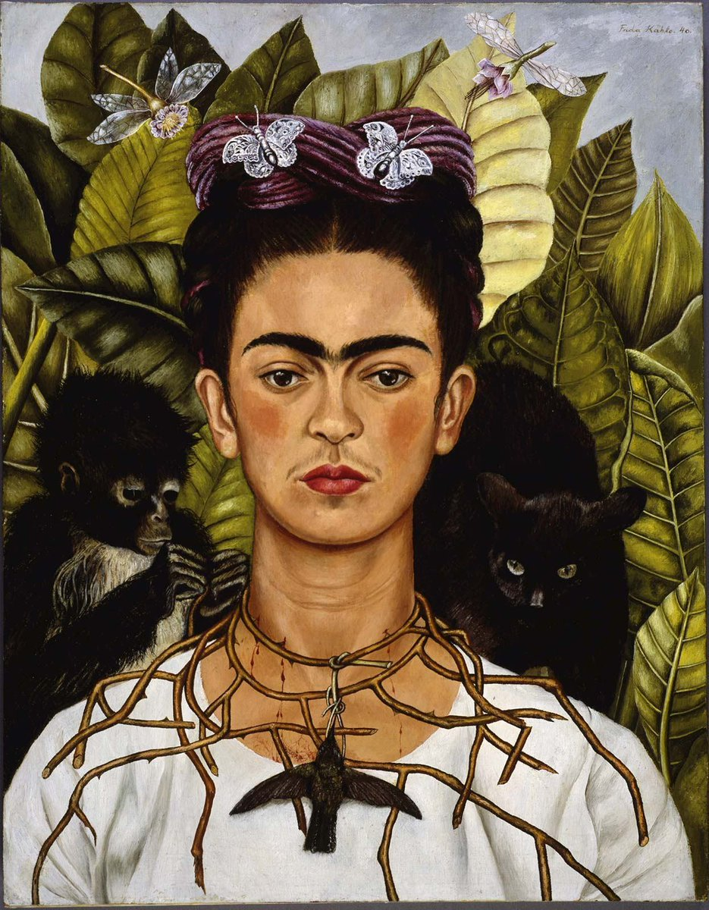

<!-- README.md is generated from README.Rmd. Please edit that file -->

```{r, include = FALSE}
knitr::opts_chunk$set(
  collapse = TRUE,
  comment = "#>"
)
```

# Dithering

<!-- badges: start -->
<!-- badges: end -->

The second prompt for [genuary](https://genuary.art) 2022 is "Dithering". So I had to look it up, and the readings were very helpful see [this](https://surma.dev/things/ditherpunk/)). Dithering seems to involve "quantization" and some random error. Quantization is to map a large number of values to a smaller set of values. 

For this little project I chose an image of the Aztec calendar:


I will use the following packages:
```{r load-packages, warning=FALSE, message=FALSE}
library(here)
library(magick)
library(MexBrewer)
library(tidyverse)
```

## Image processing Aztec calendar

Read the image using `magick::image_read()`:
```{r}
csa <- image_read(paste0(here(), "/02-dithering/calendario-azteca.jpg"))
```

Check the size of the image: 
```{r}
image_info(csa)
```
The image is 1,300 pixels in width and 912 in height. To quantize the image I change the size and change the colorspace to gray:
```{r}
set.seed(4533464)
n <- 200

csa <- csa %>% 
  image_resize(paste0(n, "x", collapse = "")) %>%
  image_quantize(max = 15, 
                 colorspace = "gray",
                 treedepth = 3)
```

This is the image after quantizing the colors and changing to grayscale:

```{r}
magick::image_ggplot(csa)
```

New size of the image:
```{r}
image_info(csa)
```

Save this image; the `image_quantize()` function does not seem to accept a seed and returns different shades of gray on different runs. This image is used from here on:
```r
image_write(csa, path = paste0(here(), "/02-dithering/calendario-azteca-gray.png"), format = "png")
```

Read saved image
```{r}
csa_grey <- image_read(paste0(here(), "/02-dithering/calendario-azteca-gray.png"))
```


Convert image to data frame and check the tones of gray:
```{r}
img_csa <- data.frame(expand.grid(x = seq(1, 200, 1), 
                              y = seq(140, 1, -1)),
                   gray = as.raster(csa_grey) %>% 
                     as.vector()) %>%
  mutate(gray = factor(gray))

levels(img_csa$gray)
  
```

There are ten shades of gray. I will give a number to each of the colors to use this quantity for aesthetic values of the plot:
```{r}
img_csa <- img_csa %>%
  mutate(c = case_when(gray == "#131313ff" ~ 8,
                       gray == "#313131ff" ~ 7,
                       gray == "#505050ff" ~ 6,
                       gray == "#6f6f6fff" ~ 5,
                       gray == "#8f8f8fff" ~ 4,
                       gray == "#afafafff" ~ 3,
                       gray == "#cececeff" ~ 2,
                       gray == "#eaeaeaff" ~ 1
                       ))
```

I will use palettes from the [{MexBrewer}](https://paezha.github.io/MexBrewer/) package.

## Concha

To complete the dithering, I will randomly sample from the data frame before rendering the image. The sampling rate is 50% and the size of the symbols is proportional to the darkness of the original pixel:
```{r dithering-concha, cache=TRUE}
set.seed(80723)
ggplot(data = sample_n(img_csa, 14000), 
       aes(x = x, 
           y = y, 
           color = gray, 
           size = c)) + 
  geom_point(shape = 17,
             alpha = 0.5) +
  scale_color_manual(values = rev(mex.brewer("Concha", 
                                         n = 8))) +
  scale_size(range = c(0.5, 4)) +
  coord_equal() +
  theme_void() + 
  theme(legend.position = "none")
```

## Frida

Use a different palette:
```{r dithering-frida, cache=TRUE}
set.seed(83328)
ggplot(data = sample_n(img_csa, 14000), 
       aes(x = x, 
           y = y, 
           color = gray, 
           size = c)) + 
  geom_point(shape = 17,
             alpha = 0.5) +
  scale_color_manual(values = rev(mex.brewer("Frida", 
                                         n = 8))) +
  scale_size(range = c(0.5, 4)) +
  coord_equal() +
  theme_void() + 
  theme(legend.position = "none")
```

## Aurora

Use a different palette:
```{r dithering-aurora, cache=TRUE}
set.seed(83288)

ggplot(data = sample_n(img_csa, 14000), 
       aes(x = x, 
           y = y, 
           color = gray, 
           size = c)) + 
  geom_point(shape = 17,
             alpha = 0.5) +
  scale_color_manual(values = rev(mex.brewer("Aurora", 
                                         n = 8))) +
  scale_size(range = c(0.5, 4)) +
  coord_equal() +
  theme_void() + 
  theme(legend.position = "none")
```

## BONUS: Dithering Frida

I was curious about the algorithm that Torsten Sauer used to dither [Frida](https://twitter.com/rtbyts/status/1477644240926744577) and how it would look with {MexBrewer} palettes, so here I try to recreate it. This is the original image:



Read the image using `magick::image_read()`:
```{r}
frida <- image_read(paste0(here(), "/02-dithering/frida.jpg"))
```

Check the size of the image: 
```{r}
image_info(frida)
```

The image is 935 pixels in width and 1200 in height. To quantize the image I change the the colorspace to gray:
```{r}
set.seed(4533464)
#n <- 200

frida <- frida %>% 
#  image_resize(paste0(n, "x", collapse = "")) %>%
  image_quantize(max = 15, 
                 colorspace = "gray",
                 treedepth = 3)
```

This is the image after quantizing the colors and changing to grayscale:

```{r}
magick::image_ggplot(frida)
```

Save this image; the `image_quantize()` function does not seem to accept a seed and returns different shades of gray on different runs. This image is used from here on:
```r
image_write(frida, path = paste0(here(), "/02-dithering/frida-gray.png"), format = "png")
```

Read saved image:
```{r}
frida_grey <- image_read(paste0(here(), "/02-dithering/frida-gray.png"))
```

Convert image to data frame and check the tones of gray (this contributes to quantization):
```{r}
img_frida <- data.frame(expand.grid(x = seq(1, 935, 1), 
                              y = seq(1200, 1, -1)),
                   gray = as.raster(frida_grey) %>% 
                     as.vector()) %>%
  mutate(gray = factor(gray))

levels(img_frida$gray)
  
```

There are eight shades of gray. I will give a number to each of the colors to use this quantity for aesthetic values of the plot:
```{r}
img_frida <- img_frida %>%
  mutate(c = case_when(gray == "#101010ff" ~ 8,
                       gray == "#2e2e2eff" ~ 7,
                       gray == "#4f4f4fff" ~ 6,
                       gray == "#6f6f6fff" ~ 5,
                       gray == "#909090ff" ~ 4,
                       gray == "#aeaeaeff" ~ 3,
                       gray == "#d0d0d0ff" ~ 2,
                       gray == "#e7e7e7ff" ~ 1
                       ))
```

The next step in the dithering process is to randomly sample from the pixels. Torsten Sauer used a 25% sampling rate, but that does not quite work for me, and it could be because of a number of other parameter combinations, like the length and size of the lines. After some experimentation, I find that a sampling rate of 80% produces a reasonably pleasant output. Finally, the pixels are replaced with small line segments, and the length/angle of the segment depends on the shade of gray of the original pixel:
```{r}
set.seed(80723)

img_frida_s <- img_frida %>%
  slice_sample(prop = 0.80) %>%
  mutate(theta = case_when(gray == "#101010ff" ~ 7/8 * pi,
                       gray == "#2e2e2eff" ~ 6/8 * pi,
                       gray == "#4f4f4fff" ~ 5/8 * pi,
                       gray == "#6f6f6fff" ~ 4/8 * pi,
                       gray == "#909090ff" ~ 3/8 * pi,
                       gray == "#aeaeaeff" ~ 2/8 * pi,
                       gray == "#d0d0d0ff" ~ 1/8 * pi,
                       gray == "#e7e7e7ff" ~ 0),
         st = sin(theta),
         ct = cos(theta),
         x1 = (cos(theta) + sin(theta)) * c/5 + x,
         y1 = (-sin(theta) + cos(theta)) * c/5 + y,
         xend = x - (cos(theta) + sin(theta)) * c/5,
         yend = y - (-sin(theta) + cos(theta)) * c/5)
```

I will use palettes from the [{MexBrewer}](https://paezha.github.io/MexBrewer/) package.

## Tierra

I will only render a close-up of Frida's face:
```{r dithering-frida-tierra, cache=TRUE}
ggplot(data = img_frida_s %>%
         filter(x >= 340 & x <= 440, y >= 620 & y <= 730), 
       aes(x = x, 
           y = y, 
           color = gray)) +
  geom_segment(aes(x = x1, y = y1,
                   xend = xend, yend = yend,
                   size = c),
               alpha = 0.7) +
  scale_color_manual(values = rev(mex.brewer("Tierra", 
                                         n = 8))) +
  scale_size(range = c(0.1, 1.5)) +
  coord_equal() +
  theme_void() + 
  theme(legend.position = "none")
```

## Aurora

```{r dithering-frida-aurora, cache=TRUE}
ggplot(data = img_frida_s %>%
         filter(x >= 340 & x <= 440, y >= 620 & y <= 730), 
       aes(x = x, 
           y = y, 
           color = gray)) +
  geom_segment(aes(x = x1, y = y1,
                   xend = xend, yend = yend,
                   size = c),
               alpha = 0.7) +
  scale_color_manual(values = rev(mex.brewer("Aurora", 
                                         n = 8))) +
  scale_size(range = c(0.1, 1.5)) +
  coord_equal() +
  theme_void() + 
  theme(legend.position = "none")
```

## Concha

```{r dithering-frida-concha, cache=TRUE}
ggplot(data = img_frida_s %>%
         filter(x >= 340 & x <= 440, y >= 620 & y <= 730), 
       aes(x = x, 
           y = y, 
           color = gray)) +
  geom_segment(aes(x = x1, y = y1,
                   xend = xend, yend = yend,
                   size = c),
               alpha = 0.7) +
  scale_color_manual(values = rev(mex.brewer("Concha", 
                                         n = 8))) +
  scale_size(range = c(0.1, 1.5)) +
  coord_equal() +
  theme_void() + 
  theme(legend.position = "none")
```

## Frida

```{r dithering-frida-frida, cache=TRUE}
ggplot(data = img_frida_s %>%
         filter(x >= 340 & x <= 440, y >= 620 & y <= 730), 
       aes(x = x, 
           y = y, 
           color = gray)) +
  geom_segment(aes(x = x1, y = y1,
                   xend = xend, yend = yend,
                   size = c),
               alpha = 0.7) +
  scale_color_manual(values = rev(mex.brewer("Frida", 
                                         n = 8))) +
  scale_size(range = c(0.1, 1.5)) +
  coord_equal() +
  theme_void() + 
  theme(legend.position = "none")
```

