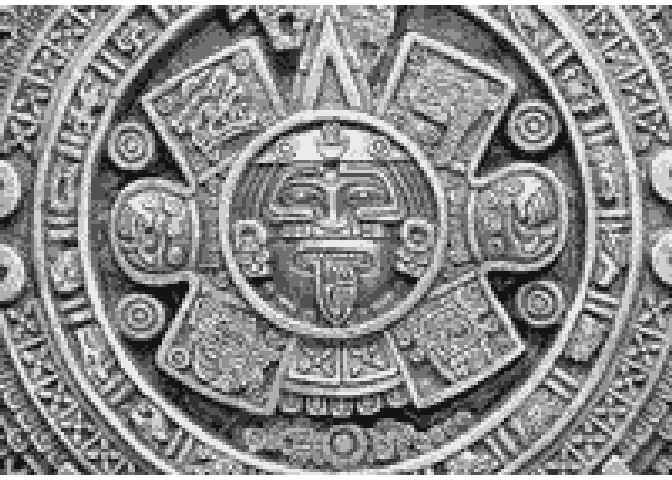
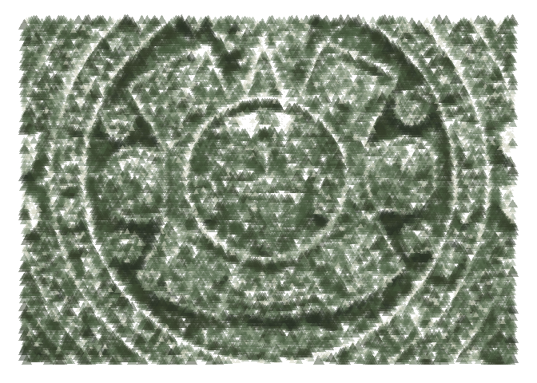
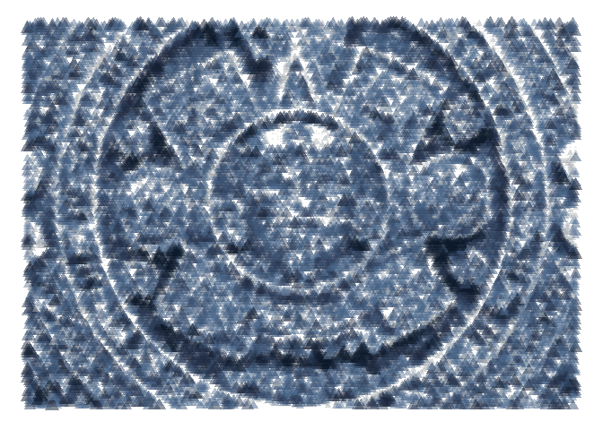
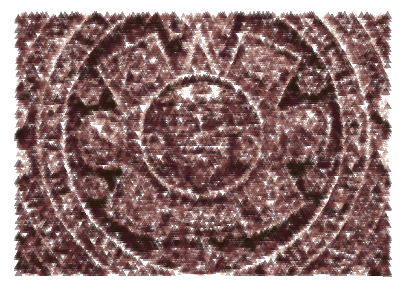
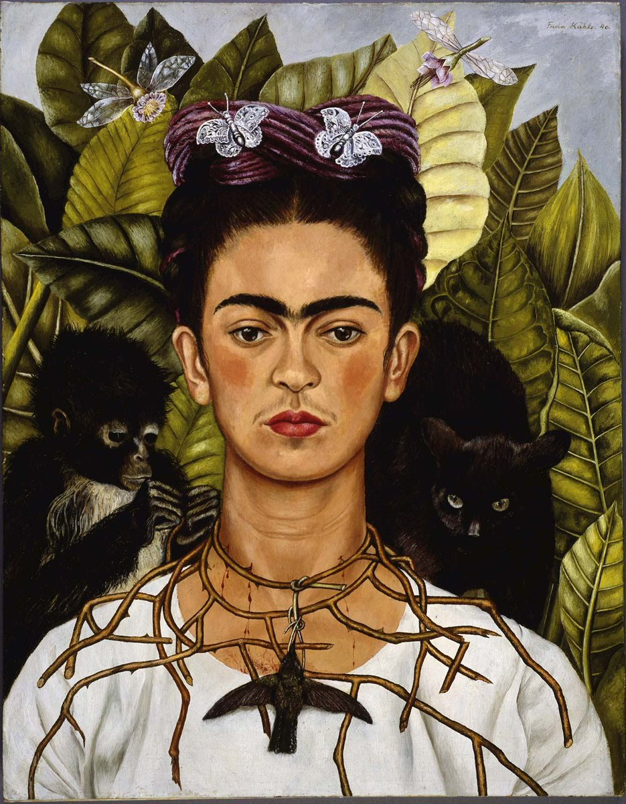
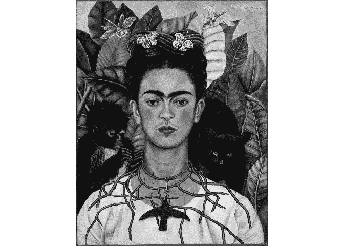
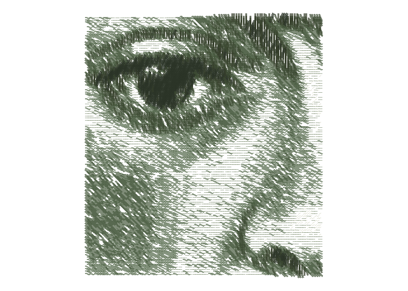

<!-- README.md is generated from README.Rmd. Please edit that file -->

# Dithering

<!-- badges: start -->
<!-- badges: end -->

The second prompt for [genuary](https://genuary.art) 2022 is
“Dithering”. So I had to look it up, and the readings were very helpful
see [this](https://surma.dev/things/ditherpunk/)). Dithering seems to
involve “quantization” and some random error. Quantization is to map a
large number of values to a smaller set of values.

For this little project I chose an image of the Aztec calendar:


I will use the following packages:

``` r
library(here)
library(magick)
library(MexBrewer)
library(tidyverse)
```

## Image processing Aztec calendar

Read the image using `magick::image_read()`:

``` r
csa <- image_read(paste0(here(), "/02-dithering/calendario-azteca.jpg"))
```

Check the size of the image:

``` r
image_info(csa)
#> # A tibble: 1 x 7
#>   format width height colorspace matte filesize density
#>   <chr>  <int>  <int> <chr>      <lgl>    <int> <chr>  
#> 1 JPEG    1300    912 sRGB       FALSE   412218 72x72
```

The image is 1,300 pixels in width and 912 in height. To quantize the
image I change the size and change the colorspace to gray:

``` r
set.seed(4533464)
n <- 200

csa <- csa %>% 
  image_resize(paste0(n, "x", collapse = "")) %>%
  image_quantize(max = 15, 
                 colorspace = "gray",
                 treedepth = 3)
```

This is the image after quantizing the colors and changing to grayscale:

``` r
magick::image_ggplot(csa)
```

<!-- -->

New size of the image:

``` r
image_info(csa)
#> # A tibble: 1 x 7
#>   format width height colorspace matte filesize density
#>   <chr>  <int>  <int> <chr>      <lgl>    <int> <chr>  
#> 1 JPEG     200    140 Gray       FALSE        0 72x72
```

Save this image; the `image_quantize()` function does not seem to accept
a seed and returns different shades of gray on different runs. This
image is used from here on:

``` r
image_write(csa, path = paste0(here(), "/02-dithering/calendario-azteca-gray.png"), format = "png")
```

Read saved image

``` r
csa_grey <- image_read(paste0(here(), "/02-dithering/calendario-azteca-gray.png"))
```

Convert image to data frame and check the tones of gray:

``` r
img_csa <- data.frame(expand.grid(x = seq(1, 200, 1), 
                              y = seq(140, 1, -1)),
                   gray = as.raster(csa_grey) %>% 
                     as.vector()) %>%
  mutate(gray = factor(gray))

levels(img_csa$gray)
#> [1] "#131313ff" "#313131ff" "#505050ff" "#6f6f6fff" "#8f8f8fff" "#afafafff"
#> [7] "#cececeff" "#eaeaeaff"
```

There are ten shades of gray. I will give a number to each of the colors
to use this quantity for aesthetic values of the plot:

``` r
img_csa <- img_csa %>%
  mutate(c = case_when(gray == "#131313ff" ~ 8,
                       gray == "#313131ff" ~ 7,
                       gray == "#505050ff" ~ 6,
                       gray == "#6f6f6fff" ~ 5,
                       gray == "#8f8f8fff" ~ 4,
                       gray == "#afafafff" ~ 3,
                       gray == "#cececeff" ~ 2,
                       gray == "#eaeaeaff" ~ 1
                       ))
```

I will use palettes from the
[{MexBrewer}](https://paezha.github.io/MexBrewer/) package.

## Concha

To complete the dithering, I will randomly sample from the data frame
before rendering the image. The sampling rate is 50% and the size of the
symbols is proportional to the darkness of the original pixel:

``` r
set.seed(80723)
ggplot(data = sample_n(img_csa, 14000), 
       aes(x = x, 
           y = y, 
           color = gray, 
           size = c)) + 
  geom_point(shape = 17,
             alpha = 0.5) +
  scale_color_manual(values = rev(mex.brewer("Concha", 
                                         n = 8))) +
  scale_size(range = c(0.5, 4)) +
  coord_equal() +
  theme_void() + 
  theme(legend.position = "none")
```

<!-- -->

## Frida

Use a different palette:

``` r
set.seed(83328)
ggplot(data = sample_n(img_csa, 14000), 
       aes(x = x, 
           y = y, 
           color = gray, 
           size = c)) + 
  geom_point(shape = 17,
             alpha = 0.5) +
  scale_color_manual(values = rev(mex.brewer("Frida", 
                                         n = 8))) +
  scale_size(range = c(0.5, 4)) +
  coord_equal() +
  theme_void() + 
  theme(legend.position = "none")
```

<!-- -->

## Aurora

Use a different palette:

``` r
set.seed(83288)

ggplot(data = sample_n(img_csa, 14000), 
       aes(x = x, 
           y = y, 
           color = gray, 
           size = c)) + 
  geom_point(shape = 17,
             alpha = 0.5) +
  scale_color_manual(values = rev(mex.brewer("Aurora", 
                                         n = 8))) +
  scale_size(range = c(0.5, 4)) +
  coord_equal() +
  theme_void() + 
  theme(legend.position = "none")
```

<!-- -->

## BONUS: Dithering Frida

I was curious about the algorithm that Torsten Sauer used to dither
[Frida](https://twitter.com/rtbyts/status/1477644240926744577) and how
it would look with {MexBrewer} palettes, so here I try to recreate it.
This is the original image:



Read the image using `magick::image_read()`:

``` r
frida <- image_read(paste0(here(), "/02-dithering/frida.jpg"))
```

Check the size of the image:

``` r
image_info(frida)
#> # A tibble: 1 x 7
#>   format width height colorspace matte filesize density
#>   <chr>  <int>  <int> <chr>      <lgl>    <int> <chr>  
#> 1 JPEG     935   1200 sRGB       FALSE   268904 72x72
```

The image is 935 pixels in width and 1200 in height. To quantize the
image I change the the colorspace to gray:

``` r
set.seed(4533464)
#n <- 200

frida <- frida %>% 
#  image_resize(paste0(n, "x", collapse = "")) %>%
  image_quantize(max = 15, 
                 colorspace = "gray",
                 treedepth = 3)
```

This is the image after quantizing the colors and changing to grayscale:

``` r
magick::image_ggplot(frida)
```

<!-- -->

Save this image; the `image_quantize()` function does not seem to accept
a seed and returns different shades of gray on different runs. This
image is used from here on:

``` r
image_write(frida, path = paste0(here(), "/02-dithering/frida-gray.png"), format = "png")
```

Read saved image:

``` r
frida_grey <- image_read(paste0(here(), "/02-dithering/frida-gray.png"))
```

Convert image to data frame and check the tones of gray (this
contributes to quantization):

``` r
img_frida <- data.frame(expand.grid(x = seq(1, 935, 1), 
                              y = seq(1200, 1, -1)),
                   gray = as.raster(frida_grey) %>% 
                     as.vector()) %>%
  mutate(gray = factor(gray))

levels(img_frida$gray)
#> [1] "#101010ff" "#2e2e2eff" "#4f4f4fff" "#6f6f6fff" "#909090ff" "#aeaeaeff"
#> [7] "#d0d0d0ff" "#e7e7e7ff"
```

There are eight shades of gray. I will give a number to each of the
colors to use this quantity for aesthetic values of the plot:

``` r
img_frida <- img_frida %>%
  mutate(c = case_when(gray == "#101010ff" ~ 8,
                       gray == "#2e2e2eff" ~ 7,
                       gray == "#4f4f4fff" ~ 6,
                       gray == "#6f6f6fff" ~ 5,
                       gray == "#909090ff" ~ 4,
                       gray == "#aeaeaeff" ~ 3,
                       gray == "#d0d0d0ff" ~ 2,
                       gray == "#e7e7e7ff" ~ 1
                       ))
```

The next step in the dithering process is to randomly sample from the
pixels. Torsten Sauer used a 25% sampling rate, but that does not quite
work for me, and it could be because of a number of other parameter
combinations, like the length and size of the lines. After some
experimentation, I find that a sampling rate of 80% produces a
reasonably pleasant output. Finally, the pixels are replaced with small
line segments, and the length/angle of the segment depends on the shade
of gray of the original pixel:

``` r
set.seed(80723)

img_frida_s <- img_frida %>%
  slice_sample(prop = 0.80) %>%
  mutate(theta = case_when(gray == "#101010ff" ~ 7/8 * pi,
                       gray == "#2e2e2eff" ~ 6/8 * pi,
                       gray == "#4f4f4fff" ~ 5/8 * pi,
                       gray == "#6f6f6fff" ~ 4/8 * pi,
                       gray == "#909090ff" ~ 3/8 * pi,
                       gray == "#aeaeaeff" ~ 2/8 * pi,
                       gray == "#d0d0d0ff" ~ 1/8 * pi,
                       gray == "#e7e7e7ff" ~ 0),
         st = sin(theta),
         ct = cos(theta),
         x1 = (cos(theta) + sin(theta)) * c/5 + x,
         y1 = (-sin(theta) + cos(theta)) * c/5 + y,
         xend = x - (cos(theta) + sin(theta)) * c/5,
         yend = y - (-sin(theta) + cos(theta)) * c/5)
```

I will use palettes from the
[{MexBrewer}](https://paezha.github.io/MexBrewer/) package.

## Tierra

I will only render a close-up of Frida’s face:

``` r
ggplot(data = img_frida_s %>%
         filter(x >= 340 & x <= 440, y >= 620 & y <= 730), 
       aes(x = x, 
           y = y, 
           color = gray)) +
  geom_segment(aes(x = x1, y = y1,
                   xend = xend, yend = yend,
                   size = c),
               alpha = 0.7) +
  scale_color_manual(values = rev(mex.brewer("Tierra", 
                                         n = 8))) +
  scale_size(range = c(0.1, 1.5)) +
  coord_equal() +
  theme_void() + 
  theme(legend.position = "none")
```

<!-- -->

## Concha

``` r
ggplot(data = img_frida_s %>%
         filter(x >= 340 & x <= 440, y >= 620 & y <= 730), 
       aes(x = x, 
           y = y, 
           color = gray)) +
  geom_segment(aes(x = x1, y = y1,
                   xend = xend, yend = yend,
                   size = c),
               alpha = 0.7) +
  scale_color_manual(values = rev(mex.brewer("Concha", 
                                         n = 8))) +
  scale_size(range = c(0.1, 1.5)) +
  coord_equal() +
  theme_void() + 
  theme(legend.position = "none")
```

<!-- -->

## Frida

``` r
ggplot(data = img_frida_s %>%
         filter(x >= 340 & x <= 440, y >= 620 & y <= 730), 
       aes(x = x, 
           y = y, 
           color = gray)) +
  geom_segment(aes(x = x1, y = y1,
                   xend = xend, yend = yend,
                   size = c),
               alpha = 0.7) +
  scale_color_manual(values = rev(mex.brewer("Frida", 
                                         n = 8))) +
  scale_size(range = c(0.1, 1.5)) +
  coord_equal() +
  theme_void() + 
  theme(legend.position = "none")
```

<!-- -->

## Aurora

``` r
ggplot(data = img_frida_s %>%
         filter(x >= 340 & x <= 440, y >= 620 & y <= 730), 
       aes(x = x, 
           y = y, 
           color = gray)) +
  geom_segment(aes(x = x1, y = y1,
                   xend = xend, yend = yend,
                   size = c),
               alpha = 0.7) +
  scale_color_manual(values = rev(mex.brewer("Aurora", 
                                         n = 8))) +
  scale_size(range = c(0.1, 1.5)) +
  coord_equal() +
  theme_void() + 
  theme(legend.position = "none")
```

<!-- -->
