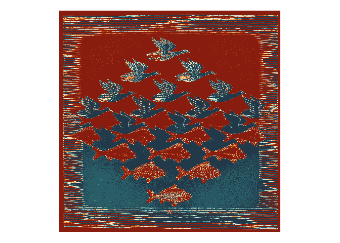

<!-- README.md is generated from README.Rmd. Please edit that file -->

# Space

<!-- badges: start -->
<!-- badges: end -->

The third prompt for [genuary](https://genuary.art) 2022 is “Space”. So
many interesting possibilities: outer space, orbits of celestial bodies,
maps, spacing between objects (for instance using the golden ratio). For
this I decided to combine some of what I learned dithering with the idea
of negative space.

I will use the following packages:

``` r
library(here)
library(magick)
library(MetBrewer)
library(MexBrewer)
library(tidyverse)
```

## Escher

Escher mosaics are great examples of negative space. I will work with
this image:


This image probably works well with divergent color palettes due to the
polar nature of the work, with the two different images (birds and fish)
blending into each other.

### Image processing

Read the image using `magick::image_read()`:

``` r
ns <- image_read(paste0(here(), "/03-space/mc-escher-1.jpg"))
```

Check the size of the image:

``` r
image_info(ns)
#> # A tibble: 1 x 7
#>   format width height colorspace matte filesize density
#>   <chr>  <int>  <int> <chr>      <lgl>    <int> <chr>  
#> 1 JPEG     745    739 sRGB       FALSE   199002 96x96
```

The image is 745 pixels in width and 739 in height. I change the
colorspace to gray:

``` r
ns <- ns %>% 
  image_quantize(max = 15, 
                 colorspace = "gray",
                 treedepth = 3)
```

This is the image after quantizing the colors and changing to grayscale:

``` r
magick::image_ggplot(ns)
```

<!-- -->

Save this image; the `image_quantize()` function does not seem to accept
a seed and returns different shades of gray on different runs. This
image is used from here on:

``` r
image_write(ns, path = paste0(here(), "/03-space/ns-gray.png"), format = "png")
```

Read saved image:

``` r
ns_grey <- image_read(paste0(here(), "/03-space/ns-gray.png"))
```

Convert image to data frame and check the tones of gray:

``` r
img_ns <- data.frame(expand.grid(x = seq(1, 745, 1), 
                              y = seq(739, 1, -1)),
                   gray = as.raster(ns_grey) %>% 
                     as.vector()) %>%
  mutate(gray = factor(gray))

levels(img_ns$gray)
#> [1] "#0b0b0bff" "#262626ff" "#4f4f4fff" "#6f6f6fff" "#8f8f8fff" "#afafafff"
#> [7] "#cfcfcfff" "#fcfcfcff"
```

There are eight shades of gray. I will give a number to each of the
colors to use this quantity for aesthetic values of the plot:

``` r
img_ns <- img_ns %>%
  mutate(c = case_when(gray == "#0b0b0bff" ~ 8,
                       gray == "#262626ff" ~ 7,
                       gray == "#4f4f4fff" ~ 6,
                       gray == "#6f6f6fff" ~ 5,
                       gray == "#8f8f8fff" ~ 4,
                       gray == "#afafafff" ~ 3,
                       gray == "#cfcfcfff" ~ 2,
                       gray == "#fcfcfcff" ~ 1
                       ))
```

I will use palettes from the
[{MexBrewer}](https://paezha.github.io/MexBrewer/) package.

### Revolucion Embroidery

``` r
ggplot(data = img_ns %>%
         filter(x >= 0 & x <= 740, y >= 0 & y <= 739), 
       aes(x = x, 
           y = y, 
           color = c)) +
  geom_point(shape = 8,
             size = 0.001) +
  scale_color_gradientn(colors = mex.brewer("Revolucion", n = 8)) +
  coord_equal() +
  theme_void() + 
  theme(legend.position = "none")
```

<!-- -->

``` r
ggplot(data = img_ns %>%
         filter(x >= 195 & x <= 345, y >= 470 & y <= 590), 
       aes(x = x, 
           y = y, 
           color = c)) +
  geom_point(shape = 8,
             size = 1) +
  scale_color_gradientn(colors = mex.brewer("Revolucion")) +
  coord_equal() +
  theme_void() + 
  theme(legend.position = "none")
```

<!-- -->

### Revolucion Pixelated

``` r
ggplot(data = img_ns %>%
         filter(x >= 0 & x <= 740, y >= 0 & y <= 739), 
       aes(x = x, 
           y = y, 
           color = c)) +
  geom_point(shape = 15,
             size = 0.01) +
  scale_color_gradientn(colors = mex.brewer("Revolucion")) +
  coord_equal() +
  theme_void() + 
  theme(legend.position = "none")
```

<!-- -->

Detail:

``` r
ggplot(data = img_ns %>%
         filter(x >= 195 & x <= 345, y >= 470 & y <= 590), 
       aes(x = x, 
           y = y, 
           color = c)) +
  geom_point(shape = 15,
             size = 0.75) +
  scale_color_gradientn(colors = mex.brewer("Revolucion")) +
  coord_equal() +
  theme_void() + 
  theme(legend.position = "none")
```

<!-- -->

``` r
ggplot(data = img_ns %>%
         filter(x >= 195 & x <= 345, y >= 270 & y <= 390), 
       aes(x = x, 
           y = y, 
           color = c)) +
  geom_point(shape = 15,
             size = 0.75) +
  scale_color_gradientn(colors = mex.brewer("Revolucion")) +
  coord_equal() +
  theme_void() + 
  theme(legend.position = "none")
```

<!-- -->

## Escher Knights

It occurs to me that this image would look quite pretty with
[{MetBrewer}]() palette `Isfahan1`:


This image probably works well with divergent color palettes due to the
polar nature of the work, with the two different images (birds and fish)
blending into each other.

### Image processing

Read the image using `magick::image_read()`:

``` r
ns_knights <- image_read(paste0(here(), "/03-space/mc-escher-knights.jpg"))
```

Check the size of the image:

``` r
image_info(ns_knights)
#> # A tibble: 1 x 7
#>   format width height colorspace matte filesize density
#>   <chr>  <int>  <int> <chr>      <lgl>    <int> <chr>  
#> 1 JPEG     470    472 sRGB       FALSE    82642 100x100
```

The image is 470 pixels in width and 472 in height. I change the
colorspace to gray:

``` r
ns_knights <- ns_knights %>% 
  image_quantize(max = 15, 
                 colorspace = "gray",
                 treedepth = 3)
```

This is the image after quantizing the colors and changing to grayscale:

``` r
magick::image_ggplot(ns_knights)
```

<!-- -->

Save this image; the `image_quantize()` function does not seem to accept
a seed and returns different shades of gray on different runs. This
image is used from here on:

``` r
image_write(ns_knights, path = paste0(here(), "/03-space/ns-knights-gray.png"), format = "png")
```

Read saved image:

``` r
ns_knights_grey <- image_read(paste0(here(), "/03-space/ns-knights-gray.png"))
```

Convert image to data frame and check the tones of gray:

``` r
img_ns_knights <- data.frame(expand.grid(x = seq(1, 470, 1), 
                              y = seq(472, 1, -1)),
                   gray = as.raster(ns_knights_grey) %>% 
                     as.vector()) %>%
  mutate(gray = factor(gray))

levels(img_ns_knights$gray)
#> [1] "#131313ff" "#2f2f2fff" "#505050ff" "#727272ff" "#8e8e8eff" "#acacacff"
#> [7] "#d3d3d3ff" "#f0f0f0ff"
```

There are eight shades of gray. I will give a number to each of the
colors to use this quantity for aesthetic values of the plot:

``` r
img_ns_knights <- img_ns_knights %>%
  mutate(c = case_when(gray == "#131313ff" ~ 8,
                       gray == "#2f2f2fff" ~ 7,
                       gray == "#505050ff" ~ 6,
                       gray == "#727272ff" ~ 5,
                       gray == "#8e8e8eff" ~ 4,
                       gray == "#acacacff" ~ 3,
                       gray == "#d3d3d3ff" ~ 2,
                       gray == "#f0f0f0ff" ~ 1
                       ))
```

### Isfahan Embroidery

``` r
ggplot(data = img_ns_knights %>%
         filter(x >= 0 & x <= 740, y >= 0 & y <= 739), 
       aes(x = x, 
           y = y, 
           color = c)) +
  geom_point(shape = 8,
             size = 0.1) +
  scale_color_gradientn(colors = met.brewer("Isfahan1")) +
  coord_equal() +
  theme_void() + 
  theme(legend.position = "none")
```

<!-- -->

``` r
ggplot(data = img_ns_knights %>%
         filter(x >= 150 & x <= 250, y >= 200 & y <= 300), 
       aes(x = x, 
           y = y, 
           color = c)) +
  geom_point(shape = 8,
             size = 1.4) +
  scale_color_gradientn(colors = met.brewer("Isfahan1")) +
  coord_equal() +
  theme_void() + 
  theme(legend.position = "none")
```

<!-- -->

## Posada

José Guadalupe Posada also worked with negative space. I will try this
image, that probably works best with a sequential palette:


### Image processing

Read the image using `magick::image_read()`:

``` r
ns_posada <- image_read(paste0(here(), "/03-space/jg-posada.jpg"))
```

Check the size of the image:

``` r
image_info(ns_posada)
#> # A tibble: 1 x 7
#>   format width height colorspace matte filesize density
#>   <chr>  <int>  <int> <chr>      <lgl>    <int> <chr>  
#> 1 JPEG     400    263 Gray       FALSE    42284 72x72
```

The image is 400 pixels in width and 263 in height. I change the
colorspace to gray:

``` r
ns_posada <- ns_posada %>% 
  image_quantize(max = 15, 
                 colorspace = "gray",
                 treedepth = 3)
```

Save this image; the `image_quantize()` function does not seem to accept
a seed and returns different shades of gray on different runs. This
image is used from here on:

``` r
image_write(ns, path = paste0(here(), "/03-space/ns-posada-gray.png"), format = "png")
```

Read saved image:

``` r
ns_posada_grey <- image_read(paste0(here(), "/03-space/ns-posada-gray.png"))
```

Convert image to data frame and check the tones of gray:

``` r
img_ns_posada <- data.frame(expand.grid(x = seq(1, 400, 1), 
                              y = seq(263, 1, -1)),
                   gray = as.raster(ns_posada_grey) %>% 
                     as.vector()) %>%
  mutate(gray = factor(gray))

levels(img_ns_posada$gray)
#> [1] "#0b0b0bff" "#2c2c2cff" "#4f4f4fff" "#6f6f6fff" "#8f8f8fff" "#afafafff"
#> [7] "#d3d3d3ff" "#edededff"
```

There are eight shades of gray. I will give a number to each of the
colors to use this quantity for aesthetic values of the plot:

``` r
img_ns_posada <- img_ns_posada %>%
  mutate(c = case_when(gray == "#0b0b0bff" ~ 8,
                       gray == "#2c2c2cff" ~ 7,
                       gray == "#4f4f4fff" ~ 6,
                       gray == "#6f6f6fff" ~ 5,
                       gray == "#8f8f8fff" ~ 4,
                       gray == "#afafafff" ~ 3,
                       gray == "#d3d3d3ff" ~ 2,
                       gray == "#edededff" ~ 1
                       ))
```

### Posada Embroidery

``` r
ggplot(data = img_ns_posada %>%
         filter(x >= 0 & x <= 400, y >= 0 & y <= 263), 
       aes(x = x, 
           y = y, 
           color = c)) +
  geom_point(shape = 8,
             size = 0.001) +
  scale_color_gradientn(colors = mex.brewer("Tierra", n = 8)) +
  coord_equal() +
  theme_void() + 
  theme(legend.position = "none")
```

<!-- -->
