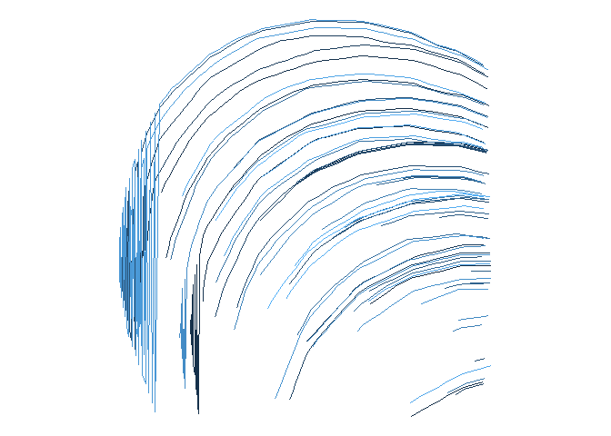

<!-- README.md is generated from README.Rmd. Please edit that file -->

# The next next Fidenza

<!-- badges: start -->
<!-- badges: end -->

The third prompt for [genuary](https://genuary.art) 2022 is “The next
next Fidenza”. Fidenza is a flow algorithm. The next next Fidenza is
beyond my skills at the moment, so I will try just a plain Fidenza.

I will use the following packages:

``` r
library(here)
library(MexBrewer)
library(tidyverse)
```

## The basic mechanics of the Fidenza

### Creating a grid with directd lines (i.e. vectors)

Generate a square grid:

``` r
# Size of grid
n <- 37
# Length of segment
l <- sqrt(2) + 0.1

df <- data.frame(expand.grid(x = seq(1, n, 1), y = seq(1, n, 1)))
```

Add end points to create line segments to show the grid:

``` r
df <- df %>%
  mutate(xend = (x + l * pi/4),
         yend = (y + l * pi/4))
```

Plot this grid:

``` r
df %>%
  ggplot() +
  geom_segment(aes(x = x,
                   y = y,
                   xend = xend,
                   yend = yend)) +
  geom_point(aes(x = xend, 
                 y =yend)) +
  coord_equal() +
  theme_void()
```

<!-- -->

Aside: something funny happens if the length of the segment is a
function of the coordinate:

``` r
df2 <- df %>%
  mutate(xend = (x + (x + 5) * pi/4),
         yend = (y + (y + 10) * pi/4),
         ll = sqrt((x - xend)^2 + (y - yend)^2))
```

Plot this grid:

``` r
df2 %>%
  ggplot() +
  geom_segment(aes(x = x,
                   y = y,
                   xend = xend,
                   yend = yend,
                   color = ll)) +
  geom_point(aes(x = xend, 
                 y =yend,
                 color = ll),
             size = 2) +
  scale_color_gradientn(colors = mex.brewer("Frida")) +
  coord_equal() +
  theme_void() +
  theme(legend.position = "none")
```

<!-- -->

In the plots above the line segments all point in the same direction.
This can be changed by making the angle a function of position:

``` r
df <- df %>%
  mutate(angle = (x * y) /n^2 * 2 * pi,
         xend = (x + l * cos(angle)), # l is the length of the segment
         yend = (y + l * sin(angle)))
```

Plot this flow field:

``` r
df %>%
  ggplot() +
  geom_segment(aes(x = x,
                   y = y,
                   xend = xend,
                   yend = yend)) +
  geom_point(aes(x = xend, 
                 y =yend)) +
  coord_equal() +
  theme_void()
```

<!-- -->

The curvature can be made more interesting by “re-centering” the
coordinates for the angle:

``` r
# Offsets
x_o <- 20
y_o <- 10

df <- df %>%
  mutate(angle = ((x - x_o) * (y - y_o)) /n^2 * 2 * pi,
         xend = (x + l * cos(angle)),
         yend = (y + l * sin(angle)))
```

Plot this grid:

``` r
df %>%
  ggplot() +
  geom_segment(aes(x = x,
                   y = y,
                   xend = xend,
                   yend = yend)) +
  geom_point(aes(x = xend, 
                 y =yend)) +
  coord_equal() +
  theme_void()
```

<!-- -->

### Create a path that follows the flow field

This is a flow field. Now, the next question is, how are curves in the
flow field drawn? Select a starting point and calculate the distance
from its endpoint to the nearest point:

``` r
st_point <- df %>%
  filter(x == 10, 
         y == 26) %>% 
  select(x, y)
```

From the starting point, we create a path of length `n_iter` by creating
a new point at a distance of `res` (for resolution) in from the starting
point in the direction of the flow. The new point becomes the starting
point to add a new point to the path:

``` r
res <- 0.2
path_1 <- data.frame(x = st_point$x, y = st_point$y)
n_iter <- 220
count <- 0
# Initialize the boundary condition
boundary_condition <- TRUE
for(i in 1:n_iter){
  # With the starting point, retrieve the angle of the closest point in the direction of the flow
  angle <- df %>% 
    mutate(d = sqrt((x - st_point$x)^2 + (y - st_point$y)^2)) %>%
    filter(d == min(d)) %>%
    pull(angle)
  # Find the next starting point for the search
  path_1 <- rbind(path_1,
                  data.frame(x = st_point$x + res * cos(angle),
                             y = st_point$y + res * sin(angle)))
  st_point <- slice_tail(path_1)
  
  # Check the boundary condition
  boundary_condition <- st_point$x < 0 | st_point$x >= n |
    st_point$y < 0 | st_point$y >= n
  # If at the boundary set i to n_iter to complete the loop
  if (boundary_condition) break
}
```

Plot path:

``` r
ggplot() + 
  geom_segment(data = df,
               aes(x = x,
                   y = y,
                   xend = xend,
                   yend = yend)) +
  geom_point(data = df,
             aes(x = xend, 
                 y =yend)) +
  geom_line(data = path_1,
            aes(x = x,
                y = y),
            color = "blue",
            size = 2) +
  coord_equal() +
  theme_void()
```

<!-- -->

### Create multiple paths that follow the flow field

Next, I’d like to generate multiple paths, so I need a second loop:

``` r
# Parameters for creating the paths
res <- 0.2 # Resolution for the path, smaller numbers create more points per path/smoother paths
n_iter <- 220 # Number of iterations per path
n_path <- 15 # Number of paths

# Sample starting points
st_point <- data.frame(#x = runif(n_path, 0, n),
                       x = 2,
                       y = runif(n_path, 0, n))

# Initialize data frame with paths
paths <- data.frame(x = numeric(), y = numeric(), path = numeric())

for(p in 1:n_path){
  paths <- rbind(paths,
                 data.frame(st_point[p,], path = p))
  next_x <- st_point[p, "x"]
  next_y <- st_point[p, "y"]
  for(i in 1:n_iter){
    # With the next point, retrieve the angle of the closest point in the direction of the flow
    angle <- df %>% 
      mutate(d = sqrt((x - next_x)^2 + (y - next_y)^2)) %>%
      filter(d == min(d)) %>%
      pull(angle)
    # Calculate the coordinates of the new next point and bind to paths
    paths <- rbind(paths,
                    data.frame(x = next_x + res * cos(angle),
                               y = next_y + res * sin(angle),
                               path = p))
    # Find the next starting point for the search
    next_x <- slice_tail(paths) %>%
      pull(x)
    next_y <- slice_tail(paths) %>%
      pull(y)
    
    # Check the boundary condition
    boundary_condition <- next_x < 0 | next_x >= n |
      next_y < 0 | next_y >= n
    # If at the boundary set i to n_iter to complete the loop
    if (boundary_condition) break
  }
}
```

Plot paths:

``` r
ggplot() + 
  geom_segment(data = df,
               aes(x = x,
                   y = y,
                   xend = xend,
                   yend = yend)) +
  geom_point(data = df,
             aes(x = xend, 
                 y = yend)) +
  geom_line(data = paths,
            aes(x = x,
                y = y,
                color = factor(path),
                group = path),
            size = 2) +
  coord_equal() +
  theme_void() + 
  theme(legend.position = "none")
```

<!-- -->

These appear to be the basic elements of the Fidenza. I am now ready to
do some experiments.

## Some experiments

### Many short paths

This is quite time consuming.

Regenerate a square grid:

``` r
# Size of grid
n <- 37
# Length of segment
l <- sqrt(2) + 0.1

df <- data.frame(expand.grid(x = seq(1, n, 1), y = seq(1, n, 1)))
```

Recreate the flow field:

``` r
# Offsets
x_o <- -17
y_o <- -17

df <- df %>%
  mutate(angle = ((x - x_o) * (y - y_o)) /n^2 * 2 * pi,
         xend = (x + l * cos(angle)),
         yend = (y + l * sin(angle)))
```

Plot this grid:

``` r
df %>%
  ggplot() +
  geom_segment(aes(x = x,
                   y = y,
                   xend = xend,
                   yend = yend)) +
  geom_point(aes(x = xend, 
                 y =yend)) +
  coord_equal() +
  theme_void()
```

<!-- -->

Make many short paths:

``` r
# Set seed for reproducibility
set.seed(346363)

# Parameters for creating the paths
res <- 0.2 # Resolution for the path, smaller numbers create more points per path/smoother paths
n_iter <- 20 # Number of iterations per path
n_path <- 1500 # Number of paths

# Sample starting points
st_point <- data.frame(x = runif(n_path, 0, n),
                       #x = 2,
                       y = runif(n_path, 0, n))

# Initialize data frame with paths
paths <- data.frame(x = numeric(), y = numeric(), path = numeric())

for(p in 1:n_path){
  paths <- rbind(paths,
                 data.frame(st_point[p,], path = p))
  next_x <- st_point[p, "x"]
  next_y <- st_point[p, "y"]
  for(i in 1:n_iter){
    # With the next point, retrieve the angle of the closest point in the direction of the flow
    angle <- df %>% 
      mutate(d = sqrt((x - next_x)^2 + (y - next_y)^2)) %>%
      filter(d == min(d)) %>%
      pull(angle)
    # Calculate the coordinates of the new next point and bind to paths
    paths <- rbind(paths,
                    data.frame(x = next_x + res * cos(angle),
                               y = next_y + res * sin(angle),
                               path = p))
    # Find the next starting point for the search
    next_x <- slice_tail(paths) %>%
      pull(x)
    next_y <- slice_tail(paths) %>%
      pull(y)
    
    # Check the boundary condition
    boundary_condition <- next_x < 0 | next_x >= n |
      next_y < 0 | next_y >= n
    # If at the boundary set i to n_iter to complete the loop
    if (boundary_condition) break
  }
}

# Rename paths

paths_ex1 <- paths
```

Plot paths:

``` r
ggplot() + 
  geom_line(data = paths_ex1,
            aes(x = x,
                y = y,
                group = path),
            size = 0.5) +
  coord_equal() +
  theme_void() + 
  theme(legend.position = "none")
```

<!-- -->

### Few long paths

Regenerate a square grid:

``` r
# Size of grid
n <- 37
# Length of segment
l <- sqrt(2) + 0.1

df <- data.frame(expand.grid(x = seq(1, n, 1), y = seq(1, n, 1)))
```

Recreate the flow field:

``` r
# Offsets
#x_o <- 100
#y_o <- 100

x_o <- -17
y_o <- -17

df <- df %>%
  mutate(angle = ((x - x_o) * (y - y_o)) /n^2 * 2 * pi,
         xend = (x + l * cos(angle)),
         yend = (y + l * sin(angle)))
```

Plot this grid:

``` r
df %>%
  ggplot() +
  geom_segment(aes(x = x,
                   y = y,
                   xend = xend,
                   yend = yend)) +
  geom_point(aes(x = xend, 
                 y =yend)) +
  coord_equal() +
  theme_void()
```

<!-- -->

Make few, long paths:

``` r
# Set seed for reproducibility
set.seed(346363)

# Parameters for creating the paths
res <- 0.2 # Resolution for the path, smaller numbers create more points per path/smoother paths
n_iter <- 500 # Number of iterations per path
n_path <- 60 # Number of paths

# Sample starting points
st_point <- data.frame(x = runif(n_path, 0, 5),
                       #x = 2,
                       y = runif(n_path, 30, n))

# Initialize data frame with paths
paths <- data.frame(x = numeric(), y = numeric(), path = numeric())

for(p in 1:n_path){
  paths <- rbind(paths,
                 data.frame(st_point[p,], path = p))
  next_x <- st_point[p, "x"]
  next_y <- st_point[p, "y"]
  for(i in 1:n_iter){
    # With the next point, retrieve the angle of the closest point in the direction of the flow
    angle <- df %>% 
      mutate(d = sqrt((x - next_x)^2 + (y - next_y)^2)) %>%
      filter(d == min(d)) %>%
      pull(angle)
    # Calculate the coordinates of the new next point and bind to paths
    paths <- rbind(paths,
                    data.frame(x = next_x + res * cos(angle),
                               y = next_y + res * sin(angle),
                               path = p))
    # Find the next starting point for the search
    next_x <- slice_tail(paths) %>%
      pull(x)
    next_y <- slice_tail(paths) %>%
      pull(y)
    
    # Check the boundary condition
    boundary_condition <- next_x < 0 | next_x >= n |
      next_y < 0 | next_y >= n
    # If at the boundary set i to n_iter to complete the loop
    if (boundary_condition) break
  }
}

# Rename paths

paths_ex2 <- paths
```

Plot paths:

``` r
ggplot() + 
  geom_line(data = paths_ex2,
            aes(x = x,
                y = y,
                color = path,
                group = path),
            size = 0.5) +
  coord_equal() +
  theme_void() + 
  theme(legend.position = "none")
```

<!-- -->

### Combining sets of paths

Recreate the flow field for a new set of paths:

``` r
x_o <- 65
y_o <- 52

df <- df %>%
  mutate(angle = ((x - x_o) * (y - y_o)) /n^2 * 2 * pi,
         xend = (x + l * cos(angle)),
         yend = (y + l * sin(angle)))
```

Plot this grid:

``` r
df %>%
  ggplot() +
  geom_segment(aes(x = x,
                   y = y,
                   xend = xend,
                   yend = yend)) +
  geom_point(aes(x = xend, 
                 y =yend)) +
  coord_equal() +
  theme_void()
```

<!-- -->

Make few, long paths:

``` r
# Set seed for reproducibility
set.seed(346363)

# Parameters for creating the paths
res <- 0.2 # Resolution for the path, smaller numbers create more points per path/smoother paths
n_iter <- 300 # Number of iterations per path
n_path <- 60 # Number of paths

# Sample starting points
st_point <- data.frame(x = runif(n_path, 30, n),
                       #x = 2,
                       y = runif(n_path, 0, 5))

# Initialize data frame with paths
paths <- data.frame(x = numeric(), y = numeric(), path = numeric())

for(p in 1:n_path){
  paths <- rbind(paths,
                 data.frame(st_point[p,], path = p))
  next_x <- st_point[p, "x"]
  next_y <- st_point[p, "y"]
  for(i in 1:n_iter){
    # With the next point, retrieve the angle of the closest point in the direction of the flow
    angle <- df %>% 
      mutate(d = sqrt((x - next_x)^2 + (y - next_y)^2)) %>%
      filter(d == min(d)) %>%
      pull(angle)
    # Calculate the coordinates of the new next point and bind to paths
    paths <- rbind(paths,
                    data.frame(x = next_x + res * cos(angle),
                               y = next_y + res * sin(angle),
                               path = p))
    # Find the next starting point for the search
    next_x <- slice_tail(paths) %>%
      pull(x)
    next_y <- slice_tail(paths) %>%
      pull(y)
    
    # Check the boundary condition
    boundary_condition <- next_x < 0 | next_x >= n |
      next_y < 0 | next_y >= n
    # If at the boundary set i to n_iter to complete the loop
    if (boundary_condition) break
  }
}

# Rename paths

paths_ex3 <- paths
```

Plot paths:

``` r
ggplot() + 
  geom_line(data = paths_ex3,
            aes(x = x,
                y = y,
                color = path,
                group = path),
            size = 0.5) +
  coord_equal() +
  theme_void() + 
  theme(legend.position = "none")
```

<!-- -->

### Finally some experiments with colors

Bind two sets of paths:

``` r
paths_bound <- rbind(data.frame(paths_ex2, set = 1),
                     data.frame(paths_ex3, set = 2)) %>%
  mutate(group = ifelse(set == 1, path, path + max(path)))
```

Plot bound paths:

``` r
col_palette <- mex.brewer("Revolucion")

ggplot() + 
  geom_rect(aes(xmin = 0, 
                xmax = n,
                ymin = 0,
                ymax = n),
            color = NA,
            fill = col_palette[5]) +
  geom_segment(data = df %>%
                 filter(xend > 0 & xend < n, 
                        yend > 0 & yend < n),
               aes(x = x,
                   y = y,
                   xend = xend,
                   yend = yend),
               size = 0.1,
                color = "lightgray") +
   geom_point(data = df %>%
                 filter(xend > 0 & xend < n, 
                        yend > 0 & yend < n),
               aes(x = xend, 
                  y =yend),
              size = 0.5,
              color = "lightgray") +
  geom_line(data = paths_bound,
            aes(x = x,
                y = y,
                color = path,
                group = group),
            size = 1.0,
            alpha = 0.8) +
  geom_rect(aes(xmin = 0, 
                xmax = n,
                ymin = 0,
                ymax = n),
            color = col_palette[1],
            fill = NA, 
            size = 3) +
  scale_color_gradientn(colors = col_palette) +
  coord_equal() +
  theme_void() + 
  theme(legend.position = "none")
```

<!-- -->

Plot bound paths:

``` r
col_palette <- mex.brewer("Ronda")

ggplot() + 
  geom_rect(aes(xmin = 0, 
                xmax = n,
                ymin = 0,
                ymax = n),
            color = NA,
            fill = col_palette[6]) +
  geom_segment(data = df %>%
                 filter(xend > 0 & xend < n, 
                        yend > 0 & yend < n),
               aes(x = x,
                   y = y,
                   xend = xend,
                   yend = yend),
               size = 0.1,
                color = "lightgray") +
   geom_point(data = df %>%
                 filter(xend > 0 & xend < n, 
                        yend > 0 & yend < n),
               aes(x = xend, 
                  y =yend),
              size = 0.5,
              color = "lightgray") +
   geom_line(data = paths_bound,
             aes(x = x,
                 y = y,
                 color = path,
                 group = group),
             size = 1.0,
             alpha = 0.8) +
   geom_rect(aes(xmin = 0, 
                 xmax = n,
                 ymin = 0,
                 ymax = n),
             color = col_palette[10],
             fill = NA, 
             size = 3) +
  scale_color_gradientn(colors = col_palette) +
  coord_equal() +
  theme_void() + 
  theme(legend.position = "none")
```

<!-- -->

### Different flow field

Regenerate a square grid:

``` r
# Size of grid
n <- 37
# Length of segment
l <- sqrt(2) + 0.1

df <- data.frame(expand.grid(x = seq(1, n, 1), y = seq(1, n, 1)))
```

Recreate the flow field for a new set of paths:

``` r
# Offsets
x_o <- 100
y_o <- 100

df <- df %>%
  mutate(angle = ((x - x_o) * (y - y_o)) /n^2 * 2 * pi,
         xend = (x + l * cos(angle)),
         yend = (y + l * sin(angle)))
```

Plot this grid:

``` r
df %>%
  ggplot() +
  geom_segment(aes(x = x,
                   y = y,
                   xend = xend,
                   yend = yend)) +
  geom_point(aes(x = xend, 
                 y =yend)) +
  coord_equal() +
  theme_void()
```

<!-- -->

Make few, long paths:

``` r
# Set seed for reproducibility
set.seed(346363)

# Parameters for creating the paths
res <- 0.2 # Resolution for the path, smaller numbers create more points per path/smoother paths
n_iter <- 600 # Number of iterations per path
n_path <- 100 # Number of paths

# Sample starting points
st_point <- data.frame(x = runif(n_path, 0, n),
                       #x = 2,
                       y = runif(n_path, 0, n))

# Initialize data frame with paths
paths <- data.frame(x = numeric(), y = numeric(), path = numeric())

for(p in 1:n_path){
  paths <- rbind(paths,
                 data.frame(st_point[p,], path = p))
  next_x <- st_point[p, "x"]
  next_y <- st_point[p, "y"]
  for(i in 1:n_iter){
    # With the next point, retrieve the angle of the closest point in the direction of the flow
    angle <- df %>% 
      mutate(d = sqrt((x - next_x)^2 + (y - next_y)^2)) %>%
      filter(d == min(d)) %>%
      pull(angle)
    # Calculate the coordinates of the new next point and bind to paths
    paths <- rbind(paths,
                    data.frame(x = next_x + res * cos(angle),
                               y = next_y + res * sin(angle),
                               path = p))
    # Find the next starting point for the search
    next_x <- slice_tail(paths) %>%
      pull(x)
    next_y <- slice_tail(paths) %>%
      pull(y)
    
    # Check the boundary condition
    boundary_condition <- next_x < 0 | next_x >= n |
      next_y < 0 | next_y >= n
    # If at the boundary set i to n_iter to complete the loop
    if (boundary_condition) break
  }
}

# Rename paths

paths_ex4 <- paths
```

Plot paths:

``` r
ggplot() + 
  geom_line(data = paths_ex4,
            aes(x = x,
                y = y,
                color = path,
                group = path),
            size = 0.5) +
  coord_equal() +
  theme_void() + 
  theme(legend.position = "none")
```

<!-- -->

Summarize path length:

``` r
paths_ex4 <- paths_ex4 %>%
left_join(paths_ex4 %>%
  group_by(path) %>%
  summarize(path = first(path),
            steps = n(),
            .groups = "drop"),
  by = "path")
```

Plot after pruning short paths and color based on length (number of
steps in path):

``` r
col_palette <- mex.brewer("Ronda")

ggplot() + 
  geom_rect(aes(xmin = 0, 
                xmax = n,
                ymin = 0,
                ymax = n),
            color = NA,
            fill = col_palette[1]) +
  geom_segment(data = df %>%
                 filter(xend > 0 & xend < n, 
                        yend > 0 & yend < n),
               aes(x = x,
                   y = y,
                   xend = xend,
                   yend = yend),
               size = 0.1,
                color = col_palette[2]) +
   geom_point(data = df %>%
                 filter(xend > 0 & xend < n, 
                        yend > 0 & yend < n),
               aes(x = xend, 
                  y =yend),
              size = 0.5,
              color = col_palette[2]) +
  geom_line(data = paths_ex4 %>%
              filter(steps > 10),
            aes(x = x,
                y = y,
                color = steps,
                group = path),
            size = 0.5) +
  geom_rect(aes(xmin = 0, 
                 xmax = n,
                 ymin = 0,
                 ymax = n),
             color = col_palette[10],
             fill = NA, 
             size = 3) +
  scale_color_gradientn(colors = col_palette) +
  coord_equal() +
  theme_void() + 
  theme(legend.position = "none")
```

<!-- -->

Change color palette:

``` r
col_palette <- mex.brewer("Revolucion")

ggplot() + 
  geom_rect(aes(xmin = 0, 
                xmax = n,
                ymin = 0,
                ymax = n),
            color = NA,
            fill = col_palette[1]) +
  geom_segment(data = df %>%
                 filter(xend > 0 & xend < n, 
                        yend > 0 & yend < n),
               aes(x = x,
                   y = y,
                   xend = xend,
                   yend = yend),
               size = 0.1,
                color = col_palette[2]) +
   geom_point(data = df %>%
                 filter(xend > 0 & xend < n, 
                        yend > 0 & yend < n),
               aes(x = xend, 
                  y =yend),
              size = 0.5,
              color = col_palette[2]) +
  geom_line(data = paths_ex4 %>%
              filter(steps > 10),
            aes(x = x,
                y = y,
                color = steps,
                group = path),
            size = 0.5) +
  geom_rect(aes(xmin = 0, 
                 xmax = n,
                 ymin = 0,
                 ymax = n),
             color = col_palette[10],
             fill = NA, 
             size = 3) +
  scale_color_gradientn(colors = col_palette) +
  coord_equal() +
  theme_void() + 
  theme(legend.position = "none")
```

<!-- -->

### Use only the flow field

Regenerate a square grid but more sparsely (the sequence is in steps of
four instead of 1):

``` r
# Size of grid
n <- 37
# Length of segment
l <- sqrt(2) + 0.1

df <- data.frame(expand.grid(x = seq(1, n, 4), y = seq(1, n, 3)))
```

Recreate the flow field for a new set of paths:

``` r
# Offsets
x_o <- 30
y_o <- 25

df <- df %>%
  # Negative values in the creates turbulence
  # smaller angles lead to smoother transitions
  mutate(angle = ((x - x_o)/x * (y - y_o)/y) * 2 * pi/3, 
         #angle = ((x - x_o) * (y - y_o)) /n^2 * pi,
         xend = (x + l * cos(angle)),
         yend = (y + l * sin(angle)))
```

Plot this grid:

``` r
df %>%
  ggplot() +
  geom_segment(aes(x = x,
                   y = y,
                   xend = xend,
                   yend = yend)) +
  geom_point(aes(x = xend, 
                 y =yend)) +
  coord_equal() +
  theme_void()
```

<!-- -->

Plot this grid after sampling (from the odd and even rows take the even
and odd columns, respectively):

``` r
df %>%
  mutate(x = ifelse(y %% 2 == 1, x + 1, x),
         xend = ifelse(y %% 2 == 1, xend + 1, xend)) %>%
  filter(x > 0 & x < n) %>%
  ggplot() +
  geom_segment(aes(x = x,
                   y = y,
                   xend = xend,
                   yend = yend)) +
  geom_point(aes(x = xend, 
                 y =yend)) +
  coord_equal() +
  theme_void()
```

<!-- -->

Plot the sampled grid with embellishments:

``` r
df %>%
  mutate(x = ifelse(y %% 2 == 1, x + 1, x),
         xend = ifelse(y %% 2 == 1, xend + 1, xend),
         p_grid = (x * y)/n^2) %>%
  filter(x > 0 & x < n) %>%
  ggplot() +
  geom_segment(aes(x = x,
                   y = y,
                   xend = xend,
                   yend = yend, 
                   size = p_grid),
               lineend = "square",
               linejoin = "mitre",
               #arrow = arrow(length = unit(0.25, "cm")),
               color = "white") +
  geom_point(aes(x = xend, 
                 y =yend,
                 size = 4 * p_grid),
             color = "white",
             shape = 18) +
  scale_size(range = c(1, 5)) +
  coord_equal() +
  theme_void() +
  theme(legend.position = "none",
        panel.background = element_rect(fill = "black"),
        plot.background = element_rect(fill = "black"))
```

<!-- -->

Put together to create various panels:

``` r
# Size of grid
n <- 37
# Length of segment
l <- sqrt(2) + 0.1

# Add the offset to the grid expansion
df_panels <- data.frame(expand.grid(x = seq(1, n, 4), 
                                    y = seq(1, n, 3),
                                    x_o = seq(0, 10, 5),
                                    y_o = seq(-5, 5, 5)))

df_panels <- df_panels %>%
  # Negative values in the creates turbulence
  # smaller angles lead to smoother transitions
  mutate(angle = ((x - x_o)/x * (y - y_o)/y) * 2 * pi/3, 
         #angle = ((x - x_o) * (y - y_o)) /n^2 * pi,
         xend = (x + l * cos(angle)),
         yend = (y + l * sin(angle)))
```

Plot the sampled grid with embellishments:

``` r
df_panels %>%
  mutate(x = ifelse(y %% 2 == 1, x + 1, x),
         xend = ifelse(y %% 2 == 1, xend + 1, xend),
         p_grid = (x * y)/n^2) %>%
  filter(x > 0 & x < n) %>%
  ggplot() +
  geom_segment(aes(x = x,
                   y = y,
                   xend = xend,
                   yend = yend, 
                   size = p_grid),
               lineend = "square",
               linejoin = "mitre",
               #arrow = arrow(length = unit(0.25, "cm")),
               color = "white") +
  geom_point(aes(x = xend, 
                 y =yend,
                 size = 4 * p_grid),
             color = "white",
             shape = 18) +
  scale_size(range = c(0.5, 3)) +
  coord_equal() +
  theme_void() +
  facet_grid(y_o ~ x_o) +
  theme(legend.position = "none",
        panel.background = element_rect(fill = "black"),
        plot.background = element_rect(fill = "black"))
```

<!-- -->
