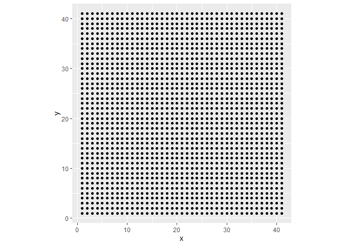
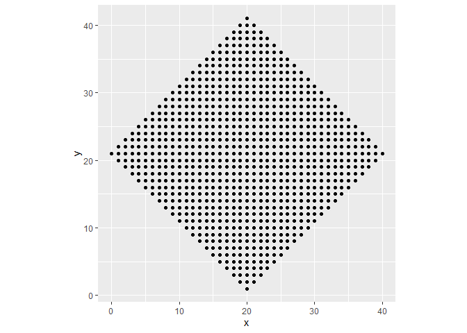
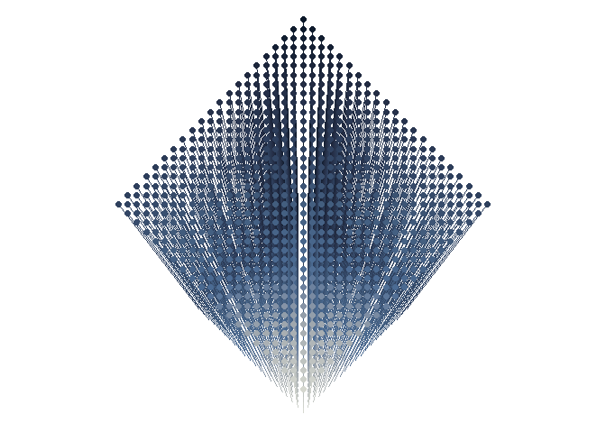
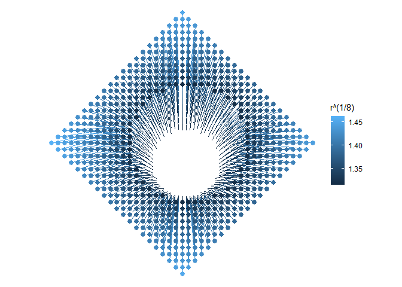
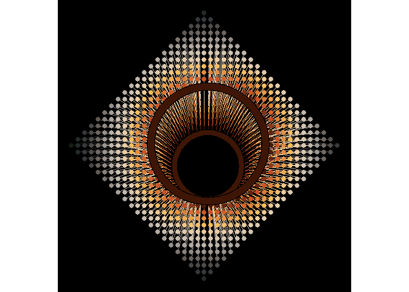
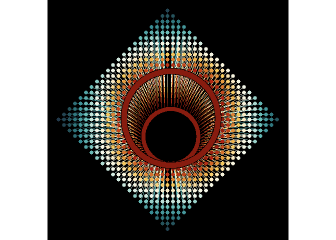
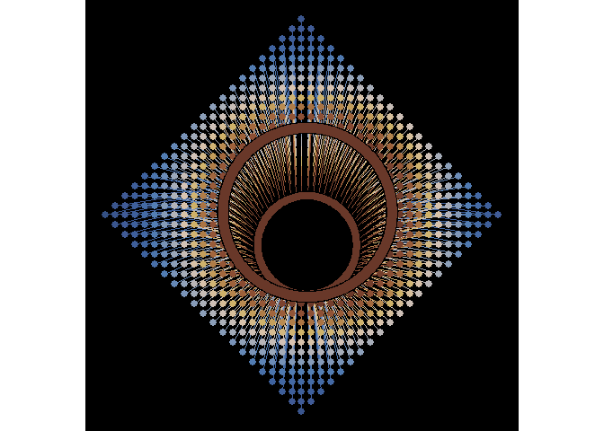

<!-- README.md is generated from README.Rmd. Please edit that file -->

# Destroy a square

<!-- badges: start -->
<!-- badges: end -->

The prompt for Day 5 of [genuary](https://genuary.art) 2022 is “Destroy
a square”. While learning the Fidenza algorithm I accidentally noticed
that when plotting line segments I could create the illusion of
perspective by making the length of the segment a function of the
coordinates. For this prompt I will use this effect to create a square,
give it the illusion of volume, and then I will break it by punching a
hole through it.

I will use the following packages:

``` r
library(ggforce)
library(MexBrewer)
library(tidyverse)
```

## Creating a grid with directed lines (i.e. vectors)

Generate a square grid:

``` r
# Size of grid
n <- 41
# Length of segment
l <- sqrt(2) + 0.1

df <- data.frame(expand.grid(x = seq(1, n, 1), y = seq(1, n, 1)))
```

Plot this grid:

``` r
ggplot(data = df,
       aes(x = x,
           y = y)) +
  geom_point() +
  coord_equal()
```

<!-- -->

Filter the points to produce a diamond instead of a square: (there must
be a more elegant way of doing this, by finding points above a line or
below a line):

``` r
df2 <- df %>% 
  mutate(x_p_y = x + y) %>% # Create a new variable with the sum of the coordinates
  filter(x_p_y > 21 & x_p_y < 63) %>% # Filter all rows with coordinates greater than or less than the specified numbers
  mutate(x = -x + 41, # Flip the coordinates and recalculate their sum
         x_p_y = x + y) %>%
  filter(x_p_y > 20 & x_p_y < 62) # Filter again
```

Plot this grid:

``` r
ggplot(data = df2,
       aes(x = x,
           y = y)) +
  geom_point() +
  coord_equal()
```

<!-- -->

## Illusion of volume and punching a hole

So this is what I discovered when learning Fidenza, that if the end
points of the segments are a function of the coordinates, the image
appears to “project” in space, giving the illusion of volume:

``` r
df2 <- df2 %>%
  mutate(xend = (x + (x - 20) * pi/4),
         yend = (y + (y + 5) * pi/4),
         ll = sqrt((x - xend)^2 + (y - yend)^2))
```

Plot this grid:

``` r
df2 %>%
  ggplot() +
  geom_segment(aes(x = x,
                   y = y,
                   xend = xend,
                   yend = yend,
                   color = ll)) +
  geom_point(aes(x = xend, 
                 y =yend,
                 color = ll),
             size = 2) +
  scale_color_gradientn(colors = mex.brewer("Frida")) +
  coord_equal() +
  theme_void() +
  theme(legend.position = "none")
```

<!-- -->

Now, to break the square with a cylinder, I need to delete observations
within a certain radius of a designated point (e.g., the center of the
square):

``` r
df2 %>% 
  mutate(r = sqrt((x - 21)^2 + (y - 21)^2)) %>% # Calculate the radius from the center of the square
  mutate(y = (y + (r + 10) * pi/4)) %>% # Make the y coordinate a function of the radius from the center of the square
  filter(r > 8.9) %>% # Filter observations with a radius greater than the specified value
  ggplot() +
  # Plot the line segments
  geom_segment(aes(x = x,
                   y = y,
                   xend = xend,
                   yend = yend,
                   color = r^(1/8))) +
  # Plot "top" segment tips
  geom_point(aes(x = xend, 
                 y =yend,
                 color = r^(1/8)),
             size = 2.5) +
  coord_equal() +
  theme_void()
```

<!-- -->

## Embellishments

Now to make this pretty. I will use color palettes from [{MexBrewer}]()
and will add a few adornments.

### Atentado

``` r
col_palette <- rev(MexBrewer::mex.brewer("Atentado"))

df2 %>% 
  mutate(r = sqrt((x - 21)^2 + (y - 21)^2)) %>% # Calculate the radius from the center of the square
  mutate(y = (y + (r + 10) * pi/4)) %>% # Make the y coordinate a function of the radius from the center of the square
  filter(r > 8.9) %>% # Filter observations with a radius greater than the specified value
  ggplot() +
  # Plot the line segments
  geom_segment(aes(x = x,
                   y = y,
                   xend = xend,
                   yend = yend,
                   color = r^(1/8))) +
  # Plot the "bottom" circle
  geom_circle(aes(x0 = 21,
                  y0 = 36,
                  r = 9.2),
              size = 3,
              color = "black") +
  geom_circle(aes(x0 = 21,
                  y0 = 36,
                  r = 8.8),
              size = 3,
              color = "black") +
  geom_circle(aes(x0 = 21,
                  y0 = 36,
                  r = 9),
              size = 3,
              color = col_palette[1]) +
  # Plot "top" segment tips
  geom_point(aes(x = xend, 
                 y =yend,
                 color = r^(1/8)),
             size = 2.5) +
  # Plot the "top" circle
  geom_circle(aes(x0 = 21,
                  y0 = 42,
                  r = 15.2),
              size = 4,
              color = "black") +
  geom_circle(aes(x0 = 21,
                  y0 = 42,
                  r = 15.6),
              size = 4,
              color = "black") +
  geom_circle(aes(x0 = 21,
                  y0 = 42,
                  r = 15.4),
              size = 4,
              color = col_palette[1]) +
  scale_color_gradientn(colors = col_palette) +
  coord_equal() +
  theme_void() +
  theme(legend.position = "none",
        plot.background = element_rect(fill = "black"))
```

<!-- -->

### Revolucion

``` r
col_palette <- MexBrewer::mex.brewer("Revolucion")

df2 %>% 
  mutate(r = sqrt((x - 21)^2 + (y - 21)^2)) %>% # Calculate the radius from the center of the square
  mutate(y = (y + (r + 10) * pi/4)) %>% # Make the y coordinate a function of the radius from the center of the square
  filter(r > 8.9) %>% # Filter observations with a radius greater than the specified value
  ggplot() +
  # Plot the line segments
  geom_segment(aes(x = x,
                   y = y,
                   xend = xend,
                   yend = yend,
                   color = r^(1/8))) +
  # Plot the "bottom" circle
  geom_circle(aes(x0 = 21,
                  y0 = 36,
                  r = 9.2),
              size = 3,
              color = "black") +
  geom_circle(aes(x0 = 21,
                  y0 = 36,
                  r = 8.8),
              size = 3,
              color = "black") +
  geom_circle(aes(x0 = 21,
                  y0 = 36,
                  r = 9),
              size = 3,
              color = col_palette[1]) +
  # Plot "top" segment tips
  geom_point(aes(x = xend, 
                 y =yend,
                 color = r^(1/8)),
             size = 2.5) +
  # Plot the "top" circle
  geom_circle(aes(x0 = 21,
                  y0 = 42,
                  r = 15.2),
              size = 4,
              color = "black") +
  geom_circle(aes(x0 = 21,
                  y0 = 42,
                  r = 15.6),
              size = 4,
              color = "black") +
  geom_circle(aes(x0 = 21,
                  y0 = 42,
                  r = 15.4),
              size = 4,
              color = col_palette[1]) +
  scale_color_gradientn(colors = col_palette) +
  coord_equal() +
  theme_void() +
  theme(legend.position = "none",
        plot.background = element_rect(fill = "black"))
```

<!-- -->

### Alacena

``` r
col_palette <- MexBrewer::mex.brewer("Alacena")

df2 %>% 
  mutate(r = sqrt((x - 21)^2 + (y - 21)^2)) %>% # Calculate the radius from the center of the square
  mutate(y = (y + (r + 10) * pi/4)) %>% # Make the y coordinate a function of the radius from the center of the square
  filter(r > 8.9) %>% # Filter observations with a radius greater than the specified value
  ggplot() +
  # Plot the line segments
  geom_segment(aes(x = x,
                   y = y,
                   xend = xend,
                   yend = yend,
                   color = r^(1/8))) +
  # Plot the "bottom" circle
  geom_circle(aes(x0 = 21,
                  y0 = 36,
                  r = 9.2),
              size = 3,
              color = "black") +
  geom_circle(aes(x0 = 21,
                  y0 = 36,
                  r = 8.8),
              size = 3,
              color = "black") +
  geom_circle(aes(x0 = 21,
                  y0 = 36,
                  r = 9),
              size = 3,
              color = col_palette[1]) +
  # Plot "top" segment tips
  geom_point(aes(x = xend, 
                 y =yend,
                 color = r^(1/8)),
             size = 2.5) +
  # Plot the "top" circle
  geom_circle(aes(x0 = 21,
                  y0 = 42,
                  r = 15.2),
              size = 4,
              color = "black") +
  geom_circle(aes(x0 = 21,
                  y0 = 42,
                  r = 15.6),
              size = 4,
              color = "black") +
  geom_circle(aes(x0 = 21,
                  y0 = 42,
                  r = 15.4),
              size = 4,
              color = col_palette[1]) +
  scale_color_gradientn(colors = col_palette) +
  coord_equal() +
  theme_void() +
  theme(legend.position = "none",
        plot.background = element_rect(fill = "black"))
```

<!-- -->
