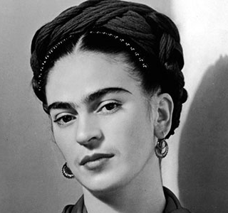
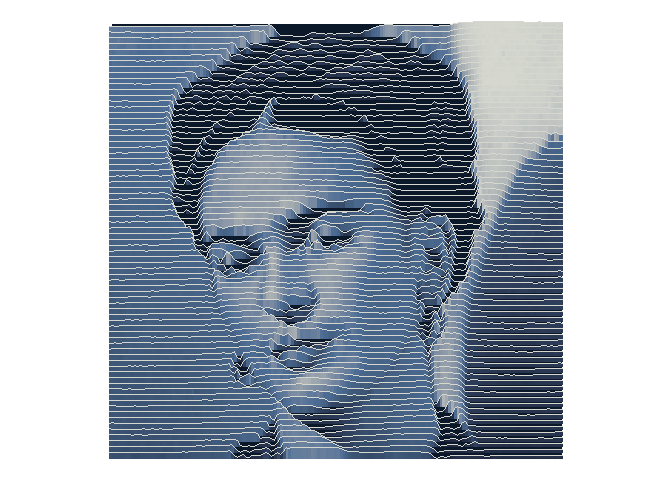

<!-- README.md is generated from README.Rmd. Please edit that file -->

# Trade styles

<!-- badges: start -->
<!-- badges: end -->

The prompt for Day 6 of [genuary](https://genuary.art) 2022 is to trade
styles with a friend. As I am out of the packet new to generative art, I
do not really have friends, so instead of trading I will copy the style
of [Georgios
Karamanis](https://github.com/gkaramanis/aRtist/tree/main/genuary) who
not only creates very beautiful stuff but also is generous enough to
share his code. This time, I will copy the code that Georgios’s used to
transform a photograph of [Lady
Gaga](https://github.com/gkaramanis/aRtist/blob/main/genuary/2021/2021-3/2021-3.png)
with ridges, but I will replace with Frida.

The code is so simple and elegant!

I will use the following packages:

``` r
library(ggplot2)
library(dplyr)
library(magick)
library(MexBrewer)
library(ggridges)
```

## Image processing

Read in image and convert to grayscale:

``` r
img <- image_read("source-frida-kahlo.jpg") %>%
  image_convert(colorspace = "gray") %>%
  image_crop("320x360+180-60") %>%
  image_trim()
img
```

<!-- --> Get
dimensions of image:

``` r
img_w <- image_info(img)$width
img_h <- image_info(img)$height
img_ratio <- img_w / img_h
```

Resize the longest dimension to 160 pixels:

``` r
if (img_w >= img_h) {
  img <- image_resize(img, "160")
} else {
  img <- image_resize(img, ("x160"))
}
```

Create array and number rows and columns:

``` r
img_array <- drop(as.integer(img[[1]]))
rownames(img_array) <- 1:nrow(img_array)
colnames(img_array) <- 1:ncol(img_array)
```

Create data frame from array and rename columns

``` r
img_df <- as.data.frame.table(img_array) %>% 
  `colnames<-`(c("y", "x", "b")) %>% 
  mutate(
    across(everything(), as.numeric),
    n = row_number()
  ) %>%
   filter(n %% 2 == 0)
```

## Frida

Colors, fill and background,, use palette `Frida`:

``` r
col_palette <- mex.brewer("Frida")
col_fill <- col_palette[7]
```

Render:

``` r
ggplot(img_df) +
  geom_rect(aes(xmin = 0 + 2, xmax = max(x),
                ymin = 0 - 2, ymax = max(y)),
            fill = col_fill) +
  geom_ridgeline_gradient(aes(x, 
                              y, 
                              height = b/50,
                              group = y, 
                              fill = b), 
                          color = col_palette[1],
                          size = 0.35) +
  scale_y_reverse() +
  scale_fill_gradientn(colours = rev(col_palette)) +
  coord_equal() +
  theme_void() +
  theme(legend.position = "none")  
```

<!-- -->

``` r
ggsave("frida-frida.png", dpi = 320, width = 7, height = 7 / img_ratio)
```

## Aurora

Colors, fill and background,, use palette `Aurora`:

``` r
col_palette <- mex.brewer("Aurora")
col_fill <- col_palette[7]
```

Render:

``` r
ggplot(img_df) +
  geom_rect(aes(xmin = 0 + 2, xmax = max(x),
                ymin = 0 - 2, ymax = max(y)),
            fill = col_fill) +
  geom_ridgeline_gradient(aes(x, 
                              y, 
                              height = b/50,
                              group = y, 
                              fill = b), 
                          color = col_palette[1],
                          size = 0.35) +
  scale_y_reverse() +
  scale_fill_gradientn(colours = rev(col_palette)) +
  coord_equal() +
  theme_void() +
  theme(legend.position = "none")  
```

<!-- -->

``` r
ggsave("frida-aurora.png", dpi = 320, width = 7, height = 7 / img_ratio)
```

## Concha

Colors, fill and background,, use palette `Concha`:

``` r
col_palette <- mex.brewer("Concha")
col_fill <- col_palette[7]
```

Render:

``` r
ggplot(img_df) +
  geom_rect(aes(xmin = 0 + 2, xmax = max(x),
                ymin = 0 - 2, ymax = max(y)),
            fill = col_fill) +
  geom_ridgeline_gradient(aes(x, 
                              y, 
                              height = b/50,
                              group = y, 
                              fill = b), 
                          color = col_palette[1],
                          size = 0.35) +
  scale_y_reverse() +
  scale_fill_gradientn(colours = rev(col_palette)) +
  coord_equal() +
  theme_void() +
  theme(legend.position = "none") 
```

<!-- -->

``` r
ggsave("frida-concha.png", dpi = 320, width = 7, height = 7 / img_ratio)
```

## Tierra

Colors, fill and background,, use palette `Tierra`:

``` r
col_palette <- mex.brewer("Tierra")
col_fill <- col_palette[7]
```

Render:

``` r
ggplot(img_df) +
  geom_rect(aes(xmin = 0 + 2, xmax = max(x),
                ymin = 0 - 2, ymax = max(y)),
            fill = col_fill) +
  geom_ridgeline_gradient(aes(x, 
                              y, 
                              height = b/50,
                              group = y, 
                              fill = b), 
                          color = col_palette[1],
                          size = 0.35) +
  scale_y_reverse() +
  scale_fill_gradientn(colours = rev(col_palette)) +
  coord_equal() +
  theme_void() +
  theme(legend.position = "none") 
```

<!-- -->

``` r
ggsave("frida-tierra.png", dpi = 320, width = 7, height = 7 / img_ratio)
```
