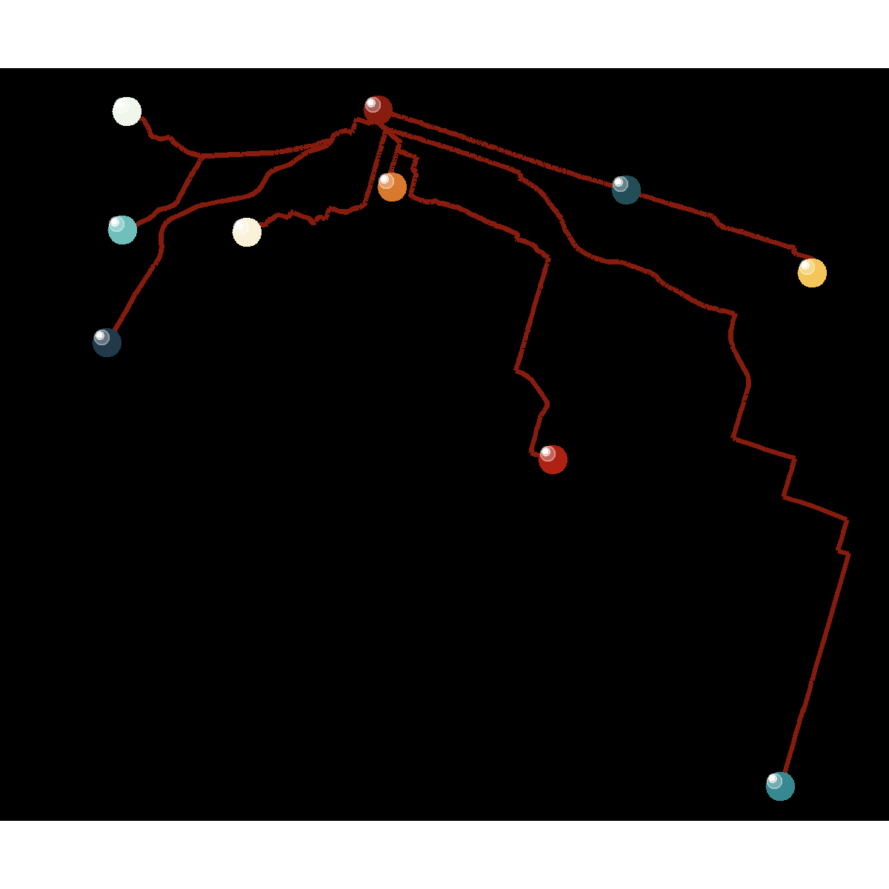

<!-- README.md is generated from README.Rmd. Please edit that file -->

```{r, include = FALSE}
knitr::opts_chunk$set(
  collapse = TRUE,
  comment = "#>",
  cache = TRUE
)
```

# Sol LeWitt Wall Painting

<!-- badges: start -->
<!-- badges: end -->

The prompt for Day 7 of [genuary](https://genuary.art) 2022 draws inspiration from Sol LeWitt's wall paintings. LeWitt thought that the true work of the artist was the concept, and not necessarily the hand-work of drafting/drawing/painting. For this reason, he would give instructions to drafters to execute the _idea_. This is an example of such (from Sol LeWitt’s 1971 Wall Drawing Instructions for the [School of the MFA Boston](https://observer.com/2012/10/here-are-the-instructions-for-sol-lewitts-1971-wall-drawing-for-the-school-of-the-mfa-boston/)):

> "On a wall surface, any  
> continuous stretch of wall,  
> using a hard pencil, place  
> fifty points at random.  
> The points should be evenly  
> distributed over the area  
> of the wall. All of the  
> points should be connected  
> by straight lines."

So this is basically an algorithm with randomness causes by the location of the points, the skill of the drafter, etc.

An aspect that I found underwhelming of these instructions is that, as a geographer, I just don't enjoy fully random stuff in space. There are a number of possibilities to make the instructions more geographical. For example, "connect only those points that are less than a distance x away from each other" (Tobler's First Law: things that are closer are more related). Or make the points bigger if their average distance to other points is short. Or change the width of the lines: make them thinner the longer they are.

For this, I will use the following instructions:

1. Take a (non-random) planar network
2. Randomly choose n nodes from this network
3. All points should be connected by the shortest paths on the network 

I will use the following packages in this exercise:
```{r load-packages, cache = FALSE, warning=FALSE, message=FALSE}
library(envsocty3LT3) # There is a planar network that I can use
library(gganimate) # Package to animate pltos
library(igraph) # Package to do network analysis
library(MexBrewer) # Color palettes
library(sf) # Spatial analysis and cartography
library(tidygraph) # Netowrks as spatial networks
library(tidyverse) # Data carpentry and visualization
```

Invoke the data set. This is a graph with the road network in the City of Hamilton, in Ontario, Canada:
```{r}
data("hamilton_graph")
```

Check the number of nodes that are centroids in the zonal system used for transportation anaysis:
```{r}
hamilton_graph %>%
  activate(nodes) %>%
  as_tibble() %>%
  mutate(GTA06 == factor(GTA06)) %>%
  summary()
```

There are 297 nodes that are zonal centroids. Specify the number of points to pick at random from this set of nodes:
```{r}
n_points <- 10
```

Randomly select `n_points`: 
```{r}
# Set seed for repeatability
set.seed(507345)
sampled_nodes <- sample(1:297, n_points)
```

Extract the nodes from the graph and give them unique identifiers between 1:n_points:
```{r}
my_nodes <- hamilton_graph %>%
  activate(nodes) %>%
  as_tibble() %>%
  st_as_sf() %>%
  filter(!is.na(GTA06)) %>%
  slice(sampled_nodes) %>%
  mutate(n = factor(1:n(),
                    ordered = TRUE))
```

Plot the randomly chosen nodes:
```{r}
ggplot() +
  geom_sf(data = my_nodes, 
          aes(color = n))
```

Retrieve the node identifiers. This information is needed for the shortest path algorithm:
```{r}
my_nodes_ids <- my_nodes %>%
  pull(nodeID)
```

Find the shortest paths from each node to the rest of nodes:
```{r}
my_paths <- list()
epaths <- list()
counter <- 0

for(i in 1:n_points){
  counter <- counter + 1
  my_paths[[counter]] <- shortest_paths(graph = hamilton_graph, # Use function `shortest_paths()` and save output to object `my_paths`
                                        from = my_nodes_ids[i], # The origin is node i of those randomly chosen
                                        to = my_nodes_ids, # The set of destinations is every other randomly chose node 
                                        mode = "out", # The shortest paths are in the outgoing direction
                                        output = "epath", # The output is the set of edges in the path
                                        weights = hamilton_graph %>%
                                          activate(edges) %>%
                                          pull(length)) # Pull the column with edge lengths from the table of edges
  # Record the edge identifiers for the shortest paths from each origin
  epaths[[i]] <- my_paths[[counter]][[2]] %>% 
    unlist() %>% 
    unlist()
}
```

Convert the paths to simple features for visualization:
```{r}
path_graph <- list()

for(i in 1:n_points){
  path_graph[[i]] <- hamilton_graph %>%
    subgraph.edges(eids = epaths[[i]]) %>%
    as_tbl_graph() %>%
    activate(edges) %>%
    as_tibble() %>%
    st_as_sf()
}
```

Collect all paths into a single simple features data frame: 
```{r}
paths <- path_graph[[1]] %>% 
  mutate(origin = 1)

for(i in 2:n_points){
  paths <- rbind(paths,
                 path_graph[[i]] %>%
                   mutate(origin = i))
}

paths <- paths %>%
  mutate(origin = factor(origin,
                         ordered = TRUE))
```

These are embelishments; I will copy the nodes and shift them to add some "shine" to the nodes in the plot:
```{r}
my_nodes_sfc = st_geometry(my_nodes)
my_nodes_shift_1 = my_nodes_sfc + c(-200, 200)
my_nodes_shift_1 <- my_nodes_shift_1 %>%
  st_set_crs(st_crs(my_nodes))

my_nodes_shift_2 = my_nodes_sfc + c(-180, 180)
my_nodes_shift_2 <- my_nodes_shift_2 %>%
  st_set_crs(st_crs(my_nodes))

my_nodes_shift_3 = my_nodes_sfc + c(-140, 140)
my_nodes_shift_3 <- my_nodes_shift_3 %>%
  st_set_crs(st_crs(my_nodes))
```

Use color palette `Revolucion` from {MexBrewer}. The paths from each origin will be rendered in turn for the animation: 
```{r eval=FALSE}
# Do not knit, enter_fade() does not seem to play well with knitr
col_palette <- mex.brewer("Revolucion", 
                          n = 10)

slw_animation <- ggplot() +
  geom_sf(data = paths,
          aes(color = origin),
          size = 0.8) +
  geom_sf(data = my_nodes,
          aes(color = n),
          size = 4) +
  geom_sf(data= my_nodes_shift_3,
          color = "white",
          size = 2,
          alpha = 0.3) +
  geom_sf(data= my_nodes_shift_2,
          color = "white",
          size = 1,
          alpha = 0.5) +
  geom_sf(data= my_nodes_shift_1,
          color = "white",
          size = 0.5) +
  scale_color_manual(values = col_palette) +
  theme_void() + 
  theme(legend.position = "none",
        plot.background = element_rect(fill = "black")) +
  transition_states(origin,
                    transition_length = 1,
                    state_length = 1) +
  enter_fade() + 
  exit_shrink() +
  ease_aes('sine-in-out')
```

Animate the plot and save as gif:
```{r eval = FALSE}
# Do not knit, enter_fade() does not seem to play well with knitr
animate(slw_animation,
        height = 4, 
        width = 4, 
        units = "in",
        res = 300)

anim_save("slw_animation.gif")
```


