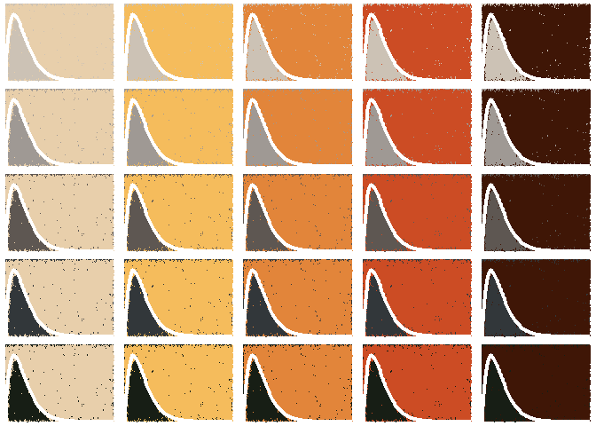

<!-- README.md is generated from README.Rmd. Please edit that file -->

# Single curve only

<!-- badges: start -->
<!-- badges: end -->

The prompt for Day 8 of [genuary](https://genuary.art) 2022 is “Single
curve only”.

Based on goodness-of-fit criteria, the gamma distribution was selected
(see red line in Figure ) with the following shape and rate parameters
(Table ) in the general form of:
$$ 
f(x, \\alpha, \\beta) = \\frac {x^{\\alpha-1}e^{-\\frac{x}{\\beta}}}{ \\beta^{\\alpha}\\Gamma(\\alpha)} \\quad \\text{for } 0 \\leq x \\leq \\infty
$$
where the estimated ‘shape’ is *α*,the estimated ‘rate’ is *β*, and the
*Γ*(*α*) is defined as:

*Γ*(*α*) = ∫<sub>0</sub><sup>∞</sup>*x*<sup>*α* − 1</sup>*e*<sup>−*x*</sup> *d**x*

I will use the following packages in this exercise:

``` r
library(gridExtra)
library(MexBrewer) # Color palettes
library(tidyverse) # Data carpentry and visualization
```

Parameters from Toronto’s callibration of distance decay function.

``` r
df <- data.frame(x = 0:130) %>% 
  mutate(y = dgamma(x, shape = 2.01884797, rate = 0.09416746))
```

## Atentado

``` r
col_palette <- mex.brewer("Atentado")

c_atentado <- list()
counter <- 0

for(i in 1:5){
  for(j in 6:10){
    counter <- counter + 1
    c_atentado[[counter]] <- ggplot(data = df) +
      #geom_line(aes(x = x, y = y)) +
      geom_ribbon(aes(x = x, 
                      ymin = y, 
                      ymax = 0.04),
                  fill = col_palette[i]) +
      geom_ribbon(aes(x = x, 
                      ymin = 0, 
                      ymax = y),
                  fill = col_palette[j]) +
      theme_void()
  }
}

grid.arrange(grobs=c_atentado, nrow = 5)
```

<!-- -->

## Alacena

``` r
col_palette <- mex.brewer("Alacena")

c_alacena <- list()
counter <- 0

for(i in 1:5){
  for(j in 6:10){
    counter <- counter + 1
    c_alacena[[counter]] <- ggplot(data = df) +
      #geom_line(aes(x = x, y = y)) +
      geom_ribbon(aes(x = x, 
                      ymin = y, 
                      ymax = 0.04),
                  fill = col_palette[i]) +
      geom_ribbon(aes(x = x, 
                      ymin = 0, 
                      ymax = y),
                  fill = col_palette[j]) +
      theme_void()
  }
}

grid.arrange(grobs=c_alacena, nrow = 5)
```

<!-- -->

## Revolucion

``` r
col_palette <- mex.brewer("Revolucion")

c_revolucion <- list()
counter <- 0

for(i in 1:5){
  for(j in 6:10){
    counter <- counter + 1
    c_revolucion[[counter]] <- ggplot(data = df) +
      #geom_line(aes(x = x, y = y)) +
      geom_ribbon(aes(x = x, 
                      ymin = y, 
                      ymax = 0.04),
                  fill = col_palette[i]) +
      geom_ribbon(aes(x = x, 
                      ymin = 0, 
                      ymax = y),
                  fill = col_palette[j]) +
      theme_void()
  }
}

grid.arrange(grobs=c_revolucion, nrow = 5)
```

<!-- -->

## Ronda

``` r
col_palette <- mex.brewer("Ronda")

c_ronda <- list()
counter <- 0

for(i in 1:5){
  for(j in 6:10){
    counter <- counter + 1
    c_ronda[[counter]] <- ggplot(data = df) +
      #geom_line(aes(x = x, y = y)) +
      geom_ribbon(aes(x = x, 
                      ymin = y, 
                      ymax = 0.04),
                  fill = col_palette[i]) +
      geom_ribbon(aes(x = x, 
                      ymin = 0, 
                      ymax = y),
                  fill = col_palette[j]) +
      theme_void()
  }
}

grid.arrange(grobs=c_ronda, nrow = 5)
```

<!-- -->
