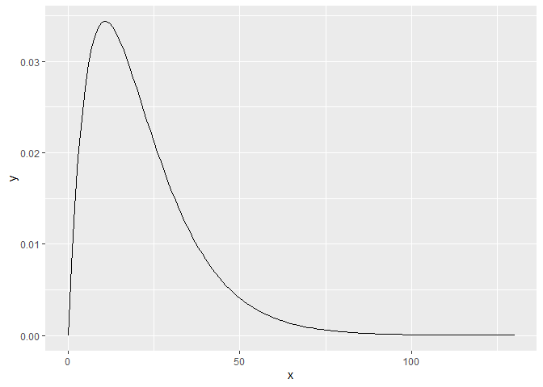
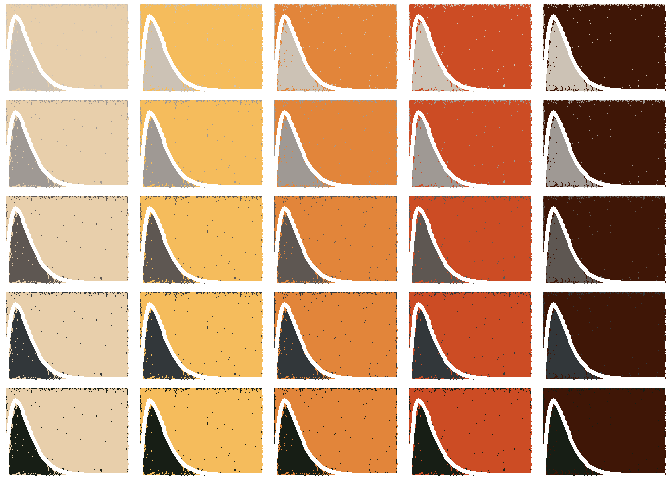

<!-- README.md is generated from README.Rmd. Please edit that file -->

# Single curve only

<!-- badges: start -->
<!-- badges: end -->

The prompt for Day 8 of [genuary](https://genuary.art) 2022 is “Single
curve only”. For this I will plot the gamma distribution, calibrated
using the trip length distribution of work trips in the Greater Toronto
and Hamilton Region by [Anastasia
Soukhov](https://soukhova.github.io/AccessPack/).

The gamma distribution was has the general form of:

$$ 
f(x, \\alpha, \\beta) = \\frac {x^{\\alpha-1}e^{-\\frac{x}{\\beta}}}{ \\beta^{\\alpha}\\Gamma(\\alpha)} \\quad \\text{for } 0 \\leq x \\leq \\infty
$$
where the estimated ‘shape’ is *α*, the estimated ‘rate’ is *β*, and
*Γ*(*α*) is defined as:

*Γ*(*α*) = ∫<sub>0</sub><sup>∞</sup>*x*<sup>*α* − 1</sup>*e*<sup>−*x*</sup> *d**x*

I will use the following packages:

``` r
library(gridExtra) # Package for arraginging multiple plots
library(MexBrewer) # Color palettes
library(tidyverse) # Data carpentry and visualization
```

The calibrated parameters are used here to define the curve:

``` r
df <- data.frame(x = 0:130) %>% 
  mutate(y = dgamma(x, 
                    shape = 2.01884797, 
                    rate = 0.09416746))
```

This is the shape of the curve:

``` r
ggplot(data = df,
       aes(x = x, 
           y = y)) +
  geom_line()
```

<!-- -->

This shape is quite common for trip length distribution for commuting:
very few people commute short or long distances.

Next, create a data frame for probabilistic hatching:

``` r
# Create an initial cloud of points for hatching
df_hatch <- data.frame(x = runif(10000, 
                                 min = 0, 
                                 max = 130),
                       y = runif(10000,
                                 min = 0,
                                 max = 0.04)) %>%
  # Calculate endpoints for the line segments that will produce the hatching
  mutate(xend = x + runif(n(), 
                          min = 1, 
                          max = 4),
         yend = y + runif(n(), 
                          min = 0, max = 0.005) * ifelse(rbinom(n(), 1, 0.5) == 0, -1, 1),
         # Add the y-coordinate of the shape for choosing colors
         y_gamma = dgamma(x, 
                          shape = 2.01884797,
                          rate = 0.09416746))
```

## Atentado

``` r
col_palette <- mex.brewer("Atentado")

c_atentado <- list()
counter <- 0

col_1 <- c(5, 4, 3, 2, 1)

for(i in col_1){
  for(j in 6:10){
    counter <- counter + 1
    c_atentado[[counter]] <- ggplot(data = df) +
      geom_ribbon(aes(x = x, 
                      ymin = y, 
                      ymax = 0.04),
                  fill = col_palette[i]) +
      geom_ribbon(aes(x = x, 
                      ymin = 0, 
                      ymax = y),
                  fill = col_palette[j]) +
  geom_segment(data = df_hatch%>%
                 filter(y < y_gamma  & y > 0.0001, yend > 0.0 & yend < 0.04), 
               aes(x = x,
                   xend = xend,
                 y = y,
                 yend = yend),
             color = col_palette[i],
             size = 0.01) +
  geom_segment(data = df_hatch %>%
               filter(y > y_gamma, xend < 130, yend > 0 & yend < 0.04), 
             aes(x = x,
                 xend = xend,
                 y = y,
                 yend = yend),
             color = col_palette[j],
             size = 0.01) +
  geom_line(aes(x = x, y = y),
            color = "white",
            size = 1.5) +
      theme_void()
  }
}

grid.arrange(grobs=c_atentado, nrow = 5)
```

<!-- -->

``` r
g <- arrangeGrob(grobs = c_atentado, nrow = 5)

ggsave(filename = "single-curve-atentado.png", g)
#> Saving 7 x 5 in image
```

## Alacena

``` r
col_palette <- mex.brewer("Alacena")

c_alacena <- list()
counter <- 0

col_1 <- c(5, 4, 3, 2, 1)

for(i in col_1){
  for(j in 6:10){
    counter <- counter + 1
    c_alacena[[counter]] <- ggplot(data = df) +
      geom_ribbon(aes(x = x, 
                      ymin = y, 
                      ymax = 0.04),
                  fill = col_palette[i]) +
      geom_ribbon(aes(x = x, 
                      ymin = 0, 
                      ymax = y),
                  fill = col_palette[j]) +
  geom_segment(data = df_hatch%>%
                 filter(y < y_gamma  & y > 0.0001, yend > 0.0 & yend < 0.04), 
               aes(x = x,
                   xend = xend,
                 y = y,
                 yend = yend),
             color = col_palette[i],
             size = 0.01) +
  geom_segment(data = df_hatch %>%
               filter(y > y_gamma, xend < 130, yend > 0 & yend < 0.04), 
             aes(x = x,
                 xend = xend,
                 y = y,
                 yend = yend),
             color = col_palette[j],
             size = 0.01) +
  geom_line(aes(x = x, y = y),
            color = "white",
            size = 1.5) +
      theme_void()
  }
}

grid.arrange(grobs=c_alacena, nrow = 5)
```

<!-- -->

``` r
g <- arrangeGrob(grobs = c_alacena, nrow = 5)

ggsave(filename = "single-curve-alacena.png", g)
#> Saving 7 x 5 in image
```

## Revolucion

``` r
col_palette <- mex.brewer("Revolucion")

c_revolucion <- list()
counter <- 0

col_1 <- c(5, 4, 3, 2, 1)

for(i in col_1){
  for(j in 6:10){
    counter <- counter + 1
    c_revolucion[[counter]] <- ggplot(data = df) +
      geom_ribbon(aes(x = x, 
                      ymin = y, 
                      ymax = 0.04),
                  fill = col_palette[i]) +
      geom_ribbon(aes(x = x, 
                      ymin = 0, 
                      ymax = y),
                  fill = col_palette[j]) +
  geom_segment(data = df_hatch%>%
                 filter(y < y_gamma  & y > 0.0001, yend > 0.0 & yend < 0.04), 
               aes(x = x,
                   xend = xend,
                 y = y,
                 yend = yend),
             color = col_palette[i],
             size = 0.01) +
  geom_segment(data = df_hatch %>%
               filter(y > y_gamma, xend < 130, yend > 0 & yend < 0.04), 
             aes(x = x,
                 xend = xend,
                 y = y,
                 yend = yend),
             color = col_palette[j],
             size = 0.01) +
  geom_line(aes(x = x, y = y),
            color = "white",
            size = 1.5) +
      theme_void()
  }
}

grid.arrange(grobs=c_revolucion, nrow = 5)
```

<!-- -->

``` r
g <- arrangeGrob(grobs = c_revolucion, nrow = 5)

ggsave(filename = "single-curve-revolucion.png", g)
#> Saving 7 x 5 in image
```

## Ronda

``` r
col_palette <- mex.brewer("Ronda")

c_ronda <- list()
counter <- 0

col_1 <- c(5, 4, 3, 2, 1)

for(i in col_1){
  for(j in 6:10){
    counter <- counter + 1
    c_ronda[[counter]] <- ggplot(data = df) +
      geom_ribbon(aes(x = x, 
                      ymin = y, 
                      ymax = 0.04),
                  fill = col_palette[i]) +
      geom_ribbon(aes(x = x, 
                      ymin = 0, 
                      ymax = y),
                  fill = col_palette[j]) +
  geom_segment(data = df_hatch%>%
                 filter(y < y_gamma  & y > 0.0001, yend > 0.0 & yend < 0.04), 
               aes(x = x,
                   xend = xend,
                 y = y,
                 yend = yend),
             color = col_palette[i],
             size = 0.01) +
  geom_segment(data = df_hatch %>%
               filter(y > y_gamma, xend < 130, yend > 0 & yend < 0.04), 
             aes(x = x,
                 xend = xend,
                 y = y,
                 yend = yend),
             color = col_palette[j],
             size = 0.01) +
  geom_line(aes(x = x, y = y),
            color = "white",
            size = 1.5) +
      theme_void()
  }
}

grid.arrange(grobs=c_ronda, nrow = 5)
```

<!-- -->

``` r
g <- arrangeGrob(grobs = c_ronda, nrow = 5)

ggsave(filename = "single-curve-ronda.png", g)
#> Saving 7 x 5 in image
```
