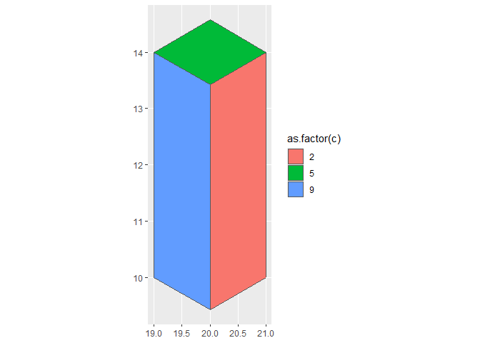
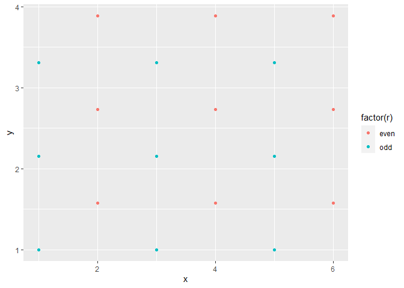
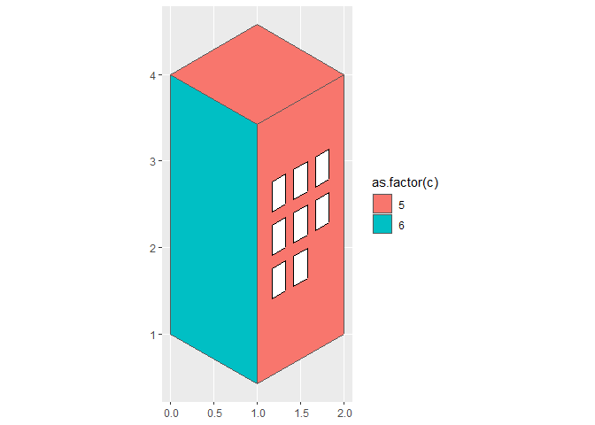
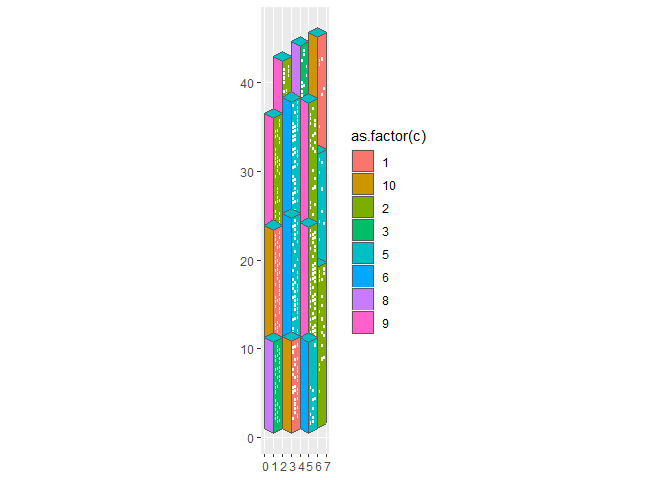
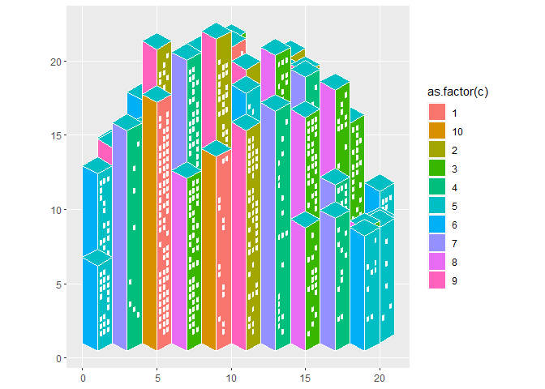
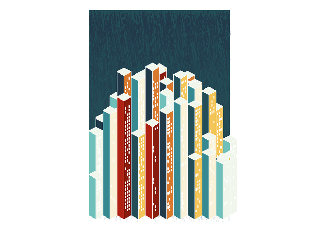
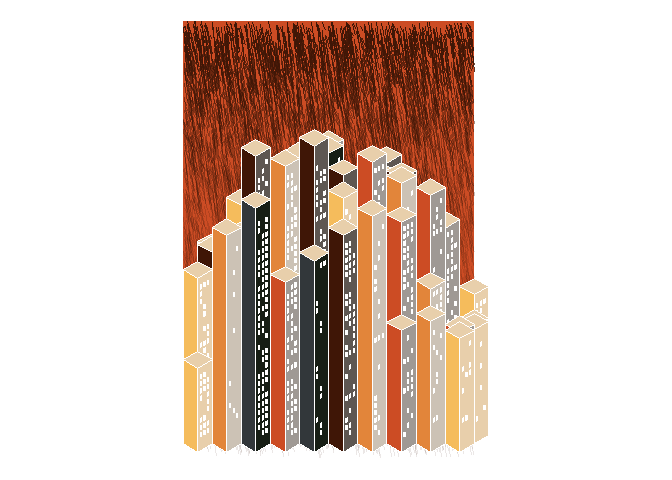
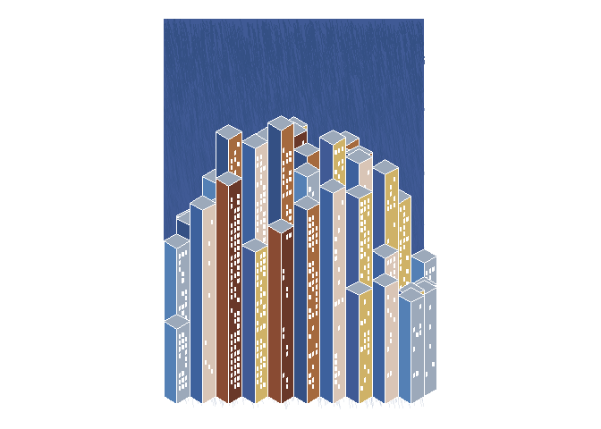

<!-- README.md is generated from README.Rmd. Please edit that file -->

# Architecture

<!-- badges: start -->
<!-- badges: end -->

This time I want to create a skyline. I have seen several variations on
this theme. I will use the following packages:

``` r
library(MexBrewer)
library(sf)
library(tidyverse)
```

## The basic mechanics of creating a tower

Position of block:

``` r
x_o <- 20
y_o <- 10
```

Height of the block:

``` r
l <- 4
```

The parts of the block:

``` r
# Create a matrix with the coordinates of the polygon that becomes the right face of the block
right_face <- matrix(c(x_o + 1, y_o, # From the coordinates of the block, displace one unit right
                       x_o, y_o - 1 * tan(pi/6), # Displace the y-coordinate to the left a distance 1 * tan(pi/6)
                       x_o, y_o - 1 * tan(pi/6) + l, # Displace the y-coordinate to the left and up to the height l 
                       x_o + 1, y_o + l, # Displace the coordinates one unit to the right and l up
                       x_o +1, y_o), # Return to starting point
                     ncol = 2,
                     byrow = TRUE)
# Create a matrix with the coordinates of the polygon that becomes the left face of the block
left_face <- matrix(c(x_o - 1, y_o, 
                      x_o, y_o - tan(pi/6), 
                      x_o, y_o - tan(pi/6) + l, 
                      x_o - 1, y_o + l, 
                      x_o - 1, y_o),
                    ncol = 2,
                    byrow = TRUE)
# Create a matrix with the coordinates of the polygon that becomes the top of the block
top <- matrix(c(x_o - 1, y_o + l,
                x_o, y_o + tan(pi/6) + l, 
                x_o + 1, y_o + l, 
                x_o, y_o - tan(pi/6) + l, 
                x_o - 1, y_o + l),
              ncol = 2,
              byrow = TRUE)

# Random number that can be used to assign colors
c <- sample.int(5, 1)

# Convert coordinates to polygons and then to simple features
rp <- data.frame(c = c,
                 geometry = st_polygon(list(right_face)) %>% 
                   st_sfc()) %>% st_as_sf()
lp <- data.frame(c = 11 - c,
                 geometry = st_polygon(list(left_face)) %>% 
                   st_sfc()) %>% st_as_sf()

top <- data.frame(c = 5,
                  geometry = st_polygon(list(top)) %>% 
                    st_sfc()) %>% st_as_sf()

# Put all faces together
faces <- rbind(rp, lp, top)
```

Plot this single block:

``` r
ggplot() + 
  geom_sf(data = faces, aes(fill = as.factor(c)))
```

<!-- -->

Create grid for placing blocks:

``` r
n_cols <- 5
n_rows <- 4

df_o <- data.frame(expand.grid(x = seq(1, n_cols, by = 2), 
                               y = seq(1, n_rows, by = 2 * tan(pi/6))), 
                   r = "odd")

df_e <- data.frame(expand.grid(x = seq(2, n_cols + 1, by = 2), 
                               y = seq(1 + tan(pi/6), n_rows, by = 2 * tan(pi/6))),
                   r = "even")

df <- rbind(df_o, df_e)
```

Plot the grid for placing blocks:

``` r
ggplot(data = df, aes(x = x, y = y, color = factor(r))) + geom_point()
```

<!-- -->

Make a function to create a block (and add windows):

``` r
tower <- function(x_o, y_o, l, s){
  # x_o and y_o are the coordinates to place the tower
  # l is the height of the tower
  # s is the sampling rate for the windows
  
  # Right face of tower
  right_face <- matrix(c(x_o + 1, y_o, 
                         x_o, y_o - tan(pi/6), 
                         x_o, y_o - tan(pi/6) + l, 
                         x_o + 1, y_o + l, 
                         x_o +1, y_o),
                       ncol = 2,
                       byrow = TRUE)
  # Left face of tower
  left_face <- matrix(c(x_o - 1, y_o, 
                        x_o, y_o - tan(pi/6), 
                        x_o, y_o - tan(pi/6) + l, 
                        x_o - 1, y_o + l, 
                        x_o - 1, y_o),
                      ncol = 2,
                      byrow = TRUE)
  # Top of tower
  top <- matrix(c(x_o - 1, y_o + l,
                  x_o, y_o + tan(pi/6) + l, 
                  x_o + 1, y_o + l, 
                  x_o, y_o - tan(pi/6) + l, 
                  x_o - 1, y_o + l),
                ncol = 2,
                byrow = TRUE)
  
  # Windows
  
  # Grid for windows
  x_w <- x_o + 1/4
  y_w <- seq(y_o + 0.5, 
             y_o + l - 1, 
             0.5) # vertical spacing between windows
  
  df_w <- data.frame(expand.grid(x = x_w, 
                                 y = y_w))
  df_w <- rbind(df_w,
                mutate(df_w, 
                       x = x + 1/4, # horizontal spacing between windows
                       y = y + 1/4 * tan(pi/6)),
                mutate(df_w, 
                       x = x + 2/4, # horizontal spacing between windows
                       y = y + 2/4 * tan(pi/6)))
  df_w <- slice_sample(df_w, prop = s)
  
  s_window <- data.frame()
  
  for(i in 1:nrow(df_w)){
    w <- matrix(c(df_w[i, 1] + 0.08, df_w[i, 2], # half the width of the window added to the x coordinate
                       df_w[i, 1] - 0.08, df_w[i, 2] - 0.16 * tan(pi/6), # width of window to translate y coordinate
                       df_w[i, 1] - 0.08, df_w[i, 2] - 0.16 * tan(pi/6) + 0.35, # height of window 
                       df_w[i, 1] + 0.08, df_w[i, 2] + 0.35, 
                       df_w[i, 1] + 0.08, df_w[i, 2]),
                       ncol = 2,
                       byrow = TRUE)
    # Convert to simple features
    w <- data.frame(c = 5,
                   geometry = st_polygon(list(w)) %>% 
                     st_sfc()) %>% 
    st_as_sf()
    s_window <- rbind(s_window, 
                     w)
  }
  
    # Add value for colors
  c <- sample.int(5, 1)
  
  # Convert to simple features
  rp <- data.frame(c = c,
                   geometry = st_polygon(list(right_face)) %>% 
                     st_sfc()) %>% 
    st_as_sf()
  lp <- data.frame(c = 11 - c,
                   geometry = st_polygon(list(left_face)) %>% 
                     st_sfc()) %>% 
    st_as_sf()
  
  top <- data.frame(c = 5,
                    geometry = st_polygon(list(top)) %>% 
                      st_sfc()) %>% 
    st_as_sf()
  
  # Complete tower
  tower <- rbind(rp, lp, top)
  return(list(tower, s_window))
}
```

Create a tower with function:

``` r
t1 <- tower(df[1, 1], df[1, 2], l = 3, s = 2/3)
```

Plot a single tower:

``` r
ggplot() + 
  geom_sf(data = t1[[1]], 
          aes(fill = as.factor(c))) + 
  geom_sf(data = t1[[2]], 
          fill = "white", 
          color = "black")
```

<!-- -->

## Put it all together

The function can create a single tower, and the grid gives the position
of several towers. Combine to create many towers:

``` r
skyline <- data.frame()
all_windows <- data.frame()

for(i in 1:nrow(df)){
  t1 <- tower(df[i, 1], 
              df[i, 2], 
              l = df[i, 2] * 10 + runif(1, 
                                        min = 0, 
                                        max = 3),
              s = runif(1, 
                        min = 0.1, 
                        max = 0.8))
  skyline <- rbind(skyline, 
                   data.frame(t1[[1]], group = i))
  
  all_windows <- rbind(all_windows,
                       data.frame(t1[[2]], group = i))
}
```

Sort by descending prder of groups to plot the last groups (in the
background) first:

``` r
skyline <- skyline %>%
  arrange(desc(group)) %>%
  st_as_sf()

all_windows <- all_windows %>%
  arrange(desc(group)) %>%
  st_as_sf()
```

Plot many towers:

``` r
p <- ggplot()

for(i in max(skyline$group):1){
  p <- p + 
    geom_sf(data = skyline %>%
                       filter(group == i), 
                     aes(fill = as.factor(c))) +
    geom_sf(data = all_windows %>%
                       filter(group == i),
            fill = "white",
            color = NA)
}

p
```

<!-- -->

Make a bigger skyline!

``` r
n_cols <- 20
n_rows <- 5

# Grid - odd rows
df_o <- data.frame(expand.grid(x = seq(1, 
                                       n_cols,
                                       by = 2), 
                               y = seq(1, 
                                       n_rows, 
                                       by = 2 * tan(pi/6))), 
                   r = "odd")

# Grid - even rows
df_e <- data.frame(expand.grid(x = seq(2, 
                                       n_cols + 1, 
                                       by = 2), 
                               y = seq(1 + tan(pi/6),
                                       n_rows, 
                                       by = 2 * tan(pi/6))),
                   r = "even")

# Bind
df <- rbind(df_o, df_e)
```

Create many towers:

``` r
skyline <- data.frame()
all_windows <- data.frame()

for(i in 1:nrow(df)){
  t1 <- tower(df[i, 1], 
              df[i, 2], 
              l = 0.25 * (-1/3 * (df[i, 1] - n_cols/2)^2 + 40) + runif(1,
                                                                     min = 0, 
                                                                     max = 10),
              s = runif(1, 
                        min = 0.1, 
                        max = 0.8)
              )
  skyline <- rbind(skyline, 
                   data.frame(t1[[1]], group = i))
  
  all_windows <- rbind(all_windows, 
                   data.frame(t1[[2]], group = i))
}

#Sort by descending group:
skyline <- skyline %>%
  arrange(desc(group)) %>%
  st_as_sf()

all_windows <- all_windows %>%
  arrange(desc(group)) %>%
  st_as_sf()
```

Plot:

``` r
p <- ggplot()

for(i in max(skyline$group):1){
  p <- p + 
    geom_sf(data = skyline %>%
                       filter(group == i), 
                     aes(fill = as.factor(c)),
                   color = "white") +
    geom_sf(data = all_windows %>%
                       filter(group == i),
            fill = "white",
            color = NA)
}

p
```

<!-- -->

## Make pretty

To prettify, create a data frame for probabilistic hatching:

``` r
# Create an initial cloud of points for hatching
df_hatch <- data.frame(x = runif(10000, 
                                 min = min(df$x) - 1, 
                                 max = max(df$x) + 1),
                       y = runif(10000,
                                 min = min(df$y) + tan(pi/6),
                                 max = 30)) %>%
  # Calculate endpoints for the line segments that will produce the hatching
  mutate(xend = x + 0.2,
         yend = y - runif(n(), 
                          min = 0.25, max = 2 + runif(n(), 
                                                      min = 0.2, 
                                                      max = 0.2)))
```

### Revolucion

Plot many towers `Revolucion` style:

``` r
col_palette <- mex.brewer("Revolucion")

p <- ggplot() + 
  geom_rect(aes(xmin = min(df$x) - 1, 
            xmax = max(df$x), 
            ymin = min(df$y) + tan(pi/6), 
            ymax = 30),
            fill = col_palette[9]) + 
  geom_segment(data = df_hatch %>%
                 filter(xend > 0 & xend < n_cols, 
                        yend > 0 & yend < 30),
               aes(x = x, 
                   y = y,
                   xend = xend,
                   yend = yend,
                   alpha = (y/30)^4),
               color = col_palette[10],
               size = 0.1)

for(i in max(skyline$group):1){
  p <- p + 
    geom_sf(data = skyline %>%
                       filter(group == i), 
                     aes(fill = as.factor(c)),
                   color = "white") +
    geom_sf(data = all_windows %>%
                       filter(group == i),
            fill = "white",
            color = NA)
}

p +
  scale_fill_manual(values = col_palette) + 
  theme_void() +
  theme(legend.position = "none")
```

<!-- -->

``` r
ggsave(filename = "skyline-revolucion.png")
#> Saving 7 x 5 in image
```

### Atentado

Plot many towers `Atentado` style:

``` r
col_palette <- mex.brewer("Atentado")

p <- ggplot() + 
  geom_rect(aes(xmin = min(df$x) - 1, 
            xmax = max(df$x), 
            ymin = min(df$y) + tan(pi/6), 
            ymax = 30),
            fill = col_palette[9]) + 
  geom_segment(data = df_hatch %>%
                 filter(xend > 0 & xend < n_cols, 
                        yend > 0 & yend < 30),
               aes(x = x, 
                   y = y,
                   xend = xend,
                   yend = yend,
                   alpha = (y/30)^4),
               color = col_palette[10],
               size = 0.1)

for(i in max(skyline$group):1){
  p <- p + 
    geom_sf(data = skyline %>%
                       filter(group == i), 
                     aes(fill = as.factor(c)),
                   color = "white") +
    geom_sf(data = all_windows %>%
                       filter(group == i),
            fill = "white",
            color = NA)
}

p +
  scale_fill_manual(values = col_palette) + 
  theme_void() +
  theme(legend.position = "none")
```

<!-- -->

``` r
ggsave(filename = "skyline-atentado.png")
#> Saving 7 x 5 in image
```

### Alacena

Plot many towers `Alacena` style:

``` r
col_palette <- mex.brewer("Alacena")

p <- ggplot() + 
  geom_rect(aes(xmin = min(df$x) - 1, 
            xmax = max(df$x), 
            ymin = min(df$y) + tan(pi/6), 
            ymax = 30),
            fill = col_palette[9]) + 
  geom_segment(data = df_hatch %>%
                 filter(xend > 0 & xend < n_cols, 
                        yend > 0 & yend < 30),
               aes(x = x, 
                   y = y,
                   xend = xend,
                   yend = yend,
                   alpha = (y/30)^4),
               color = col_palette[10],
               size = 0.1)

for(i in max(skyline$group):1){
  p <- p + 
    geom_sf(data = skyline %>%
                       filter(group == i), 
                     aes(fill = as.factor(c)),
                   color = "white") +
    geom_sf(data = all_windows %>%
                       filter(group == i),
            fill = "white",
            color = NA)
}

p +
  scale_fill_manual(values = col_palette) + 
  theme_void() +
  theme(legend.position = "none")
```

<!-- -->

``` r
ggsave(filename = "skyline-alacena.png")
#> Saving 7 x 5 in image
```

### Ronda

Plot many towers `Ronda` style:

``` r
col_palette <- mex.brewer("Ronda")

p <- ggplot() + 
  geom_rect(aes(xmin = min(df$x) - 1, 
            xmax = max(df$x), 
            ymin = min(df$y) + tan(pi/6), 
            ymax = 30),
            fill = col_palette[9]) + 
  geom_segment(data = df_hatch %>%
                 filter(xend > 0 & xend < n_cols, 
                        yend > 0 & yend < 30),
               aes(x = x, 
                   y = y,
                   xend = xend,
                   yend = yend,
                   alpha = (y/30)^4),
               color = col_palette[10],
               size = 0.1)

for(i in max(skyline$group):1){
  p <- p + 
    geom_sf(data = skyline %>%
                       filter(group == i), 
                     aes(fill = as.factor(c)),
                   color = "white") +
    geom_sf(data = all_windows %>%
                       filter(group == i),
            fill = "white",
            color = NA)
}

p +
  scale_fill_manual(values = col_palette) + 
  theme_void() +
  theme(legend.position = "none")
```

<!-- -->

``` r
ggsave(filename = "skyline-ronda.png")
#> Saving 7 x 5 in image
```
