<!-- README.md is generated from README.Rmd. Please edit that file -->

# Circle packing

<!-- badges: start -->
<!-- badges: end -->

I have been curious about circle packing for some time. Here are some
resources that I checked:
<https://github.com/Ijeamakaanyene/circle_packing>
<https://tylerxhobbs.com/essays/2016/a-randomized-approach-to-cicle-packing>

I would like to be able to pack various irregular polygons, not sure if
the packages that I have seen do that. I will use the following in this
exercise:

``` r
library(MexBrewer)
library(sf)
library(tidyverse)
```

## The basic mechanics of circle packing

I will begin by creating a set of polygons similar to the towers that I
used in Day 9 for
[architecture](https://github.com/paezha/genuary2022/tree/master/09-architecture).
The position of my experimental block is:

``` r
x_o <- 20
y_o <- 10
```

Height of the block:

``` r
l <- 4
```

The parts of the block:

``` r
# Create a matrix with the coordinates of the polygon that becomes the right face of the block
right_face <- matrix(c(x_o + 1, y_o, # From the coordinates of the block, displace one unit right
                       x_o, y_o - 1 * tan(pi/6), # Displace the y-coordinate to the left a distance 1 * tan(pi/6)
                       x_o, y_o - 1 * tan(pi/6) + l, # Displace the y-coordinate to the left and up to the height l 
                       x_o + 1, y_o + l, # Displace the coordinates one unit to the right and l up
                       x_o +1, y_o), # Return to starting point
                     ncol = 2,
                     byrow = TRUE)
# Create a matrix with the coordinates of the polygon that becomes the left face of the block
left_face <- matrix(c(x_o - 1, y_o, 
                      x_o, y_o - tan(pi/6), 
                      x_o, y_o - tan(pi/6) + l, 
                      x_o - 1, y_o + l, 
                      x_o - 1, y_o),
                    ncol = 2,
                    byrow = TRUE)
# Create a matrix with the coordinates of the polygon that becomes the top of the block
top <- matrix(c(x_o - 1, y_o + l,
                x_o, y_o + tan(pi/6) + l, 
                x_o + 1, y_o + l, 
                x_o, y_o - tan(pi/6) + l, 
                x_o - 1, y_o + l),
              ncol = 2,
              byrow = TRUE)

# Random number that can be used to assign colors
c <- sample.int(5, 1)

# Convert coordinates to polygons and then to simple features
rp <- data.frame(id = 1, 
                 r = NA,
                 geometry = st_multilinestring(list(right_face)) %>% 
                   st_sfc()) %>% st_as_sf()
lp <- data.frame(id = 2, 
                 r = NA,
                 geometry = st_multilinestring(list(left_face)) %>% 
                   st_sfc()) %>% st_as_sf()

top <- data.frame(id = 3, 
                  r = NA,
                  geometry = st_multilinestring(list(top)) %>% 
                    st_sfc()) %>% st_as_sf()

# Put all faces together
faces_lines <- rbind(rp, lp, top)
```

Also, I will need polygons to check that points are inside polygons and
if so inside which one:

``` r
faces_polygons <- faces_lines %>%
  st_cast(to = "POLYGON")
```

Plot this single block as lines:

``` r
ggplot() + 
  geom_sf(data = faces_lines, 
          aes(color = factor(id)))
```

<!-- -->

Plot this single block as polygons:

``` r
ggplot() + 
  geom_sf(data = faces_polygons, 
          aes(fill = factor(id)))
```

<!-- -->

Generate random points for circle packing:

``` r
max_circles <- 500
min_radius <- 0.1

c_points <- data.frame(x = runif(n = max_circles,
                                 min = x_o - 1,
                                 max = x_o + 1),
                       y = runif(n = max_circles,
                                 min = y_o - tan(pi/6),
                                 max = y_o + tan(pi/6) + l))

c_points <- c_points %>%
  st_as_sf(coords = c("x", "y")) %>%
  mutate(PID = 1:n())
```

Spatial join to drop points outside the polygons:

``` r
c_points <- c_points %>%
  st_join(faces_polygons) %>%
  drop_na(id)
```

Plot the points in the polygons:

``` r
ggplot() + 
  geom_sf(data = faces_polygons, 
          aes(fill = factor(id))) +
  geom_sf(data = c_points,
          size = 2)
```

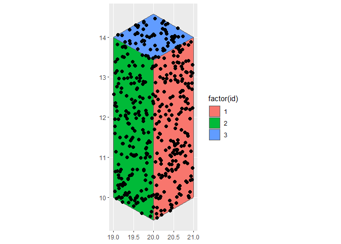<!-- -->

For the first circle randomly select by group:

``` r
circle_candidates <- c_points %>% 
  group_by(id) %>%
  slice_sample(n =1) %>%
  ungroup()

circle_candidates
#> Simple feature collection with 3 features and 3 fields
#> Geometry type: POINT
#> Dimension:     XY
#> Bounding box:  xmin: 19.1384 ymin: 10.49434 xmax: 20.45271 ymax: 13.937
#> CRS:           NA
#> # A tibble: 3 x 4
#>     PID    id r                geometry
#>   <int> <dbl> <lgl>             <POINT>
#> 1   163     1 NA    (20.16442 13.00563)
#> 2   265     2 NA     (19.1384 10.49434)
#> 3    77     3 NA      (20.45271 13.937)
```

Remove the candidates from the table of points so that they are not
considered again in the future:

``` r
c_points <- c_points %>%
  anti_join(circle_candidates %>%
              st_drop_geometry() %>%
              select(PID),
            by = "PID")
```

Plot the candidates for circles:

``` r
ggplot() + 
  geom_sf(data = faces_polygons, 
          aes(fill = factor(id))) +
  geom_sf(data = c_points,
          size = 2) +
  geom_sf(data = circle_candidates,
          size = 4,
          color = "magenta")
```

<!-- -->

Find the distance of these points to their boundaries:

``` r
circle_candidates$r <- circle_candidates %>%
  st_distance(faces_lines) %>% 
  data.frame() %>%
  apply(1, min)

circle_candidates$r
#> [1] 0.1644248 0.1384000 0.2190863
```

Filter candidates with a radius greater than the minimum:

``` r
circle_candidates <- circle_candidates %>% 
  filter(r >= min_radius)
```

Create a data frame with the center points and radius of the circles:

``` r
#circles <- circle_candidates
#circles$radius <- r

circles <- circle_candidates %>%
  st_buffer(dist = circle_candidates$r)
```

Plot the first circles:

``` r
ggplot() + 
  geom_sf(data = faces_polygons, 
          aes(fill = factor(id))) +
  geom_sf(data = c_points,
          aes(shape = factor(id)),
          size = 2) +
  geom_sf(data = circles,
          fill = NA)
```

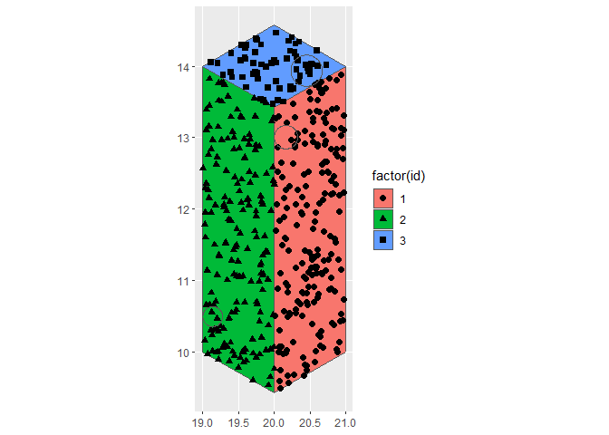<!-- -->

Clear points that are now *inside* a circle from the candidates (the
radius will *not* be NA):

``` r
c_points <- c_points %>%
  select(-c(r)) %>% 
  st_join(circles %>%
            select(-c(PID, id))) %>%
  filter(is.na(r))
```

Plot minus blacklisted points:

``` r
ggplot() + 
  geom_sf(data = faces_polygons, 
          aes(fill = factor(id))) +
  geom_sf(data = c_points,
          aes(shape = factor(id)),
          size = 2) +
  geom_sf(data = circles,
          fill = NA)
```

<!-- -->

Randomly select next candidates for circles by group:

``` r
circle_candidates <- c_points %>% 
  group_by(id) %>%
  slice_sample(n =1) %>%
  ungroup()

circle_candidates
#> Simple feature collection with 3 features and 3 fields
#> Geometry type: POINT
#> Dimension:     XY
#> Bounding box:  xmin: 19.83023 ymin: 10.36726 xmax: 20.8573 ymax: 14.01876
#> CRS:           NA
#> # A tibble: 3 x 4
#>     PID    id     r            geometry
#>   <int> <dbl> <dbl>             <POINT>
#> 1    26     1    NA  (20.8573 12.34848)
#> 2   367     2    NA (19.91838 10.36726)
#> 3   176     3    NA (19.83023 14.01876)
```

Remove the candidates from the table of points so that they are not
considered again in the future:

``` r
c_points <- c_points %>%
  anti_join(circle_candidates %>%
              st_drop_geometry() %>%
              select(PID),
            by = "PID")
```

Plot candidate points:

``` r
ggplot() + 
  geom_sf(data = faces_polygons, 
          aes(fill = factor(id))) +
  geom_sf(data = c_points,
          aes(shape = factor(id)),
          size = 2) +
  geom_sf(data = circles,
          fill = NA) +
  geom_sf(data = circle_candidates,
          size = 4,
          color = "magenta")
```

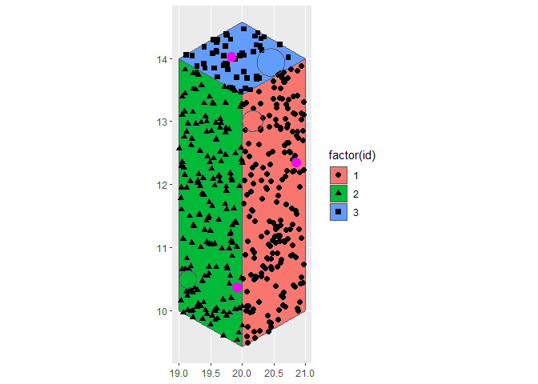<!-- -->

Find the distance of these points to the boundaries of the polygons that
contain them *and* to existing circles:

``` r
circle_candidates$r <- circle_candidates %>%
  st_distance(rbind(faces_lines, 
                    circles %>%
                      select(-PID))) %>% 
  data.frame() %>%
  apply(1, min)

circle_candidates$r
#> [1] 0.14270237 0.08162049 0.39886913
```

Filter candidates with a radius greater than the minimum:

``` r
circle_candidates <- circle_candidates %>% 
  filter(r >= min_radius)
```

Add new circles to the data frame:

``` r
circles <- rbind(circles,
                 circle_candidates %>%
                   st_buffer(dist = circle_candidates$r))
```

Plot with the new circles:

``` r
ggplot() + 
  geom_sf(data = faces_polygons, 
          aes(fill = factor(id))) +
  geom_sf(data = c_points,
          aes(shape = factor(id)),
          size = 2) +
  geom_sf(data = circles,
          fill = NA)
```

<!-- -->

Clear points that are now *inside* a circle from the candidates (the
radius will *not* be NA):

``` r
c_points <- c_points %>%
  select(-c(r)) %>% 
  st_join(circles %>%
            select(-c(id))) %>%
  filter(is.na(r))
```

Plot minus blacklisted points:

``` r
ggplot() + 
  geom_sf(data = faces_polygons, 
          aes(fill = factor(id))) +
  geom_sf(data = c_points,
          aes(shape = factor(id)),
          size = 2) +
  geom_sf(data = circles,
          fill = NA)
```

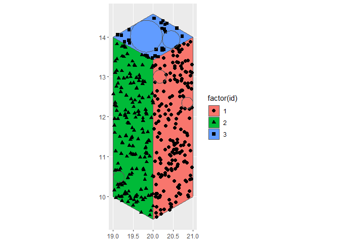<!-- -->

I am ready to automate this process.

The inputs:

-   A sf object with polystring.
-   Parameters for generating the circles:
-   Maximum number of circles
-   Maximum radius for a circle
-   Minimum radius for a circle

``` r
st_circle_packer <- function(p, max_circles = 100, max_radius = 1, min_radius = 0.1){
  
  # Initialize the table with circles
  circles <- data.frame()
  
  # Convert lines to polygons
  p_polygons <- p %>%
    st_cast(to = "POLYGON")
  
  # Create initial set of points for potential circles in the space of the bounding box of the polygons
  region <- st_bbox(p)
  c_points <- data.frame(x = runif(n = max_circles,
                                   min = region[1],
                                   max = region[3]),
                         y = runif(n = max_circles,
                                   min = region[2],
                                   max = region[4]))
  
  # Convert the points to simple features and add a unique point identifier (PID)
  c_points <- c_points %>%
    st_as_sf(coords = c("x", "y")) %>%
    mutate(PID = 1:n())
  
  # Find any points that fall outside of a polygon and remove
  c_points <- c_points %>%
    st_join(p_polygons) %>%
    drop_na(id)
  
  # Initialize stopping criterion
  stopping_criterion <- TRUE
  
  while(stopping_criterion){
    # Sample one point from each polygon: these points are candidates for circles
    circle_candidates <- c_points %>% 
      group_by(id) %>%
      slice_sample(n =1) %>%
      ungroup()
    
    # Remove the points sampled from the table of points so that they are not considered again in the future
    c_points <- c_points %>%
      anti_join(circle_candidates %>%
                  st_drop_geometry() %>%
                  select(PID),
                by = "PID")
    
    # Find the distance of the candidate points to the boundaries of the polygons if no circles exist yet
    if(nrow(circles) == 0){
      circle_candidates$r <- circle_candidates %>%
        st_distance(p) %>% 
        data.frame() %>%
        apply(1, min)
    }# Find the distance of the candidate points to the boundaries of the polygons and circles if they exist
    else{
      circle_candidates$r <- circle_candidates %>%
        st_distance(rbind(p, 
                          circles %>%
                            select(-PID))) %>% 
        data.frame() %>%
        apply(1, min)
    }
    
    # Filter candidates with a radius greater than the minimum
    circle_candidates <- circle_candidates %>% 
      filter(r >= min_radius)
    
    # Make sure that the radius does not exceed the maximum
    circle_candidates <- circle_candidates %>%
      mutate(r = ifelse(r >= max_radius, max_radius, r))
    
    # If there are candidates points with a radius above the tolerance then create circles
    if(nrow(circle_candidates) > 0){
      # Use the points and buffers to create circles that are added to the existing table of circles
      circles <- rbind(circles,
                       circle_candidates %>%
                         st_buffer(dist = circle_candidates$r))
      
      # Clear points that are now _inside_ a circle from the candidates (the radius will _not_ be NA)
      c_points <- c_points %>%
        select(-c(r)) %>% 
        st_join(circles %>%
                  select(r)) %>%
        filter(is.na(r))
    }
    stopping_criterion <- nrow(c_points) > 0
  }
  return(circles)
}
```

Try it out:

``` r
circles <- faces_lines %>%
  st_circle_packer(max_circles = 500, max_radius = 0.3, min_radius = 0.1)
```

Plot:

``` r
ggplot() + 
  geom_sf(data = faces_polygons, 
          aes(fill = factor(id))) +
  geom_sf(data = circles,
          fill = NA)
```

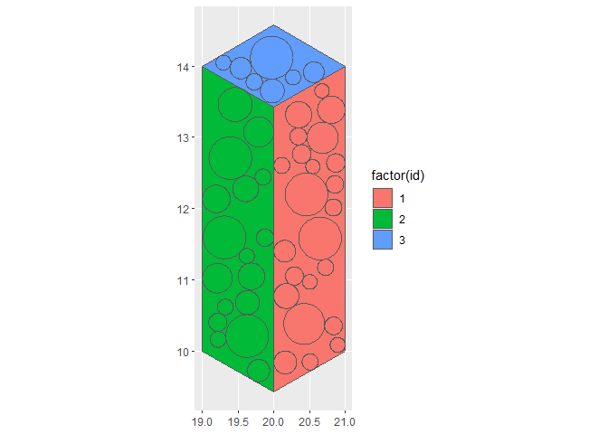<!-- -->

Increasing the number of circles adds greater coverage:

``` r
circles <- faces_lines %>%
  st_circle_packer(max_circles = 1000, 
                   max_radius = 0.3, 
                   min_radius = 0.1)
```

Plot:

``` r
ggplot() + 
  geom_sf(data = faces_polygons, 
          aes(fill = factor(id))) +
  geom_sf(data = circles,
          fill = NA)
```

<!-- -->

Changing the range of sizes of the circles can also give greater
coverage, but perhaps take longer:

``` r
circles <- faces_lines %>%
  st_circle_packer(max_circles = 1000, 
                   max_radius = 0.25, 
                   min_radius = 0.01)
```

Plot:

``` r
ggplot() + 
  geom_sf(data = faces_polygons, 
          aes(fill = factor(id))) +
  geom_sf(data = circles,
          fill = NA)
```

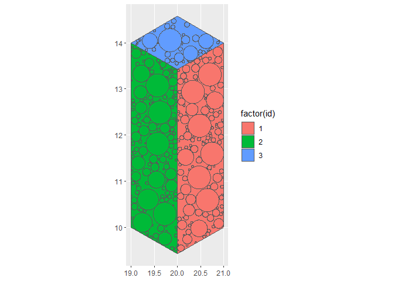<!-- -->

I will use my function to make towers:

``` r
tower <- function(x_o, y_o, l, s){
  # x_o and y_o are the coordinates to place the tower
  # l is the height of the tower
  # s is the sampling rate for the windows
  
  # Right face of tower
  right_face <- matrix(c(x_o + 1, y_o, 
                         x_o, y_o - tan(pi/6), 
                         x_o, y_o - tan(pi/6) + l, 
                         x_o + 1, y_o + l, 
                         x_o +1, y_o),
                       ncol = 2,
                       byrow = TRUE)
  # Left face of tower
  left_face <- matrix(c(x_o - 1, y_o, 
                        x_o, y_o - tan(pi/6), 
                        x_o, y_o - tan(pi/6) + l, 
                        x_o - 1, y_o + l, 
                        x_o - 1, y_o),
                      ncol = 2,
                      byrow = TRUE)
  # Top of tower
  top <- matrix(c(x_o - 1, y_o + l,
                  x_o, y_o + tan(pi/6) + l, 
                  x_o + 1, y_o + l, 
                  x_o, y_o - tan(pi/6) + l, 
                  x_o - 1, y_o + l),
                ncol = 2,
                byrow = TRUE)
  
  # Windows
  
  # Grid for windows
  x_w <- x_o + 1/4
  y_w <- seq(y_o + 0.5, 
             y_o + l - 1, 
             0.5) # vertical spacing between windows
  
  df_w <- data.frame(expand.grid(x = x_w, 
                                 y = y_w))
  df_w <- rbind(df_w,
                mutate(df_w, 
                       x = x + 1/4, # horizontal spacing between windows
                       y = y + 1/4 * tan(pi/6)),
                mutate(df_w, 
                       x = x + 2/4, # horizontal spacing between windows
                       y = y + 2/4 * tan(pi/6)))
  df_w <- slice_sample(df_w, prop = s)
  
  s_window <- data.frame()
  
  for(i in 1:nrow(df_w)){
    w <- matrix(c(df_w[i, 1] + 0.08, df_w[i, 2], # half the width of the window added to the x coordinate
                       df_w[i, 1] - 0.08, df_w[i, 2] - 0.16 * tan(pi/6), # width of window to translate y coordinate
                       df_w[i, 1] - 0.08, df_w[i, 2] - 0.16 * tan(pi/6) + 0.35, # height of window 
                       df_w[i, 1] + 0.08, df_w[i, 2] + 0.35, 
                       df_w[i, 1] + 0.08, df_w[i, 2]),
                       ncol = 2,
                       byrow = TRUE)
    # Convert to simple features
    w <- data.frame(c = 5,
                   geometry = st_polygon(list(w)) %>% 
                     st_sfc()) %>% 
    st_as_sf()
    s_window <- rbind(s_window, 
                     w)
  }
  
    # Add value for colors
  c <- sample.int(5, 1)
  
  # Convert to simple features
  rp <- data.frame(c = c,
                   geometry = st_polygon(list(right_face)) %>% 
                     st_sfc()) %>% 
    st_as_sf()
  lp <- data.frame(c = 11 - c,
                   geometry = st_polygon(list(left_face)) %>% 
                     st_sfc()) %>% 
    st_as_sf()
  
  top <- data.frame(c = 5,
                    geometry = st_polygon(list(top)) %>% 
                      st_sfc()) %>% 
    st_as_sf()
  
  # Complete tower
  tower <- rbind(rp, lp, top)
  return(list(tower, s_window))
}
```

Make a few towers:

``` r
n_cols <- 5
n_rows <- 2

# Grid - odd rows
df_o <- data.frame(expand.grid(x = seq(1, 
                                       n_cols,
                                       by = 2), 
                               y = seq(1, 
                                       n_rows, 
                                       by = 2 * tan(pi/6))), 
                   r = "odd")

# Grid - even rows
df_e <- data.frame(expand.grid(x = seq(2, 
                                       n_cols + 1, 
                                       by = 2), 
                               y = seq(1 + tan(pi/6),
                                       n_rows, 
                                       by = 2 * tan(pi/6))),
                   r = "even")

# Bind
df <- rbind(df_o, df_e)
```

Create many towers:

``` r
skyline <- data.frame()
all_windows <- data.frame()

for(i in 1:nrow(df)){
  t1 <- tower(df[i, 1], 
              df[i, 2], 
              l = runif(1,
                        min = 5, 
                        max = 10),
              s = runif(1, 
                        min = 0.1, 
                        max = 0.8)
              )
  skyline <- rbind(skyline, 
                   data.frame(t1[[1]], group = i))
  
  all_windows <- rbind(all_windows, 
                   data.frame(t1[[2]], group = i))
}

#Sort by descending group:
skyline <- skyline %>%
  arrange(desc(group)) %>%
  st_as_sf()

all_windows <- all_windows %>%
  arrange(desc(group)) %>%
  st_as_sf()
```

Plot:

``` r
ggplot() + geom_sf(data = skyline, 
                     aes(fill = factor(group)),
                   color = "white")
```

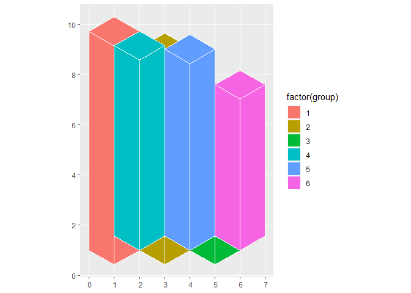<!-- -->

Convert polygons to multilinestring:

``` r
skyline_lines <- skyline %>%
  filter(group <= 3) %>%
  group_by(group) %>%
  st_cast(to = "MULTILINESTRING")
```

Plot:

``` r
ggplot() + geom_sf(data = skyline_lines, 
                     aes(color = factor(group)))
```

<!-- -->

Copy group to id (which is used by st_circle_packer):

``` r
skyline_lines <- skyline_lines %>%
  transmute(id = group, r = NA)
```

Pack these creatures:

``` r
circles <- skyline_lines %>%
  st_circle_packer(max_circles = 5000, 
                   max_radius = 0.25, 
                   min_radius = 0.005)
```

Plot:

``` r
ggplot() + 
  geom_sf(data = skyline_lines %>% 
            group_by(id) %>%
            st_cast(to = "POLYGON"), 
          aes(fill = factor(id))) +
  geom_sf(data = circles,
          fill = NA) + 
  theme_void() +
  theme(legend.position = "none")
```

<!-- -->

Prettify.

### Revolucion

Plot packed cubes `Revolucion` style:

``` r
col_palette <- mex.brewer("Revolucion")

ggplot() + 
  geom_rect(aes(xmin = min(df$x) - 2.5, 
            xmax = max(df$x) + 1.5, 
            ymin = -0.5, 
            ymax = 11),
            fill = col_palette[9]) + 
    geom_sf(data = skyline %>%
                       filter(group <= 3), 
                     aes(fill = factor(c)),
                   color = "white",
          size = 0.5) +
  geom_sf(data = circles %>%
            mutate(c = sample.int(10, 
                                  size = nrow(circles), 
                                  replace = TRUE)),
          aes(fill = factor(c)),
          color = "white",
          size = 0.01) + 
  scale_fill_manual(values = col_palette) + 
  theme_void() +
  theme(legend.position = "none")
```

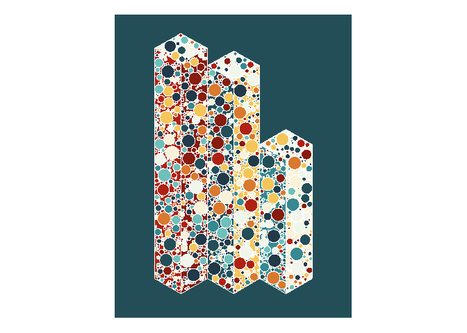<!-- -->

``` r
ggsave(filename = "circle-packing-revolucion.png", width = 3, height = 2)
```

### Alacena

Plot packed cubes `Alacena` style:

``` r
col_palette <- mex.brewer("Alacena")

ggplot() + 
  geom_rect(aes(xmin = min(df$x) - 2.5, 
            xmax = max(df$x) + 1.5, 
            ymin = -0.5, 
            ymax = 11),
            fill = col_palette[9]) + 
    geom_sf(data = skyline %>%
                       filter(group <= 3), 
                     aes(fill = factor(c)),
                   color = "white",
          size = 0.5) +
  geom_sf(data = circles %>%
            mutate(c = sample.int(10, 
                                  size = nrow(circles), 
                                  replace = TRUE)),
          aes(fill = factor(c)),
          color = "white",
          size = 0.01) + 
  scale_fill_manual(values = col_palette) + 
  theme_void() +
  theme(legend.position = "none")
```

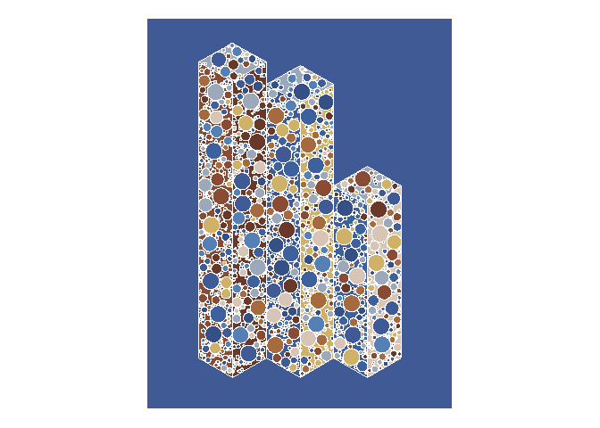<!-- -->

``` r
ggsave(filename = "circle-packing-alacena.png", width = 3, height = 2)
```

### Atentado

Plot packed cubes `Atentado` style:

``` r
col_palette <- mex.brewer("Atentado")

ggplot() + 
  geom_rect(aes(xmin = min(df$x) - 2.5, 
            xmax = max(df$x) + 1.5, 
            ymin = -0.5, 
            ymax = 11),
            fill = col_palette[9]) + 
    geom_sf(data = skyline %>%
                       filter(group <= 3), 
                     aes(fill = factor(c)),
                   color = "white",
          size = 0.5) +
  geom_sf(data = circles %>%
            mutate(c = sample.int(10, 
                                  size = nrow(circles), 
                                  replace = TRUE)),
          aes(fill = factor(c)),
          color = "white",
          size = 0.01) + 
  scale_fill_manual(values = col_palette) + 
  theme_void() +
  theme(legend.position = "none")
```

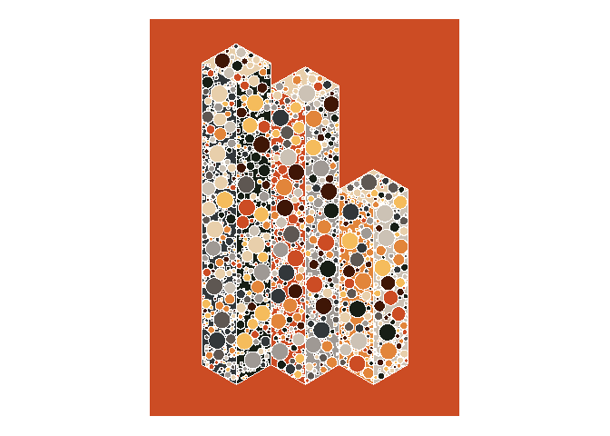<!-- -->

``` r
ggsave(filename = "circle-packing-atentado.png", width = 3, height = 2)
```

### Ronda

Plot packed cubes `Ronda` style:

``` r
col_palette <- mex.brewer("Ronda")

ggplot() + 
  geom_rect(aes(xmin = min(df$x) - 2.5, 
            xmax = max(df$x) + 1.5, 
            ymin = -0.5, 
            ymax = 11),
            fill = col_palette[9]) + 
    geom_sf(data = skyline %>%
                       filter(group <= 3), 
                     aes(fill = factor(c)),
                   color = "white",
          size = 0.5) +
  geom_sf(data = circles %>%
            mutate(c = sample.int(10, 
                                  size = nrow(circles), 
                                  replace = TRUE)),
          aes(fill = factor(c)),
          color = "white",
          size = 0.01) + 
  scale_fill_manual(values = col_palette) + 
  theme_void() +
  theme(legend.position = "none")
```

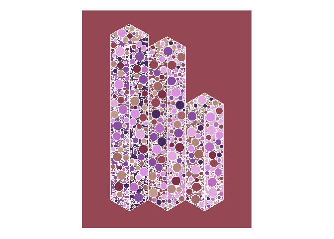<!-- -->

``` r
ggsave(filename = "circle-packing-ronda.png", width = 3, height = 2)
```
