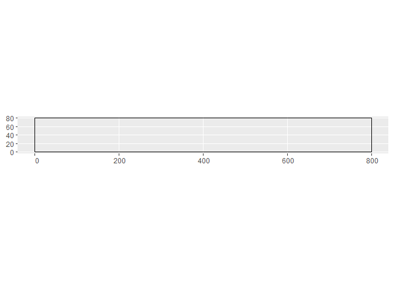
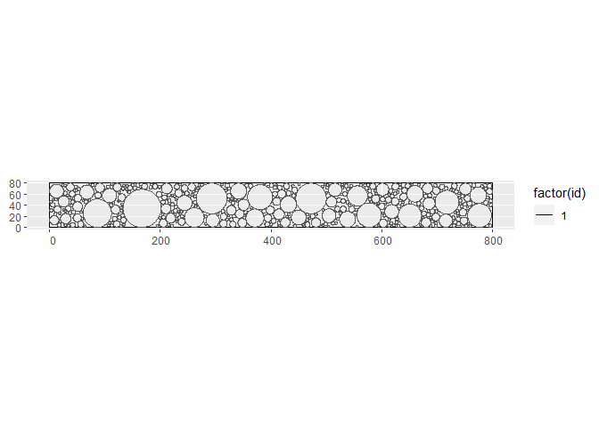
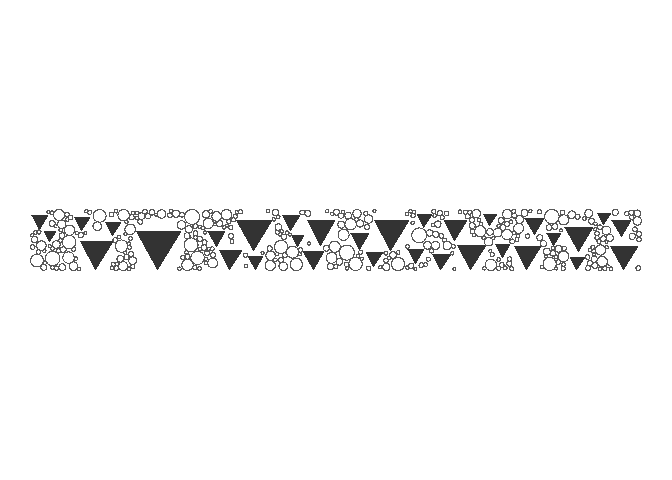
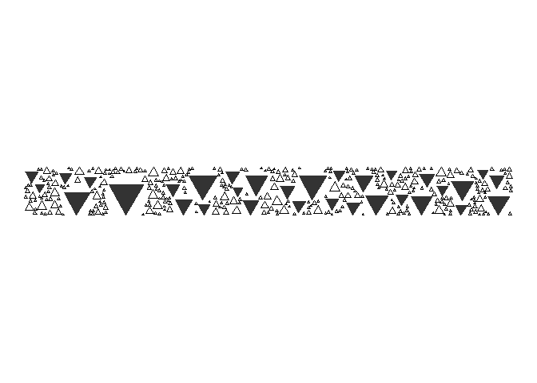
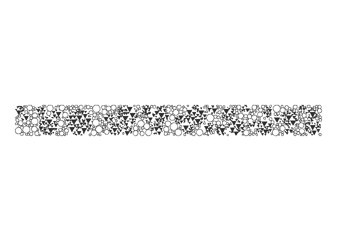

<!-- README.md is generated from README.Rmd. Please edit that file -->

# 800x80

<!-- badges: start -->
<!-- badges: end -->

This is a long, narrow format that I can use to experiment some more
with packing shapes.

I will use the following in this exercise:

``` r
library(ggforce)
library(sf)
library(tidyverse)
```

## Circle packing

Create a polygon of the stipulated dimensions:

``` r
container <- matrix(c(0, 0, 
                       0, 80, 
                       800, 80,  
                       800, 0,
                       0, 0),
                     ncol = 2,
                     byrow = TRUE)

# Convert coordinates to polygons and then to simple features
container <- data.frame(id = 1,
                        r = NA,
                 geometry = st_polygon(list(container)) %>% 
                   st_sfc()) %>% 
  st_as_sf() %>% 
  st_cast(to = "MULTILINESTRING")
```

Plot this initial container:

``` r
ggplot() + 
  geom_sf(data = container)
```

<!-- -->

The inputs for the packing algorithm are:

-   An sf object with multilinestring.
-   Parameters for generating the circles:
    -   Maximum number of circles
    -   Maximum radius for a circle
    -   Minimum radius for a circle

Function for packing:

``` r
st_circle_packer <- function(p, max_circles = 100, max_radius = 1, min_radius = 0.1){
  
  # Initialize the table with circles
  circles <- data.frame()
  
  # Convert lines to polygons
  p_polygons <- p %>%
    st_cast(to = "POLYGON")
  
  # Create initial set of points for potential circles in the space of the bounding box of the polygons
  region <- st_bbox(p)
  c_points <- data.frame(x = runif(n = max_circles,
                                   min = region[1],
                                   max = region[3]),
                         y = runif(n = max_circles,
                                   min = region[2],
                                   max = region[4]))
  
  # Convert the points to simple features and add a unique point identifier (PID)
  c_points <- c_points %>%
    st_as_sf(coords = c("x", "y")) %>%
    mutate(PID = 1:n())
  
  # Find any points that fall outside of a polygon and remove
  c_points <- c_points %>%
    st_join(p_polygons) %>%
    drop_na(id)
  
  # Initialize stopping criterion
  stopping_criterion <- TRUE
  
  while(stopping_criterion){
    # Sample one point from each polygon: these points are candidates for circles
    circle_candidates <- c_points %>% 
      group_by(id) %>%
      slice_sample(n =1) %>%
      ungroup()
    
    # Remove the points sampled from the table of points so that they are not considered again in the future
    c_points <- c_points %>%
      anti_join(circle_candidates %>%
                  st_drop_geometry() %>%
                  select(PID),
                by = "PID")
    
    # Find the distance of the candidate points to the boundaries of the polygons if no circles exist yet
    if(nrow(circles) == 0){
      circle_candidates$r <- circle_candidates %>%
        st_distance(p) %>% 
        data.frame() %>%
        apply(1, min)
    }# Find the distance of the candidate points to the boundaries of the polygons and circles if they exist
    else{
      circle_candidates$r <- circle_candidates %>%
        st_distance(rbind(p, 
                          circles %>%
                            select(-PID))) %>% 
        data.frame() %>%
        apply(1, min)
    }
    
    # Filter candidates with a radius greater than the minimum
    circle_candidates <- circle_candidates %>% 
      filter(r >= min_radius)
    
    # Make sure that the radius does not exceed the maximum
    circle_candidates <- circle_candidates %>%
      mutate(r = ifelse(r >= max_radius, max_radius, r))
    
    # If there are candidates points with a radius above the tolerance then create circles
    if(nrow(circle_candidates) > 0){
      # Use the points and buffers to create circles that are added to the existing table of circles
      circles <- rbind(circles,
                       circle_candidates %>%
                         st_buffer(dist = circle_candidates$r))
      
      # Clear points that are now _inside_ a circle from the candidates (the radius will _not_ be NA)
      c_points <- c_points %>%
        select(-c(r)) %>% 
        st_join(circles %>%
                  select(r)) %>%
        filter(is.na(r))
    }
    stopping_criterion <- nrow(c_points) > 0
  }
  return(circles)
}
```

Create a first pack:

``` r
circles <- container %>%
  st_circle_packer(max_circles = 5000, 
                   max_radius = 39,
                   min_radius = 2)
```

Plot:

``` r
ggplot() + 
  geom_sf(data = container, 
          aes(fill = factor(id))) +
  geom_sf(data = circles,
          fill = NA)
```

<!-- -->

Extract centroids and radii of the circles to plot as triangles:

``` r
triangles <- data.frame(circles %>% 
                            st_drop_geometry(),
                          st_centroid(circles) %>% 
                            st_coordinates())
#> Warning in st_centroid.sf(circles): st_centroid assumes attributes are constant
#> over geometries of x
triangles_1 <- triangles %>%
  filter(r >= 10)

triangles_2 <- triangles %>%
  filter(r < 10)
```

Use {ggforce} to plot as triangles

``` r
ggplot() +
  geom_regon(data = triangles_1,
             aes(x0 = X,
                 y0 = Y, 
                 sides = 3,
                 angle = 45, 
                 r = r)) +
  geom_sf(data = circles %>%
            filter(r < 10),
          fill = "white") + 
  theme_void()
```

<!-- -->

``` r
ggsave(filename = "800x80-1.png")
#> Saving 7 x 5 in image
```

Plot all triangles:

``` r
ggplot() +
  geom_regon(data = triangles_1,
             aes(x0 = X,
                 y0 = Y, 
                 sides = 3,
                 angle = 45, 
                 r = r)) +
  geom_regon(data = triangles_2,
             aes(x0 = X,
                 y0 = Y, 
                 sides = 3,
                 angle = 0, 
                 r = r),
             fill = "white",
             color = "black") +
  coord_equal() +
  theme_void()
```

<!-- -->

``` r
ggsave(filename = "800x80-2.png")
#> Saving 7 x 5 in image
```

Next I’d like to pack circles in the bigger circles of the first pack
and turn them into triangles. First convert to lines and select those
with a radius greater than 10:

``` r
circles_lines <- circles %>%
  st_cast(to = "MULTILINESTRING") %>%
  filter(r >= 10)
```

Plot:

``` r
ggplot() + 
  geom_sf(data = container, 
          aes(fill = factor(id))) +
  geom_sf(data = circles_lines,
          fill = NA)
```

<!-- -->

Now pack those circles:

``` r
triangles_level2 <- circles_lines %>% 
  transmute(id = 1:nrow(circles_lines), # Reset ids
            r = NA) %>% # set radius to NA
  st_circle_packer(max_circles = 5000, 
                   max_radius = 8,
                   min_radius = 1)
```

Prepare for plotting as triangles:

``` r
triangles_level2 <- data.frame(triangles_level2 %>% 
                            st_drop_geometry(),
                          st_centroid(triangles_level2) %>% 
                            st_coordinates())
#> Warning in st_centroid.sf(triangles_level2): st_centroid assumes attributes are
#> constant over geometries of x
```

Plot:

``` r
ggplot() + 
  geom_sf(data = circles %>%
            filter(r < 10),
          fill = NA) +
  geom_regon(data = triangles_level2,
             aes(x0 = X,
                 y0 = Y, 
                 sides = 3,
                 angle = 45, 
                 r = r + 1)) +
  theme_void()
```

<!-- -->

``` r
ggsave(filename = "800x80-3.png")
#> Saving 7 x 5 in image
```
