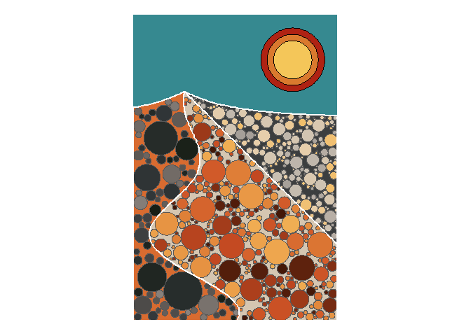

<!-- README.md is generated from README.Rmd. Please edit that file -->

# Sand

<!-- badges: start -->
<!-- badges: end -->

For this prompt I will do something with what I learned from circle
packing: packing irregular polygons, splitting polygons, using different
tolerances for circles in polygons.

I will use the following packages:

``` r
library(ggforce)
library(lwgeom)
library(MexBrewer)
library(sf)
library(tidyverse)
```

This is my improved function that allows for circle packing using radius
parameters (min/max) that vary by polygon:

``` r
st_circle_packer <- function(p, max_circles = 100, max_radius = 1, min_radius = 0.1){
  
  # p = a simple features object with n >= 1 or more polygon features
  # max_circles = a number with the maximum number of candidate points for drawing circles
  # max_radius = a value with the maximum radius for drawing circles; can be a vector of size n so that the largest radius is different by polygon
  # min_radius = a value with the minimum radius for drawing circles; can be a vector of size n so that the smalest radius is different by polygon
  
  # Initialize the table with circles
  circles <- data.frame()
  
  # Initialize table with tolerance parameters
  radius_pars <- data.frame(id = p$id, 
                            min_radius, 
                            max_radius)
  
  # Convert polygons to lines
  p_lines <- p %>%
    st_cast(to = "MULTILINESTRING")
  
  # Create initial set of points for potential circles in the space of the bounding box of the polygons
  region <- st_bbox(p)
  c_points <- data.frame(x = runif(n = max_circles,
                                   min = region[1],
                                   max = region[3]),
                         y = runif(n = max_circles,
                                   min = region[2],
                                   max = region[4]))
  
  # Convert the points to simple features and add a unique point identifier (PID)
  c_points <- c_points %>%
    st_as_sf(coords = c("x", "y")) %>%
    mutate(PID = 1:n())
  
  # Find any points that fall outside of a polygon and remove
  c_points <- c_points %>%
    st_join(p) %>%
    drop_na(id)
  
  # Initialize stopping criterion
  stopping_criterion <- TRUE
  
  while(stopping_criterion){
    # Sample one point from each polygon: these points are candidates for circles
    circle_candidates <- c_points %>% 
      group_by(id) %>%
      slice_sample(n =1) %>%
      ungroup()
    
    # Remove the points sampled from the table of points so that they are not considered again in the future
    c_points <- c_points %>%
      anti_join(circle_candidates %>%
                  st_drop_geometry() %>%
                  select(PID),
                by = "PID")
    
    # Find the distance of the candidate points to the boundaries of the polygons if no circles exist yet
    if(nrow(circles) == 0){
      circle_candidates$r <- circle_candidates %>%
        st_distance(p_lines) %>% 
        data.frame() %>%
        apply(1, min)
    }# Find the distance of the candidate points to the boundaries of the polygons and circles if they exist
    else{
      circle_candidates$r <- circle_candidates %>%
        st_distance(rbind(p_lines, 
                          circles %>%
                            select(-PID))) %>% 
        data.frame() %>%
        apply(1, min)
    }
    
    # Join the tolerance parameters and filter candidates with a radius greater than the minimum
    circle_candidates <- circle_candidates %>% 
      left_join(radius_pars, by = "id") %>%
      filter(r >= min_radius)
    
    # Make sure that the radius does not exceed the maximum
    circle_candidates <- circle_candidates %>%
      mutate(r = ifelse(r >= max_radius, max_radius, r)) %>%
      select(-c(min_radius, max_radius)) # Drop tolerance parameters from table, no longer needed
    
    # If there are candidates points with a radius above the tolerance then create circles
    if(nrow(circle_candidates) > 0){
      # Use the points and buffers to create circles that are added to the existing table of circles
      circles <- rbind(circles,
                       circle_candidates %>%
                         st_buffer(dist = circle_candidates$r))
      
      # Clear points that are now _inside_ a circle from the candidates (the radius will _not_ be NA)
      c_points <- c_points %>%
        select(-c(r)) %>% 
        st_join(circles %>%
                  select(r)) %>%
        filter(is.na(r))
    }
    stopping_criterion <- nrow(c_points) > 0
  }
  return(circles)
}
```

## Design landscape

Create a polygon of to become the frame for my “landscape”:

``` r
container_polygon <- matrix(c(0, 0, 
                       0, 12, 
                       8, 12,  
                       8, 0,
                       0, 0),
                     ncol = 2,
                     byrow = TRUE)

# Convert coordinates to polygons and then to simple features
container_polygon <- data.frame(id = 1,
                        r = NA,
                 geometry = st_polygon(list(container_polygon)) %>% 
                   st_sfc()) %>% 
  st_as_sf()
```

Plot this initial container:

``` r
ggplot() + 
  geom_sf(data = container_polygon)
```

<!-- -->

Take the original container and pass lines through it to create a
landscape by partitioning it. Create a data frame for these lines:

``` r
df_lines <- data.frame(x = seq(-1,
                               9,
                               0.1))
```

Function for lines:

``` r
df_line_1 <- df_lines %>%
  mutate(y = 8 + exp(-0.5 * abs(x - 2)))

df_line_2 <- df_lines %>%
  filter(x >= 2) %>%
  mutate(y = 9 - (x - 2))
```

Line three

``` r
df_line_3 <- data.frame(y = seq(-1,
                     9,
                     0.1)) %>%
  mutate(x = ((y - 9) / 4) * cos(y + 9) + 2)
```

``` r
ggplot() +
  geom_sf(data = container_polygon) +
  geom_line(data = df_line_1,
            aes(x = x, y = y)) +
  geom_line(data = df_line_2,
            aes(x = x, y = y),
            color = "blue") +
  geom_path(data = df_line_3,
            aes(x = x, y = y),
            color = "red")
```

<!-- -->

Convert lines to simple features:

``` r
line_1 <- matrix(c(df_line_1$x,
                   df_line_1$y),
                 nrow = nrow(df_line_1),
                 byrow = FALSE)

line_2 <- matrix(c(df_line_2$x,
                   df_line_2$y),
                 nrow = nrow(df_line_2),
                 byrow = FALSE)

line_3 <- matrix(c(df_line_3$x,
                   df_line_3$y),
                 nrow = nrow(df_line_3),
                 byrow = FALSE)

# Convert coordinates to lines and then to simple features
line_1 <- data.frame(id = 1,
                     r = NA,
                     geometry = st_linestring(line_1) %>% 
                   st_sfc()) %>% 
  st_as_sf()

line_2 <- data.frame(id = 2,
                     r = NA,
                     geometry = st_linestring(line_2) %>% 
                   st_sfc()) %>% 
  st_as_sf()

line_3 <- data.frame(id = 3,
                     r = NA,
                     geometry = st_linestring(line_3) %>% 
                   st_sfc()) %>% 
  st_as_sf()

# Define "blade" to split container

blade <- rbind(line_1,
               line_2,
               line_3)
```

Split original container:

``` r
container_2 <- container_polygon %>%
  st_split(blade)
```

Extract polygons and give them new ids:

``` r
container_2 <- container_2 %>%
  st_collection_extract(c("POLYGON")) %>%
  mutate(id = 1:n())
```

Plot:

``` r
ggplot() +
  geom_sf(data = container_2,
          aes(fill = factor(id)))
```

<!-- -->

Pack these bad boys (but use only polygons that are “ground”). Use
palette `Atentado` and `Revolucion`:

``` r
col_palette <- mex.brewer("Atentado", 
                          n = 30)
# Pack polygons
circles_1 <- container_2 %>%
  filter(id %in% c(1, 3, 4)) %>% # Select bottom three polygons
  st_circle_packer(max_circles = 3000, 
                   max_radius = c(1, 0.25, 0.5),
                   min_radius = c(0.1, 0.025, 0.05))

# Create a sun
sun <- data.frame(disk = 1:3,
                            x = 6.25, 
                            y = 10.25) %>%
            st_as_sf(coords = c("x", "y")) %>%
            st_buffer(dist = c(0.75, 1.00, 1.25))

# Plot
ggplot() + 
  # Plot "sky" polygon
  geom_sf(data = container_2 %>%
            filter(id == 2),
          color = NA,
          fill = mex.brewer("Revolucion")[8]) +
  # Plot "sun"
  geom_sf(data = sun[3,],
          color = NA,
          fill = mex.brewer("Revolucion")[2]) +
  geom_sf(data = sun[2,],
          color = NA,
          fill = mex.brewer("Revolucion")[3]) +
  geom_sf(data = sun[1,],
          color = NA,
          fill = mex.brewer("Revolucion")[4]) +
  # Plot "ground" polygons
  geom_sf(data = container_2 %>%
            filter(id %in% c(1, 3, 4)) %>%
            mutate(c = case_when(id == 3 ~ 5,
                                 id == 4 ~ 15,
                                 id == 1 ~ 25)), 
          aes(fill = c),
          color = NA) +
  # Plot circles
  geom_sf(data = circles_1 %>%
            mutate(c = case_when(id == 3 ~ runif(n(), 11, 20),
                                 id == 4 ~ runif(n(), 21, 30),
                                 id == 1 ~ runif(n(), 1, 10))),
          aes(fill = c)) +
  # Plot "ridges"
  geom_sf(data = container_2 %>%
            filter(id %in% c(1, 3, 4)),
          color = "white", 
          fill = NA,
          size = 1) +
  scale_fill_gradientn(colors = col_palette) +
  theme_void() + 
  theme(legend.position = "none")
```

<!-- -->

``` r
ggsave(filename = "sand-atentado-revolucion.png", 
       width = 8, 
       height = 12, 
       units = "in")
```

Use palette `Atentado` and `Alacena`:

``` r
col_palette <- mex.brewer("Atentado", 
                          n = 30)
# Pack polygons
circles_1 <- container_2 %>%
  filter(id %in% c(1, 3, 4)) %>% # Select bottom three polygons
  st_circle_packer(max_circles = 3000, 
                   max_radius = c(1, 0.25, 0.5),
                   min_radius = c(0.1, 0.025, 0.05))

# Create a sun
sun <- data.frame(disk = 1:3,
                            x = 6.25, 
                            y = 10.25) %>%
            st_as_sf(coords = c("x", "y")) %>%
            st_buffer(dist = c(0.75, 1.00, 1.25))

# Plot
ggplot() + 
  # Plot "sky" polygon
  geom_sf(data = container_2 %>%
            filter(id == 2),
          color = NA,
          fill = mex.brewer("Alacena")[7]) +
  # Plot "sun"
  geom_sf(data = sun[3,],
          color = NA,
          fill = mex.brewer("Alacena")[2]) +
  geom_sf(data = sun[2,],
          color = NA,
          fill = mex.brewer("Alacena")[3]) +
  geom_sf(data = sun[1,],
          color = NA,
          fill = mex.brewer("Alacena")[4]) +
  # Plot "ground" polygons
  geom_sf(data = container_2 %>%
            filter(id %in% c(1, 3, 4)) %>%
            mutate(c = case_when(id == 3 ~ 5,
                                 id == 4 ~ 15,
                                 id == 1 ~ 25)), 
          aes(fill = c),
          color = NA) +
  # Plot circles
  geom_sf(data = circles_1 %>%
            mutate(c = case_when(id == 3 ~ runif(n(), 11, 20),
                                 id == 4 ~ runif(n(), 21, 30),
                                 id == 1 ~ runif(n(), 1, 10))),
          aes(fill = c)) +
  # Plot "ridges"
  geom_sf(data = container_2 %>%
            filter(id %in% c(1, 3, 4)),
          color = "white", 
          fill = NA,
          size = 1) +
  scale_fill_gradientn(colors = col_palette) +
  theme_void() + 
  theme(legend.position = "none")
```

<!-- -->

``` r
ggsave(filename = "sand-atentado-alacena.png", 
       width = 8, 
       height = 12, 
       units = "in")
```

Use palette `Tierra` and `Revolucion`:

``` r
col_palette <- mex.brewer("Tierra", 
                          n = 30)
# Pack polygons
circles_1 <- container_2 %>%
  filter(id %in% c(1, 3, 4)) %>% # Select bottom three polygons
  st_circle_packer(max_circles = 3000, 
                   max_radius = c(1, 0.25, 0.5),
                   min_radius = c(0.1, 0.025, 0.05))

# Create a sun
sun <- data.frame(disk = 1:3,
                            x = 6.25, 
                            y = 10.25) %>%
            st_as_sf(coords = c("x", "y")) %>%
            st_buffer(dist = c(0.75, 1.00, 1.25))

# Plot
ggplot() + 
  # Plot "sky" polygon
  geom_sf(data = container_2 %>%
            filter(id == 2),
          color = NA,
          fill = mex.brewer("Revolucion")[7]) +
  # Plot "sun"
  geom_sf(data = sun[3,],
          color = NA,
          fill = mex.brewer("Revolucion")[2]) +
  geom_sf(data = sun[2,],
          color = NA,
          fill = mex.brewer("Revolucion")[3]) +
  geom_sf(data = sun[1,],
          color = NA,
          fill = mex.brewer("Revolucion")[4]) +
  # Plot "ground" polygons
  geom_sf(data = container_2 %>%
            filter(id %in% c(1, 3, 4)) %>%
            mutate(c = case_when(id == 4 ~ 5,
                                 id == 1 ~ 15,
                                 id == 3 ~ 25)), 
          aes(fill = c),
          color = NA) +
  # Plot circles
  geom_sf(data = circles_1 %>%
            mutate(c = case_when(id == 4 ~ runif(n(), 11, 20),
                                 id == 1 ~ runif(n(), 21, 30),
                                 id == 3 ~ runif(n(), 1, 10))),
          aes(fill = c),
          color = "white") +
  # Plot "ridges"
  geom_sf(data = container_2 %>%
            filter(id %in% c(1, 3, 4)),
          color = "black", 
          fill = NA,
          size = 1) +
  scale_fill_gradientn(colors = col_palette) +
  theme_void() + 
  theme(legend.position = "none")
```

<!-- -->

``` r
ggsave(filename = "sand-tierra-revolucion.png", 
       width = 8, 
       height = 12, 
       units = "in")
```
