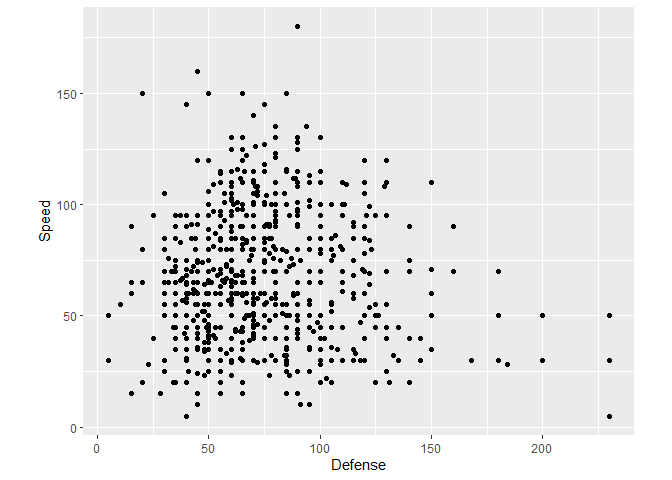
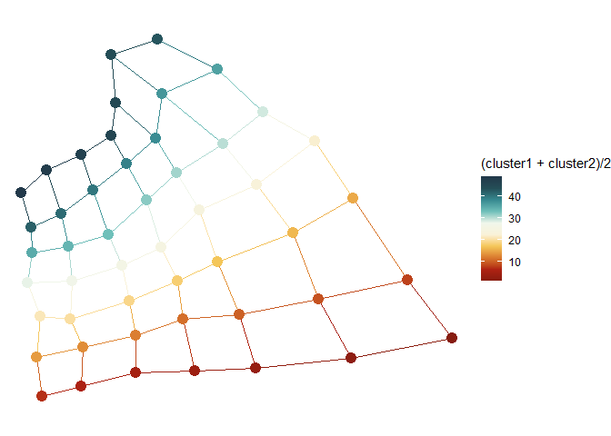
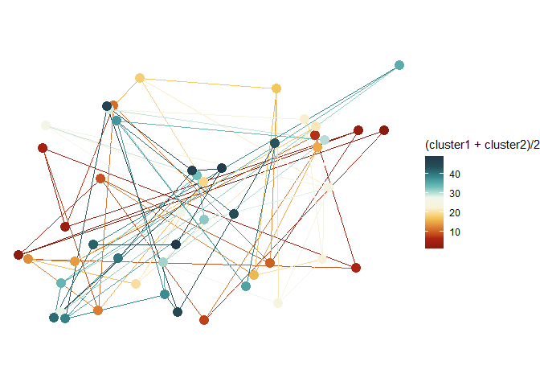
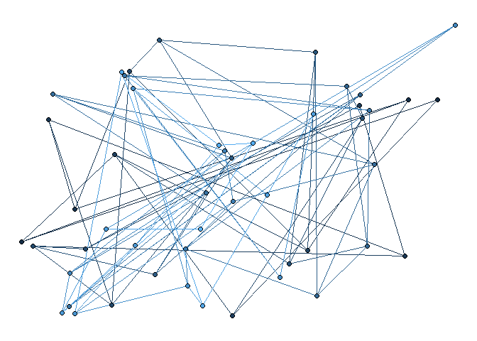
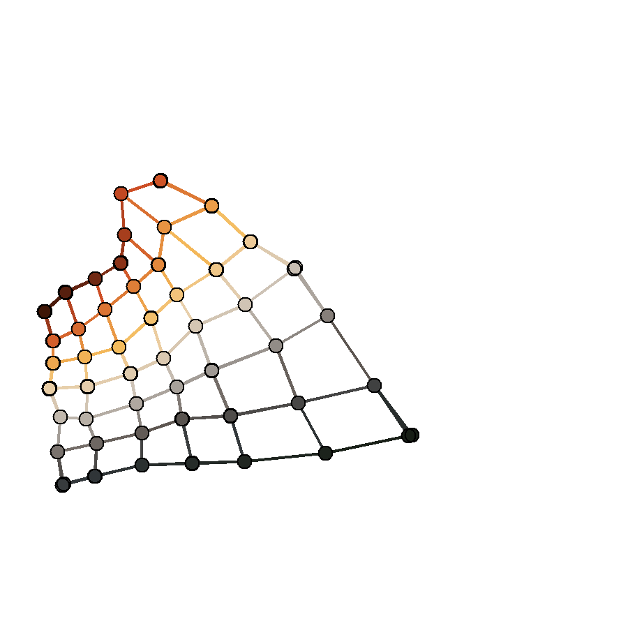
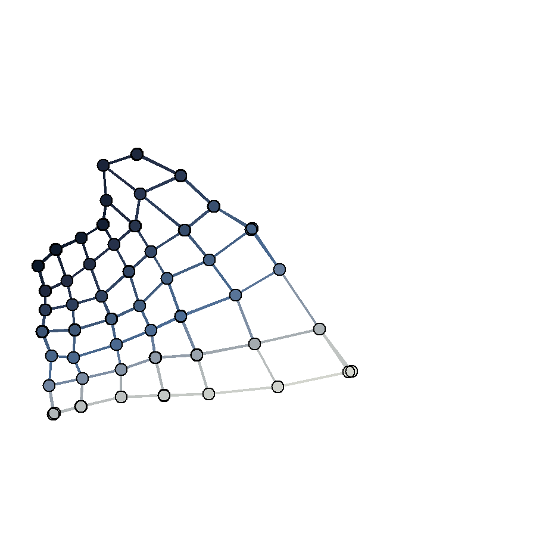
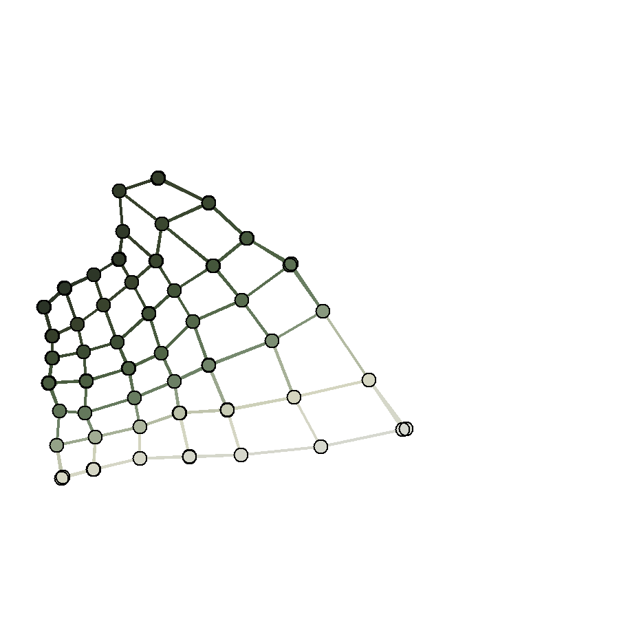

<!-- README.md is generated from README.Rmd. Please edit that file -->

# Color gradients gone wrong

<!-- badges: start -->
<!-- badges: end -->

For this prompt I will do revisit some machine learning stuff that I did
some time ago. Self-organizing maps begin as random arrangements and
become ordered. So I could run a self-organized map in reverse to go
from order to random.

I will use the following packages:

``` r
library(gganimate)
library(MexBrewer)
library(SOMbrero)
library(spdep)
library(tidyverse)
```

The dataset for the example is a collection of pokemon characters,
compiled from several sources, as described
[here](https://www.kaggle.com/shwetp/pokemon-visualizations-unsupervised-learning/data)

``` r
pokemon <- read_csv("pokemon_gen.csv")
```

Note that generation should be a factor, so lets change it:

``` r
pokemon$Generation <- as.factor(pokemon$Generation)
```

To illustrate SOMs in two dimensions, we will use only two of the
*stats* in the dataframe, `Defense` and `Speed`:

``` r
df <- select(pokemon, Defense, Speed)
```

Since these are two numerical attributes, we can visualize them using a
scattetplot:

``` r
ggplot(data = df, aes(x = Defense, y = Speed)) + 
  geom_point() +
  coord_fixed()
```

<!-- -->

Given these two attributes, a SOM can be trained using the function
`trainSOM` from `SOMbrero`. Only one argument is needed, the input data
`x.data`. Other arguments can be assigned by default. In what follows
the dimension of the map is given as 5-by-5, and I request that 100
intermediate steps be saved.

``` r
set.seed(593)
# run the SOM algorithm 
nrows <- 7
ncols <- 7
poke.som <- trainSOM(x.data=df, dimension=c(nrows, ncols), nb.save = 100, radius.type = "letremy", verbose = TRUE)
#> Self-Organizing Map algorithm...
#> 
#>   Parameters of the SOM
#> 
#>     SOM mode                       :  online 
#>     SOM type                       :  numeric 
#>     Affectation type               :  standard 
#>     Grid                           : 
#>       Self-Organizing Map structure
#> 
#>         Features   :
#>            topology     :  square 
#>            x dimension  :  7 
#>            y dimension  :  7 
#>            distance type:  letremy 
#> 
#>     Number of iterations           :  4000 
#>     Number of intermediate backups :  100 
#>     Initializing prototypes method :  random 
#>     Data pre-processing type       :  unitvar 
#>     Neighbourhood type             :  letremy 
#> 
#> 0 % done
#> 10 % done
#> 20 % done
#> 30 % done
#> 40 % done
#> 50 % done
#> 60 % done
#> 70 % done
#> 80 % done
#> 90 % done
#> 100 % done
```

The value of the function (output) is an object of class somRes:

``` r
class(poke.som)
#> [1] "somRes"
```

The summary reports some attributes of the map:

``` r
summary(poke.som)
#> 
#> Summary
#> 
#>       Class :  somRes 
#> 
#>       Self-Organizing Map object...
#>          online learning, type: numeric 
#>          7 x 7 grid with square topology
#>          neighbourhood type: letremy 
#>          distance type: letremy 
#> 
#>       Final energy     : 0.002365575 
#>       Topographic error: 0 
#> 
#>       ANOVA                : 
#> 
#>         Degrees of freedom :  48 
#> 
#>               F pvalue significativity
#> Defense 313.187      0             ***
#> Speed   402.835      0             ***
```

In this implementation of SOM, the energy is a measure of deformation of
the map, when conceptualized as an elastic membrane. The *topographic
error*, on the other hand, is the proportion of all data vectors for
which first and second best matching units are not adjacent. This
measures topology preservation.

In addition, the summary of the SOM includes the results of ANOVA, using
the the results of the clustering as the factor. This helps to assess
the relevance of each variable to discriminate between clusters. In the
present example, the results of ANOVA indicate that the means of the
variables for the clusters are significantly different.

The `somRes` object includes the following items:

-   clustering: the results of the clustering algorithm, which gives
    each observation a number that corresponds to their best matching
    unit (BMU).

-   prototypes: the final weights of the cells.

-   energy: the final energy.

-   backup: a list that includes the prototypes (the weights) at
    intermediate steps, the steps at which backups were recorded,
    intermediate clustering results, etc.

To visualize the evolution of the map we must define the topology of the
lattice:

``` r
poke.grid <- cell2nb(nrow = nrows, ncol = ncols, type = "rook")
```

The above gives the list of neighbors for neurons in the lattice.

The prototypes from the backups are extracted for each of the backups
and flattened for plotting. The topology obtained above can be used to
obtain the edges, by giving the start and endpoints by neighbors:

``` r
som.grid <- data.frame(x1 = numeric(length(poke.som$backup$prototypes) * length(unlist(poke.grid))))
count <- 0
for(p in 1:length(poke.som$backup$prototypes)){
  for(i in 1:(nrows * ncols)){
    for(j in 1:length(poke.grid[[i]])){
      count <- count + 1
      som.grid$x1[count] <- poke.som$backup$prototypes[[p]][i,1]
      som.grid$y1[count] <- poke.som$backup$prototypes[[p]][i,2]
      som.grid$x2[count] <- poke.som$backup$prototypes[[p]][poke.grid[[i]][j],1]
      som.grid$y2[count] <- poke.som$backup$prototypes[[p]][poke.grid[[i]][j],2]
      som.grid$backup[count] <- p
    }
  }  
}
```

And these are the points:

``` r
som.points <- do.call(rbind.data.frame, poke.som$backup$prototypes)
rownames(som.points) <- c()
som.points$backup <- rep(1:100, each = 49)
som.points$cluster <- rep(1:49, 100)
```

Make a concordance between edges and clusters:

``` r
concordance <- som.grid %>%
  filter(backup == 100) %>%
  left_join(som.points %>%
              filter(backup == 100) %>%
              select(-backup),
            by = c("x1" = "Defense", "y1" = "Speed")) %>%
  rename(cluster1 = cluster) %>%
  left_join(som.points %>%
              filter(backup == 100) %>%
              select(-backup),
            by = c("x2" = "Defense", "y2" = "Speed")) %>%
  rename(cluster2 = cluster)
```

Join the concordance to the grid table:

``` r
som.grid$cluster1 <- concordance %>% 
  pull(cluster1) %>% 
  rep(100)

som.grid$cluster2 <- concordance %>% 
  pull(cluster2) %>% 
  rep(100)
```

This is the final state of the map:

``` r
ggplot(data = som.points %>%
         filter(backup == 100), 
       aes(x = Defense, y = Speed)) +
  geom_segment(data = som.grid %>%
                 filter(backup == 100), 
               aes(x = x1, y = y1, xend = x2, yend = y2,
                   color = (cluster1 + cluster2)/2)) +
  geom_point(aes(color = cluster),
             size = 4) +
  scale_color_gradientn(colors = MexBrewer::mex.brewer("Revolucion")) +
  coord_equal() + 
  theme_void()
```

<!-- -->

This was the initial state of the map:

``` r
ggplot(data = som.points %>%
         filter(backup == 1), 
       aes(x = Defense, y = Speed)) +
  geom_segment(data = som.grid %>%
                 filter(backup == 1), 
               aes(x = x1, y = y1, xend = x2, yend = y2,
                   color = (cluster1 + cluster2)/2)) +
  geom_point(aes(color = cluster),
             size = 4) +
  scale_color_gradientn(colors = MexBrewer::mex.brewer("Revolucion")) +
  coord_equal() + 
  theme_void()
```

<!-- -->

The evolution of the map can be plotted as follows:

``` r
ggplot(data = som.points, 
       aes(x = Defense, y = 
             Speed)) +
  geom_segment(data = som.grid, 
               aes(x = x1, y = y1, xend = x2, yend = y2,
                   color = (cluster1 + cluster2)/2)) +
  geom_point(aes(color = cluster),
             size = 2) +
  geom_point(shape = 1,
             size = 2) +
  coord_equal() + 
  theme_void() +
  theme(legend.position = "none") +
  transition_time(backup) +  # The negative reverses the animation, the log makes it slower at the end
   ease_aes('cubic-in-out')
```

<!-- -->

To go from order to random reverse the time.

## Revolution

Create animation `Revolution` style:

``` r
ggw_animation <- ggplot(data = som.points, 
       aes(x = Defense, y = 
             Speed)) +
  geom_segment(data = som.grid, 
               aes(x = x1, y = y1, xend = x2, yend = y2,
                   color = (cluster1 + cluster2)/2)) +
  geom_point(aes(color = cluster),
             size = 2) +
  geom_point(shape = 1,
             size = 2) +
  scale_color_gradientn(colors = MexBrewer::mex.brewer("Revolucion")) +
  coord_equal() + 
  theme_void() +
  theme(legend.position = "none") +
  transition_time(-log(backup)) +  # The negative reverses the animation, the log makes it slower at the end
   ease_aes('cubic-in-out')
```

Animate the gradients gone wrong plot and save as gif:

``` r
# Do not knit, enter_fade() does not seem to play well with knitr
animate(ggw_animation,
        height = 3, 
        width = 3, 
        units = "in",
        res = 300)
```

<!-- -->

``` r
anim_save("ggw_animation_revolucion.gif")
```

## Ronda

Now `Ronda` style:

``` r
ggw_animation <- ggplot(data = som.points, 
       aes(x = Defense, y = 
             Speed)) +
  geom_segment(data = som.grid, 
               aes(x = x1, y = y1, xend = x2, yend = y2,
                   color = (cluster1 + cluster2)/2)) +
  geom_point(aes(color = cluster),
             size = 2) +
  geom_point(shape = 1,
             size = 2) +
  scale_color_gradientn(colors = MexBrewer::mex.brewer("Ronda")) +
  coord_equal() + 
  theme_void() +
  theme(legend.position = "none") +
  transition_time(-log(backup)) +  # The negative reverses the animation, the log makes it slower at the end
   ease_aes('cubic-in-out')
```

Animate the gradients gone wrong plot and save as gif:

``` r
# Do not knit, enter_fade() does not seem to play well with knitr
animate(ggw_animation,
        height = 3, 
        width = 3, 
        units = "in",
        res = 300)
```

<!-- -->

``` r
anim_save("ggw_animation_ronda.gif")
```

## Atentado

Now `Ronda` style:

``` r
ggw_animation <- ggplot(data = som.points, 
       aes(x = Defense, y = 
             Speed)) +
  geom_segment(data = som.grid, 
               aes(x = x1, y = y1, xend = x2, yend = y2,
                   color = (cluster1 + cluster2)/2)) +
  geom_point(aes(color = cluster),
             size = 2) +
  geom_point(shape = 1,
             size = 2) +
  scale_color_gradientn(colors = MexBrewer::mex.brewer("Atentado")) +
  coord_equal() + 
  theme_void() +
  theme(legend.position = "none") +
  transition_time(-log(backup)) +  # The negative reverses the animation, the log makes it slower at the end
   ease_aes('cubic-in-out')
```

Animate the gradients gone wrong plot and save as gif:

``` r
# Do not knit, enter_fade() does not seem to play well with knitr
animate(ggw_animation,
        height = 3, 
        width = 3, 
        units = "in",
        res = 300)
```

<!-- -->

``` r
anim_save("ggw_animation_atentado.gif")
```

## Frida

Now `Frida` style:

``` r
ggw_animation <- ggplot(data = som.points, 
       aes(x = Defense, y = 
             Speed)) +
  geom_segment(data = som.grid, 
               aes(x = x1, y = y1, xend = x2, yend = y2,
                   color = (cluster1 + cluster2)/2)) +
  geom_point(aes(color = cluster),
             size = 2) +
  geom_point(shape = 1,
             size = 2) +
  scale_color_gradientn(colors = MexBrewer::mex.brewer("Frida")) +
  coord_equal() + 
  theme_void() +
  theme(legend.position = "none") +
  transition_time(-log(backup)) +  # The negative reverses the animation, the log makes it slower at the end
   ease_aes('cubic-in-out')
```

Animate the gradients gone wrong plot and save as gif:

``` r
# Do not knit, enter_fade() does not seem to play well with knitr
animate(ggw_animation,
        height = 3, 
        width = 3, 
        units = "in",
        res = 300)
```

<!-- -->

``` r
anim_save("ggw_animation_frida.gif")
```

## Ronda

Now `Concha` style:

``` r
ggw_animation <- ggplot(data = som.points, 
       aes(x = Defense, y = 
             Speed)) +
  geom_segment(data = som.grid, 
               aes(x = x1, y = y1, xend = x2, yend = y2,
                   color = (cluster1 + cluster2)/2)) +
  geom_point(aes(color = cluster),
             size = 2) +
  geom_point(shape = 1,
             size = 2) +
  scale_color_gradientn(colors = MexBrewer::mex.brewer("Concha")) +
  coord_equal() + 
  theme_void() +
  theme(legend.position = "none") +
  transition_time(-log(backup)) +  # The negative reverses the animation, the log makes it slower at the end
   ease_aes('cubic-in-out')
```

Animate the gradients gone wrong plot and save as gif:

``` r
# Do not knit, enter_fade() does not seem to play well with knitr
animate(ggw_animation,
        height = 3, 
        width = 3, 
        units = "in",
        res = 300)
```

<!-- -->

``` r
anim_save("ggw_animation_concha.gif")
```
