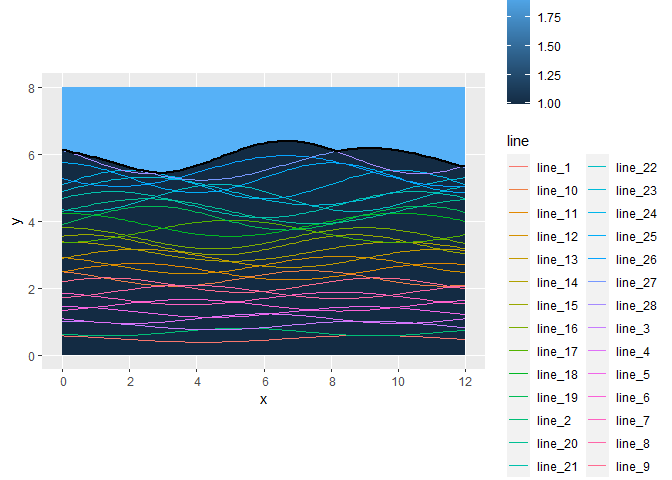
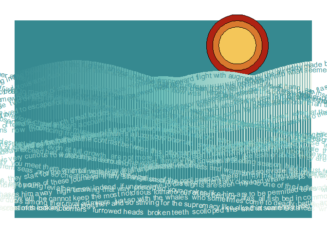
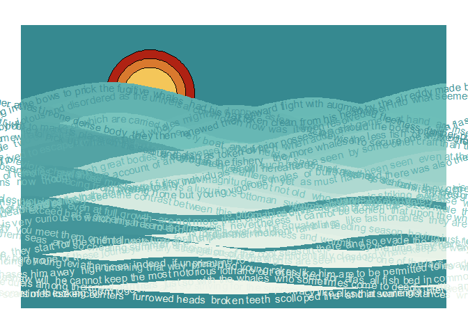

<!-- README.md is generated from README.Rmd. Please edit that file -->

# Text

<!-- badges: start -->
<!-- badges: end -->

For this prompt I want to try the package
[{geomtextpath}](https://github.com/AllanCameron/geomtextpath) to add
curvy text to my plot. I thought this would be neat to try with the
Fidenza algorithm, and it is is maybe simpler to implement with some
simpler waves (no underlying flow field). So I am inspired to make some
waves with text from Melville’s Moby Dick (I played around with it a
little bit when I was learning about computer assisted text analysis a
few years back). I will also reuse elements from my experiments with
[sand](https://github.com/paezha/genuary2022/tree/master/15-sand).

Today I will use the following packages:

``` r
library(geomtextpath)
library(lwgeom)
library(MexBrewer)
library(sf)
library(tidyverse)
```

## Preparing text

The steps to process the text are from this [blog
post](https://rpubs.com/Lieto/100943) by Vesa Kuoppala.

I grabbed the text from this
[repository](https://github.com/mjockers/TAWR2/blob/master/data/text/melville.txt)

``` r
text1.v <- scan("melville.txt", what="character", sep="\n")
```

Find where the main text starts and ends:

``` r
start.v <- which(text1.v == "CHAPTER 1. Loomings.")
end.v <- which(text1.v == "orphan.")
```

Separate any metadata from the text of the novel proper:

``` r
start.metadata.v <- text1.v[1:start.v - 1]
end.metadata.v <- text1.v[(end.v + 1): length(text1.v)]
metadata.v <- c(start.metadata.v, end.metadata.v)
novel.lines.v <- text1.v[start.v:end.v]
```

Join all the lines into one long string and convert to lower case:

``` r
novel.lower.v <- novel.lines.v %>%
  paste(collapse = " ") %>%
  tolower()
```

Collect only words to list and simplify to vector:

``` r
moby.words.l <- strsplit(novel.lower.v, "\\W")
moby.word.v <- unlist(moby.words.l)
```

Convert text to a single string:

``` r
moby.text <- paste(moby.word.v, collapse = " ")
```

## Creating a seascape

Create a polygon of to become the frame for my “landscape”:

``` r
container_polygon <- matrix(c(0, 0, 
                              0, 8, 
                              12, 8,  
                              12, 0,
                              0, 0),
                            ncol = 2,
                            byrow = TRUE)

# Convert coordinates to polygons and then to simple features
container_polygon <- data.frame(id = 1,
                                r = NA,
                                geometry = st_polygon(list(container_polygon)) %>% 
                                  st_sfc()) %>% 
  st_as_sf()
```

Plot this initial container:

``` r
ggplot() + 
  geom_sf(data = container_polygon)
```

<!-- -->

Make waves:

``` r
# Initialize data frame
df_lines <- data.frame(x = seq(0,
                               12,
                               0.1))

# Initialize position in y
vjust <- seq(0.5, 6, 0.2)

# Initialize amplitude of waves
Amax <- 0.5
Amin <- 0.1
A <- seq(Amin, Amax, (Amax - Amin)/length(vjust))[1:length(vjust)]

# Initialize inverse of f
f <- seq(8, 10, 1)

# Initialize phase
phi <- seq(0, 2 * pi, pi/6)


# Initialize counter
count <- 0

# Make waves
for(i in vjust){
  count <- count + 1
  df_lines[[paste0("line_", count, collapse = "")]] <- (A[count] * cos(2 * pi * 1/f[sample.int(length(f), 1)] * df_lines$x + phi[sample.int(length(phi), 1)]) + vjust[count])
}

# Pivot longer
df_lines <- df_lines %>%
  pivot_longer(cols = -x, names_to = "line", values_to = "y")
```

Plot:

``` r
ggplot() +
  geom_sf(data = container_polygon,
          color = NA,
          fill = "lightgray") +
  geom_line(data = df_lines,
            aes(x = x, 
                y = y, 
                color = line))
```

<!-- -->

Make “blade for splitting container:

``` r
df_blade <- df_lines %>%
  group_by(x) %>%
  summarize(y = max(y),
            .groups = "drop")
```

Plot blade:

``` r
ggplot() +
  geom_sf(data = container_polygon,
          color = NA,
          fill = "lightgray") +
  geom_line(data = df_lines,
            aes(x = x, 
                y = y, 
                color = line)) +
  geom_line(data = df_blade,
            aes(x = x,
                y = y),
            color = "black",
            size = 1)
```

<!-- -->

Turn blade to sf:

``` r
blade <- matrix(c(df_blade$x,
                  df_blade$y),
                nrow = nrow(df_blade),
                byrow = FALSE)

# Convert coordinates to lines and then to simple features
blade <- data.frame(id = 1,
                    geometry = st_linestring(blade) %>% 
                      st_sfc()) %>% 
  st_as_sf()
```

Split original container:

``` r
container_2 <- container_polygon %>%
  st_split(blade)
```

Extract polygons and give them new ids:

``` r
container_2 <- container_2 %>%
  st_collection_extract(c("POLYGON")) %>%
  mutate(id = 1:n())
```

Plot:

``` r
ggplot() +
  geom_sf(data = container_2,
          aes(fill = id),
          color = NA) +
  geom_line(data = df_lines,
            aes(x = x, 
                y = y, 
                color = line)) +
  geom_line(data = df_blade,
            aes(x = x,
                y = y),
            color = "black",
            size = 1)
```

<!-- -->

Excellent.

Now put all of it together.

## Making waves with text

Make waves:

``` r
# Initialize data frame
df_lines <- data.frame(x = seq(0,
                               12,
                               0.1))

# Initialize position in y
vjust <- seq(0.5, 6, 0.2)

# Initialize amplitude of waves
Amax <- 0.5
Amin <- 0.1
A <- seq(Amin, Amax, (Amax - Amin)/length(vjust))[1:length(vjust)]

# Initialize inverse of f
f <- seq(8, 10, 1)

# Initialize phase
phi <- seq(0, 2 * pi, pi/6)


# Initialize counter
count <- 0

# Make waves
for(i in vjust){
  count <- count + 1
  df_lines[[paste0("line_", count, collapse = "")]] <- (A[count] * cos(2 * pi * 1/f[sample.int(length(f), 1)] * df_lines$x + phi[sample.int(length(phi), 1)]) + vjust[count])
}

# Pivot longer
df_lines <- df_lines %>%
  pivot_longer(cols = -x, names_to = "line", values_to = "y")
```

Make “blade for splitting container:

``` r
df_blade <- df_lines %>%
  group_by(x) %>%
  summarize(y = max(y),
            .groups = "drop")
```

Turn blade to sf:

``` r
blade <- matrix(c(df_blade$x,
                  df_blade$y),
                nrow = nrow(df_blade),
                byrow = FALSE)

# Convert coordinates to lines and then to simple features
blade <- data.frame(id = 1,
                    geometry = st_linestring(blade) %>% 
                      st_sfc()) %>% 
  st_as_sf()
```

Split original container:

``` r
container_2 <- container_polygon %>%
  st_split(blade)
```

Extract polygons and give them new ids:

``` r
container_2 <- container_2 %>%
  st_collection_extract(c("POLYGON")) %>%
  mutate(id = 1:n())
```

Separate container for sky and smash the rest. There are two ways to do
this, in one go and sequentially, and the algorithm behaves differently.
Try in one go:

``` r
container_sky <- container_2 %>%
  filter(id == 2)

# Recreate blade
blade <- matrix(c(df_lines$x,
                  df_lines$y),
                nrow = nrow(df_lines),
                byrow = FALSE)

# Convert coordinates to lines and then to simple features
blade <- data.frame(id = 1,
                    geometry = st_linestring(blade) %>% 
                      st_sfc()) %>% 
  st_as_sf()

# Split the container for the sea
container_sea_1 <- container_2 %>%
  filter(id == 1) %>%
  st_split(blade) %>%
  st_collection_extract(c("POLYGON")) %>%
  mutate(id = 1:n())
```

Split the container for sea sequentially instead of in one go:

``` r
# Initialize container
container_sea_2 <- container_2 %>%
  filter(id == 1)

for(i in 1:length(vjust)){
  # Recreate blade
  df_blade <- df_lines %>%
    filter(line == paste0("line_", i, collapse = ""))
  
  blade <- matrix(c(df_blade$x,
                    df_blade$y),
                  nrow = nrow(df_blade),
                  byrow = FALSE)
  
  # Convert coordinates to lines and then to simple features
  blade <- data.frame(id = 1,
                      geometry = st_linestring(blade) %>% 
                        st_sfc()) %>% 
    st_as_sf()
  
  # Split the container for the sea
  container_sea_2 <- container_sea_2 %>%
                           st_split(blade) %>%
                           st_collection_extract(c("POLYGON")) %>%
                           mutate(id = 1:n())
  
}
```

Extract text for landscape:

``` r
# Number of characters per line
n_char <- 155
l_text <- n_char * length(vjust)

# extract text fragment
moby.fragment <- moby.text %>%
  str_sub(runif(1, 1, str_length(moby.text) - l_text) %>% 
            floor(),
          str_length(moby.text))

# Assemble data frame
df_text <- data.frame(line = "line_",
                      n = length(vjust):1) %>%
  transmute(line = paste0(line, n)) %>%
  mutate(start_text = seq(1, 
                          n_char * length(vjust), 
                          n_char),
         end_text = seq(n_char, 
                        n_char * length(vjust), 
                        n_char),
         text = str_sub(moby.fragment, 
                        start_text, 
                        end_text))
```

Join to lines data frame:

``` r
df_lines_text <- df_lines %>%
  left_join(df_text,
            by = "line")
```

Plot with sea split in one go:

``` r
# Color palette
col_palette <- mex.brewer("Revolucion")

# Create a sun
sun <- data.frame(disk = 1:3,
                  x = runif(1, 2, 9), 
                  y = runif(1, 6, 7)) %>%
  st_as_sf(coords = c("x", "y")) %>%
  st_buffer(dist = c(0.75, 1.00, 1.25))

# Plot
ggplot() +
  # Plot "sky" polygon
  geom_sf(data = container_sky,
          color = NA,
          fill = col_palette[sample.int(10, 1)]) +
  # Plot "sun"
  geom_sf(data = sun[3,],
          color = "black",
          fill = col_palette[2]) +
  geom_sf(data = sun[2,],
          color = "black",
          fill = col_palette[3]) +
  geom_sf(data = sun[1,],
          color = "black",
          fill = col_palette[4]) +
  # Plot "sea" polygon
  geom_sf(data = container_sea_1,
          aes(fill = id),
          color = NA) +
  # Plot "Waves"
  geom_textpath(data = df_lines_text,
                aes(x,
                    y, 
                    label = text,
                    color = y), 
                #color = "white",
                size = 4,
                vjust = 1, 
                text_only = TRUE) +
  scale_color_gradientn(colors = col_palette[6:8]) +
  scale_fill_gradientn(colors = rev(col_palette[6:8])) +
  theme_void() +
  theme(legend.position = "none")
```

<!-- -->

``` r
ggsave(filename = "text-sea-split-simultaneously-revolucion.png", 
       width = 12, 
       height = 8, 
       units = "in")
```

Plot with sea split sequentially:

``` r
# Color palette
col_palette <- mex.brewer("Revolucion")

# Create a sun
sun <- data.frame(disk = 1:3,
                  x = runif(1, 2, 9), 
                  y = runif(1, 6, 7)) %>%
  st_as_sf(coords = c("x", "y")) %>%
  st_buffer(dist = c(0.75, 1.00, 1.25))

# Plot
ggplot() +
  # Plot "sky" polygon
  geom_sf(data = container_sky,
          color = NA,
          fill = col_palette[sample.int(10, 1)]) +
  # Plot "sun"
  geom_sf(data = sun[3,],
          color = "black",
          fill = col_palette[2]) +
  geom_sf(data = sun[2,],
          color = "black",
          fill = col_palette[3]) +
  geom_sf(data = sun[1,],
          color = "black",
          fill = col_palette[4]) +
  # Plot "sea" polygon
  geom_sf(data = container_sea_2,
          aes(fill = id),
          color = NA) +
  # Plot "Waves"
  geom_textpath(data = df_lines_text,
                aes(x,
                    y, 
                    label = text,
                    color = y), 
                #color = "white",
                size = 4,
                vjust = 1, 
                text_only = TRUE) +
  scale_color_gradientn(colors = col_palette[6:8]) +
  scale_fill_gradientn(colors = rev(col_palette[6:8])) +
  theme_void() +
  theme(legend.position = "none")
```

<!-- -->

``` r
ggsave(filename = "text-sea-split-sequentially-revolucion.png", 
       width = 12, 
       height = 8, 
       units = "in")
```

I think I like the second effect more than the first.
