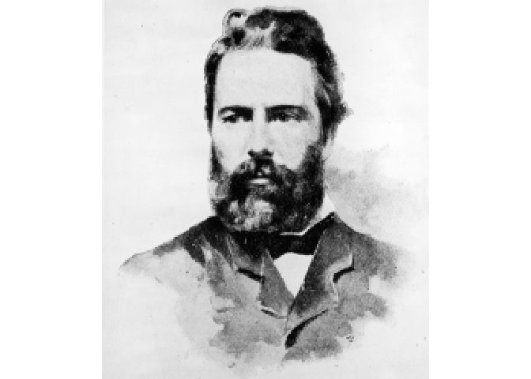
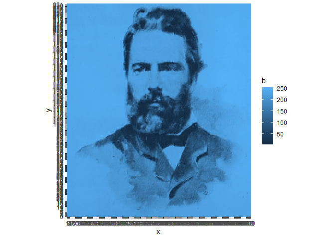
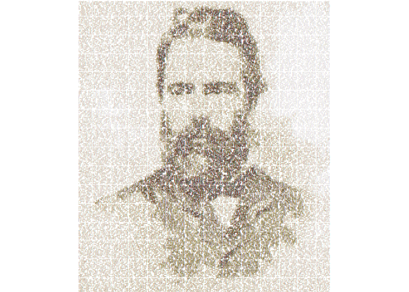

<!-- README.md is generated from README.Rmd. Please edit that file -->

# Combine two previous pieces

<!-- badges: start -->
<!-- badges: end -->

The second prompt for [genuary](https://genuary.art) 2022 is “Dithering”
and Day 19 was Text/Typography. Here I combine an image of Melville with
text from Moby Dick.

I will use the following packages:

``` r
library(magick)
library(MexBrewer)
library(tidyverse)
```

## Process image

Read the image using `magick::image_read()`:

``` r
#melville <- image_read("melville_lg.jpg")
melville <- image_read("melville-2.jpg")
```

Check the size of the image:

``` r
image_info(melville)
#> # A tibble: 1 x 7
#>   format width height colorspace matte filesize density
#>   <chr>  <int>  <int> <chr>      <lgl>    <int> <chr>  
#> 1 JPEG    2208   2560 sRGB       FALSE   842061 72x72
```

Scale image:

``` r
melville_scaled <- melville %>% 
  image_scale("200")
```

Change the colorspace to gray:

``` r
melville_scaled <- melville_scaled %>% 
  image_convert(colorspace = "gray")
```

This is the image after changing to grayscale:

``` r
magick::image_ggplot(melville_scaled)
```

<!-- -->

Create array and number rows and columns:

``` r
img_array <- drop(as.integer(melville_scaled[[1]]))
rownames(img_array) <- 1:nrow(img_array)
colnames(img_array) <- ncol(img_array):1
```

Create data frame from array and rename columns

``` r
img_df <- as.data.frame.table(img_array) %>% 
  `colnames<-`(c("y", "x", "b")) %>%
  mutate(x = as.numeric(x),
         y = - (as.numeric(y) - image_info(melville_scaled)$height))
```

## Process text

``` r
text1.v <- scan("melville.txt", what="character", sep="\n")
```

Find where the main text starts and ends:

``` r
start.v <- which(text1.v == "CHAPTER 1. Loomings.")
end.v <- which(text1.v == "orphan.")
```

Separate any metadata from the text of the novel proper:

``` r
start.metadata.v <- text1.v[1:start.v - 1]
end.metadata.v <- text1.v[(end.v + 1): length(text1.v)]
metadata.v <- c(start.metadata.v, end.metadata.v)
novel.lines.v <- text1.v[start.v:end.v]
```

Join all the lines into one long string and convert to lower case:

``` r
novel.lower.v <- novel.lines.v %>%
  paste(collapse = " ") %>%
  tolower()
```

Collect only words to list and simplify to vector:

``` r
moby.words.l <- strsplit(novel.lower.v, "\\W")
moby.word.v <- unlist(moby.words.l)
```

Convert text to a single string:

``` r
moby.text <- paste(moby.word.v, collapse = " ")
```

``` r
moby.fragment <- moby.text %>%
  str_sub(1, image_info(melville_scaled)$width * image_info(melville_scaled)$height)
```

Create data frame with text:

``` r
text_df <- data.frame(expand.grid(x = 1:max(img_df$x),
                                  y = max(img_df$y):0),
            text = moby.fragment %>%
  str_extract_all(boundary("character")) %>% 
  unlist())
```

## Put together

Join image and text data frames:

``` r
img_df <- img_df %>%
  left_join(text_df,
            by = c("x", "y")) %>%
  select(x, y, b, text) %>%
  mutate(x = factor(x),
         y = factor(y))
```

Plot image:

``` r
ggplot(img_df) +
  geom_point(aes(x = x, y = y, color = b)) +
  coord_equal()
```

<!-- -->

Plot image with text:

``` r
col_palette <- mex.brewer("Tierra")

ggplot(img_df) +
  geom_text(aes(x = x, 
                y = y, 
                color = -b, 
                label = text,
                size = -b)) +
  coord_equal() + 
  scale_color_gradientn(colors = col_palette) +
  scale_size(range = c(0.75, 1.55)) +
  theme_void() +
  theme(legend.position = "none")
```

<!-- -->

``` r
ggsave("melville-text-tierra.png", 
       width = 7,
       units = "in")
#> Saving 7 x 5 in image
```
