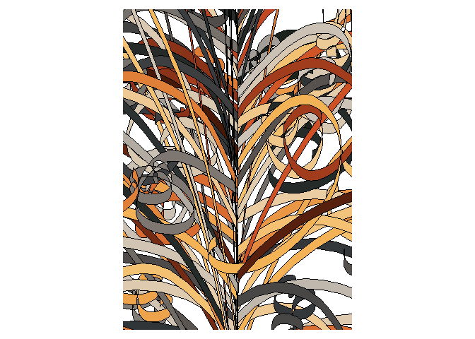
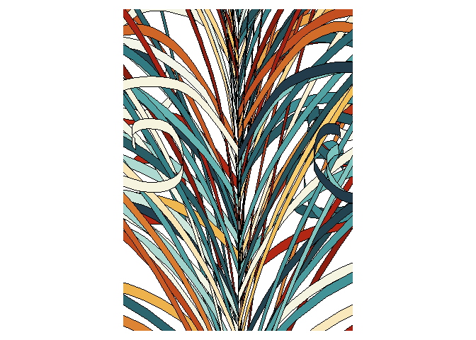
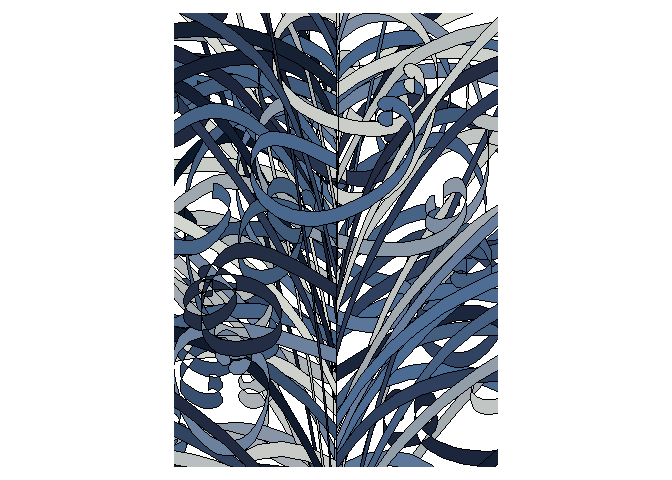
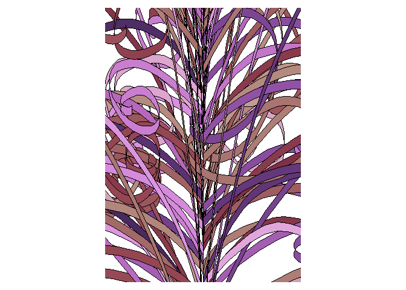
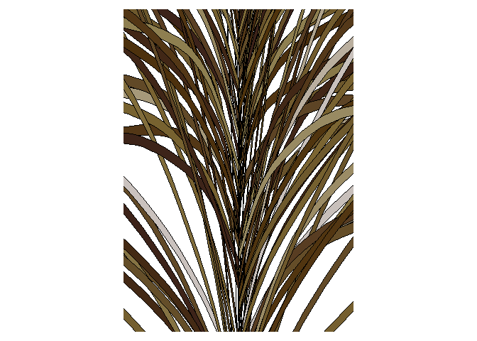

<!-- README.md is generated from README.Rmd. Please edit that file -->

# Abstract vegatation

<!-- badges: start -->
<!-- badges: end -->

Too busy today writing to try to create abstract vegetation from a
scratch. Thankfully, [Pierre Casadebaig](https://github.com/picasa) has
generously made his code public, and I have been very curious to explore
his asemic characters and vegetation-like plots. So this is a great
opportunity for it!

As explained
[here](https://github.com/picasa/generative_examples/blob/master/R/sequence_collatz.rmd#L25),
vegetation-like shapes can be obtained by defining a curve that maps a
sequence of integers to segment lengths, changing the angle between
segments by some pre-determined amount. Nodes are made of multiple
curves, and stems are made of multiple nodes.

This example uses Casadebaig’s package
[{generate}](https://github.com/picasa/generate):

``` r
library(ggforce)
#> Loading required package: ggplot2
library(MexBrewer)
library(tidyverse)
#> -- Attaching packages --------------------------------------- tidyverse 1.3.1 --
#> v tibble  3.1.6     v dplyr   1.0.7
#> v tidyr   1.1.4     v stringr 1.4.0
#> v readr   2.1.1     v forcats 0.5.1
#> v purrr   0.3.4
#> -- Conflicts ------------------------------------------ tidyverse_conflicts() --
#> x dplyr::filter() masks stats::filter()
#> x dplyr::lag()    masks stats::lag()
# functions
# remotes::install_github("picasa/generate")
library(generate)
```

Here I create a few figures with a single node and dense polygons. This
is basically Casadebaig’s example with just some minor changes in the
inputs. Instead of using the `render_node()` function, I extract the
rendering commands to have more control on the aspect of the plot. I
will also try different color palettes from my package [{MexBrewer}]().

## Atentado

``` r
# plot a single node with dense polygons
p_seed = 12
p_node = 300
p_imax = 100
p_lmax = 3000
p_angle = 60
p_shift = 4
p_width = c(0, 10)
p_render = "spline"

# seeds 4, 8, 11
data_dense <- gen_node(n = p_node, 
                       imax = p_imax, 
                       lmax = p_lmax,
                       amin = -p_angle, 
                       amax = p_angle, 
                       shift = p_shift, 
                       width = p_width, 
                       seed = p_seed, 
                       method = p_render)
#> Joining, by = c("id", "c_l")

# Create random variable to add colors
col_table <- data.frame(id = 1:max(data_dense$id)) %>%
  mutate(color = runif(max(id)))

# Choose color palette
col_palette <- MexBrewer::mex.brewer("Atentado")

# Join to data table
data_dense_plus <- data_dense %>%
  left_join(col_table,
            by = c("id"))

data_dense_plus %>%
  ggplot(aes(x,y, group = id)) +
  geom_shape(aes(fill = color),
             color="black",
             size = 0.5, 
             radius = grid::unit(0, 'pt')) +
  coord_fixed(xlim = c(-100, 100),
                       ylim = c(180,460)) +
  scale_fill_gradientn(colors = col_palette) +
  theme_void() +
  theme(legend.position = "none",
        plot.margin = rep(grid::unit(10, "pt"), 4))
```

<!-- -->

Save plot:

``` r
ggsave(file = "abstract-vegetation-atentado.png",
  width = 7, 
  height = 7,
  dpi = 300, 
  scale = 1,
  units="in")
```

## Revolucion

``` r
# plot a single node with dense polygons
p_seed = 53
p_node = 300
p_imax = 100
p_lmax = 3000
p_angle = 35
p_shift = 4
p_width = c(0, 10)
p_render = "spline"

# seeds 4, 8, 11
data_dense <- gen_node(n = p_node, 
                       imax = p_imax, 
                       lmax = p_lmax,
                       amin = -p_angle, 
                       amax = p_angle, 
                       shift = p_shift, 
                       width = p_width, 
                       seed = p_seed, 
                       method = p_render)
#> Joining, by = c("id", "c_l")

# Create random variable to add colors
col_table <- data.frame(id = 1:max(data_dense$id)) %>%
  mutate(color = runif(max(id)))

# Choose color palette
col_palette <- MexBrewer::mex.brewer("Revolucion")

# Join to data table
data_dense_plus <- data_dense %>%
  left_join(col_table,
            by = c("id"))

data_dense_plus %>%
  ggplot(aes(x,y, group = id)) +
  geom_shape(aes(fill = color),
             color="black",
             size = 0.5, 
             radius = grid::unit(0, 'pt')) +
  coord_fixed(xlim = c(-100, 100),
                       ylim = c(180,460)) +
  scale_fill_gradientn(colors = col_palette) +
  theme_void() +
  theme(legend.position = "none",
        plot.margin = rep(grid::unit(10, "pt"), 4))
```

<!-- -->

Save plot:

``` r
ggsave(file = "abstract-vegetation-revolucion.png",
  width = 7, 
  height = 7,
  dpi = 300, 
  scale = 1,
  units="in")
```

## Frida

``` r
# plot a single node with dense polygons
p_seed = 8
p_node = 300
p_imax = 100
p_lmax = 3000
p_angle = 70
p_shift = 4
p_width = c(0, 10)
p_render = "spline"

# seeds 4, 8, 11
data_dense <- gen_node(n = p_node, 
                       imax = p_imax, 
                       lmax = p_lmax,
                       amin = -p_angle, 
                       amax = p_angle, 
                       shift = p_shift, 
                       width = p_width, 
                       seed = p_seed, 
                       method = p_render)
#> Joining, by = c("id", "c_l")

# Create random variable to add colors
col_table <- data.frame(id = 1:max(data_dense$id)) %>%
  mutate(color = runif(max(id)))

# Choose color palette
col_palette <- MexBrewer::mex.brewer("Frida")

# Join to data table
data_dense_plus <- data_dense %>%
  left_join(col_table,
            by = c("id"))

data_dense_plus %>%
  ggplot(aes(x,y, group = id)) +
  geom_shape(aes(fill = color),
             color="black",
             size = 0.5, 
             radius = grid::unit(0, 'pt')) +
  coord_fixed(xlim = c(-100, 100),
                       ylim = c(180,460)) +
  scale_fill_gradientn(colors = col_palette) +
  theme_void() +
  theme(legend.position = "none",
        plot.margin = rep(grid::unit(10, "pt"), 4))
```

<!-- -->

Save plot:

``` r
ggsave(file = "abstract-vegetation-frida.png",
  width = 7, 
  height = 7,
  dpi = 300, 
  scale = 1,
  units="in")
```

## Ronda

``` r
# plot a single node with dense polygons
p_seed = 30
p_node = 300
p_imax = 100
p_lmax = 3000
p_angle = 45
p_shift = 4
p_width = c(0, 10)
p_render = "spline"

# seeds 4, 8, 11
data_dense <- gen_node(n = p_node, 
                       imax = p_imax, 
                       lmax = p_lmax,
                       amin = -p_angle, 
                       amax = p_angle, 
                       shift = p_shift, 
                       width = p_width, 
                       seed = p_seed, 
                       method = p_render)
#> Joining, by = c("id", "c_l")

# Create random variable to add colors
col_table <- data.frame(id = 1:max(data_dense$id)) %>%
  mutate(color = runif(max(id)))

# Choose color palette
col_palette <- MexBrewer::mex.brewer("Ronda")

# Join to data table
data_dense_plus <- data_dense %>%
  left_join(col_table,
            by = c("id"))

data_dense_plus %>%
  ggplot(aes(x,y, group = id)) +
  geom_shape(aes(fill = color),
             color="black",
             size = 0.5, 
             radius = grid::unit(0, 'pt')) +
  coord_fixed(xlim = c(-100, 100),
                       ylim = c(180,460)) +
  scale_fill_gradientn(colors = col_palette) +
  theme_void() +
  theme(legend.position = "none",
        plot.margin = rep(grid::unit(10, "pt"), 4))
```

<!-- -->

Save plot:

``` r
ggsave(file = "abstract-vegetation-ronda.png",
  width = 7, 
  height = 7,
  dpi = 300, 
  scale = 1,
  units="in")
```

## Tierra

``` r
# plot a single node with dense polygons
p_seed = 3
p_node = 300
p_imax = 100
p_lmax = 3000
p_angle = 20
p_shift = 4
p_width = c(0, 10)
p_render = "spline"

# seeds 4, 8, 11
data_dense <- gen_node(n = p_node, 
                       imax = p_imax, 
                       lmax = p_lmax,
                       amin = -p_angle, 
                       amax = p_angle, 
                       shift = p_shift, 
                       width = p_width, 
                       seed = p_seed, 
                       method = p_render)
#> Joining, by = c("id", "c_l")

# Create random variable to add colors
col_table <- data.frame(id = 1:max(data_dense$id)) %>%
  mutate(color = runif(max(id)))

# Choose color palette
col_palette <- MexBrewer::mex.brewer("Tierra")

# Join to data table
data_dense_plus <- data_dense %>%
  left_join(col_table,
            by = c("id"))

data_dense_plus %>%
  ggplot(aes(x,y, group = id)) +
  geom_shape(aes(fill = color),
             color="black",
             size = 0.5, 
             radius = grid::unit(0, 'pt')) +
  coord_fixed(xlim = c(-100, 100),
                       ylim = c(180,460)) +
  scale_fill_gradientn(colors = col_palette) +
  theme_void() +
  theme(legend.position = "none",
        plot.margin = rep(grid::unit(10, "pt"), 4))
```

<!-- -->

Save plot:

``` r
ggsave(file = "abstract-vegetation-tierra.png",
  width = 7, 
  height = 7,
  dpi = 300, 
  scale = 1,
  units="in")
```
