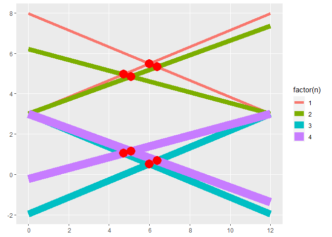

<!-- README.md is generated from README.Rmd. Please edit that file -->

# Perspective

<!-- badges: start -->
<!-- badges: end -->

This will be a quick experiment with two point perspective.

I use these package:

``` r
library(MexBrewer)
library(sf)
#> Linking to GEOS 3.9.1, GDAL 3.2.1, PROJ 7.2.1; sf_use_s2() is TRUE
library(tidyverse)
#> -- Attaching packages --------------------------------------- tidyverse 1.3.1 --
#> v ggplot2 3.3.5     v purrr   0.3.4
#> v tibble  3.1.6     v dplyr   1.0.7
#> v tidyr   1.1.4     v stringr 1.4.0
#> v readr   2.1.1     v forcats 0.5.1
#> -- Conflicts ------------------------------------------ tidyverse_conflicts() --
#> x dplyr::filter() masks stats::filter()
#> x dplyr::lag()    masks stats::lag()
```

## Create a canvas

Create a polygon of to become the frame for my “towerscape”:

``` r
container_polygon <- matrix(c(0, -2, 
                              0, 8, 
                              12, 8,  
                              12, -2,
                              0, -2),
                            ncol = 2,
                            byrow = TRUE)

# Convert coordinates to polygons and then to simple features
container_polygon <- data.frame(id = "canvas",
                                geometry = st_polygon(list(container_polygon)) %>% 
                                  st_sfc()) %>% 
  st_as_sf()
```

Plot this initial container:

``` r
ggplot() + 
  geom_sf(data = container_polygon)
```

<!-- -->

## Create a “horizon”

``` r
horizon <- matrix(c(0, 3, 
                    12, 3),
                  ncol = 2,
                  byrow = TRUE)

# Convert coordinates to a string and then to simple features
horizon <- data.frame(id = "horizon",
                      geometry = st_linestring(horizon) %>% 
                        st_sfc()) %>% 
  st_as_sf()
```

Plot:

``` r
ggplot() + 
  geom_sf(data = container_polygon) +
  geom_sf(data = horizon)
```

<!-- -->

## Draw perspective lines

The perspective lines here have the property that they are symmetrical
about the “horizon” (but do they have to be??):

``` r
width <- 12
height <- 3

theta_1 <- pi/8
theta_2 <- pi/9
theta_3 <- pi/8
theta_4 <- pi/12

persp_lines_1 <- st_multipoint(matrix(c(0, height, 
                                        width, height + width * tan(theta_1), 
                                        0, height, 
                                        width, height + width * tan(theta_2), 
                                        0, height, 
                                        width, height - width * tan(theta_1), 
                                        0, height, 
                                        width, height - width * tan(theta_2)), 
                                      ncol = 2, 
                                      byrow = TRUE), 
                               dim = "XY")

persp_lines_2 <- st_multipoint(matrix(c(width, height, 
                                        0, height + width * tan(theta_3), 
                                        width, height, 
                                        0, height + width * tan(theta_4), 
                                        width, height, 
                                        0, height - width * tan(theta_3), 
                                        width, height, 
                                        0, height - width * tan(theta_4)), 
                                      ncol = 2, 
                                      byrow = TRUE), 
                               dim = "XY")

persp_lines_1 <- st_cast(st_geometry(persp_lines_1), "POINT") 
persp_lines_2 <- st_cast(st_geometry(persp_lines_2), "POINT") 

# Number of total linestrings to be created
n <- length(persp_lines_1) - 1

# Build linestrings
linestrings_1 <- lapply(X = 1:n, FUN = function(x) {
  
  pair <- st_combine(c(persp_lines_1[x], persp_lines_1[x + 1]))
  line <- st_cast(pair, "LINESTRING")
  return(line)
  
})

linestrings_1 <- st_multilinestring(do.call("rbind", linestrings_1))

linestrings_1 <- data.frame(id = "perspective 1",
                            geometry = st_geometry(linestrings_1)) %>%
  st_as_sf()

linestrings_2 <- lapply(X = 1:n, FUN = function(x) {
  
  pair <- st_combine(c(persp_lines_2[x], persp_lines_2[x + 1]))
  line <- st_cast(pair, "LINESTRING")
  return(line)
  
})

linestrings_2 <- st_multilinestring(do.call("rbind", linestrings_2))

linestrings_2 <- data.frame(id = "perspective 2",
                            geometry = st_geometry(linestrings_2)) %>%
  st_as_sf()

persp_lines <- rbind(linestrings_1,
                     linestrings_2) %>%
  st_cast(to = "LINESTRING") %>%
  distinct() %>%
  group_by(id) %>%
  mutate(n = 1:n()) %>%
  ungroup()
#> Warning in st_cast.sf(., to = "LINESTRING"): repeating attributes for all sub-
#> geometries for which they may not be constant
```

Find intersections:

``` r
line_intersections <- st_intersection(persp_lines %>%
                                        filter(id == "perspective 1"),
                                      persp_lines %>%
                                        filter(id == "perspective 2")) %>%
  st_cast(to = "POINT")
#> Warning: attribute variables are assumed to be spatially constant throughout all
#> geometries
```

``` r
ggplot() +
  geom_sf(data = persp_lines,
          aes(color = factor(n),
              size = factor(n))) +
  geom_sf(data = line_intersections,
          color = "red",
          shape = 16,
          size = 6)
#> Warning: Using size for a discrete variable is not advised.
```

<!-- -->

## Use the intersections to create convex hulls

Convex hulls make the isotower:

``` r
tower <- st_convex_hull(st_union(line_intersections))

top <- st_convex_hull(st_union(line_intersections %>%
                                 filter(n %in% c(1, 2), n.1 %in% c(1, 2))))

bottom <- st_convex_hull(st_union(line_intersections %>%
                                    filter(n %in% c(3, 4), n.1 %in% c(3, 4))))
```

Plot:

``` r
ggplot() +
  geom_sf(data = persp_lines,
          aes(color = factor(n))) +
  geom_sf(data = tower,
          color = "black",
          size = 1) +
  geom_sf(data = top) +
  geom_sf(data = bottom)
```

<!-- -->

## Make a function to create isotowers

``` r
isotower <- function(width = 12, height = 3, theta_1 = pi/8, theta_2 = pi/9, theta_3 = pi/8, theta_4 = pi/12){
  persp_lines_1 <- st_multipoint(matrix(c(0, height, 
                                          width, height + width * tan(theta_1), 
                                          0, height, 
                                          width, height + width * tan(theta_2), 
                                          0, height, 
                                          width, height - width * tan(theta_1), 
                                          0, height, 
                                          width, height - width * tan(theta_2)), 
                                        ncol = 2, 
                                        byrow = TRUE), 
                                 dim = "XY")
  
  persp_lines_2 <- st_multipoint(matrix(c(width, height, 
                                          0, height + width * tan(theta_3), 
                                          width, height, 
                                          0, height + width * tan(theta_4), 
                                          width, height, 
                                          0, height - width * tan(theta_3), 
                                          width, height, 
                                          0, height - width * tan(theta_4)), 
                                        ncol = 2, 
                                        byrow = TRUE), 
                                 dim = "XY")
  
  persp_lines_1 <- st_cast(st_geometry(persp_lines_1), "POINT") 
  persp_lines_2 <- st_cast(st_geometry(persp_lines_2), "POINT") 
  
  # Number of total linestrings to be created
  n <- length(persp_lines_1) - 1
  
  # Build linestrings
  linestrings_1 <- lapply(X = 1:n, FUN = function(x) {
    
    pair <- st_combine(c(persp_lines_1[x], persp_lines_1[x + 1]))
    line <- st_cast(pair, "LINESTRING")
    return(line)
    
  })
  
  linestrings_1 <- st_multilinestring(do.call("rbind", linestrings_1))
  
  linestrings_1 <- data.frame(id = "perspective 1",
                              geometry = st_geometry(linestrings_1)) %>%
    st_as_sf()
  
  linestrings_2 <- lapply(X = 1:n, FUN = function(x) {
    
    pair <- st_combine(c(persp_lines_2[x], persp_lines_2[x + 1]))
    line <- st_cast(pair, "LINESTRING")
    return(line)
    
  })
  
  linestrings_2 <- st_multilinestring(do.call("rbind", linestrings_2))
  
  linestrings_2 <- data.frame(id = "perspective 2",
                              geometry = st_geometry(linestrings_2)) %>%
    st_as_sf()
  
  persp_lines <- rbind(linestrings_1,
                       linestrings_2) %>%
    st_cast(to = "LINESTRING") %>%
    distinct() %>%
    group_by(id) %>%
    mutate(n = 1:n()) %>%
    ungroup()
  
  # Find intersections:
  line_intersections <- st_intersection(persp_lines %>%
                                          filter(id == "perspective 1"),
                                        persp_lines %>%
                                          filter(id == "perspective 2")) %>%
    st_cast(to = "POINT")
  
  #Convex hull:
  tower <- st_convex_hull(st_union(line_intersections))
  
  top <- st_convex_hull(st_union(line_intersections %>%
                                   filter(n %in% c(1, 2), n.1 %in% c(1, 2))))
  
  bottom <- st_convex_hull(st_union(line_intersections %>%
                                      filter(n %in% c(3, 4), n.1 %in% c(3, 4))))
  
  return(list(tower = rbind(data.frame(id = "tower", 
                               geometry = tower) %>% 
                      st_sf(),
                    data.frame(id = "top", 
                               geometry = top) %>% 
                      st_sf(),
                    data.frame(id = "bottom", 
                               geometry = bottom) %>% 
                      st_sf()),
              plines = persp_lines))
}
```

Plot:

``` r
towers <- isotower(theta_1 = pi/3, theta_2 = pi/(3+1))
#> Warning in st_cast.sf(., to = "LINESTRING"): repeating attributes for all sub-
#> geometries for which they may not be constant
#> Warning: attribute variables are assumed to be spatially constant throughout all
#> geometries
plines <- towers[["plines"]]
towers <- towers[["tower"]]

ggplot() +
  geom_sf(data = plines) +
  geom_sf(data = towers)
```

<!-- -->

Now create many towers using the fibonacci sequence:

``` r
angles <- c(89, 55, 34, 21, 13, 8, 5, 3) 
towers <- data.frame()
plines <- data.frame()
count <- 0

for(i in angles){
  count <- count + 1
  junk <- isotower(theta_1 = pi/i, theta_2 = pi/(i + 0.5), theta_3 = pi/10, theta_4 = pi/14)
  towers <- rbind(towers,
                  junk[["tower"]] %>%
                    mutate(id = count))
  plines <- rbind(plines,
                  junk[["plines"]] %>%
                    mutate(id = count))
}
#> Warning in st_cast.sf(., to = "LINESTRING"): repeating attributes for all sub-
#> geometries for which they may not be constant
#> Warning: attribute variables are assumed to be spatially constant throughout all
#> geometries
#> Warning in st_cast.sf(., to = "LINESTRING"): repeating attributes for all sub-
#> geometries for which they may not be constant
#> Warning: attribute variables are assumed to be spatially constant throughout all
#> geometries
#> Warning in st_cast.sf(., to = "LINESTRING"): repeating attributes for all sub-
#> geometries for which they may not be constant
#> Warning: attribute variables are assumed to be spatially constant throughout all
#> geometries
#> Warning in st_cast.sf(., to = "LINESTRING"): repeating attributes for all sub-
#> geometries for which they may not be constant
#> Warning: attribute variables are assumed to be spatially constant throughout all
#> geometries
#> Warning in st_cast.sf(., to = "LINESTRING"): repeating attributes for all sub-
#> geometries for which they may not be constant
#> Warning: attribute variables are assumed to be spatially constant throughout all
#> geometries
#> Warning in st_cast.sf(., to = "LINESTRING"): repeating attributes for all sub-
#> geometries for which they may not be constant
#> Warning: attribute variables are assumed to be spatially constant throughout all
#> geometries
#> Warning in st_cast.sf(., to = "LINESTRING"): repeating attributes for all sub-
#> geometries for which they may not be constant
#> Warning: attribute variables are assumed to be spatially constant throughout all
#> geometries
#> Warning in st_cast.sf(., to = "LINESTRING"): repeating attributes for all sub-
#> geometries for which they may not be constant
#> Warning: attribute variables are assumed to be spatially constant throughout all
#> geometries
```

Plot:

``` r
ggplot() +
  geom_sf(data = container_polygon,
          fill= "black") + 
  geom_sf(data = plines %>%
            filter(id == max(id) - 2), 
          color = "white",
          linetype = "dotted",
          size = 0.25) + 
  geom_sf(data = towers %>%
            filter(id != max(id) - 2),
          color = "white",
          fill= "black",
          size = 0.25) + 
  geom_sf(data = towers %>%
            filter(id == max(id) - 2),
          color = "black",
          fill= "white", 
          size = 0.5) + 
  theme_void()
```

<!-- -->

Save plot:

``` r
ggsave(file = "perspective-bw.png",
       width = 7, 
       height = 7,
       dpi = 300, 
       scale = 1,
       units="in")
```
