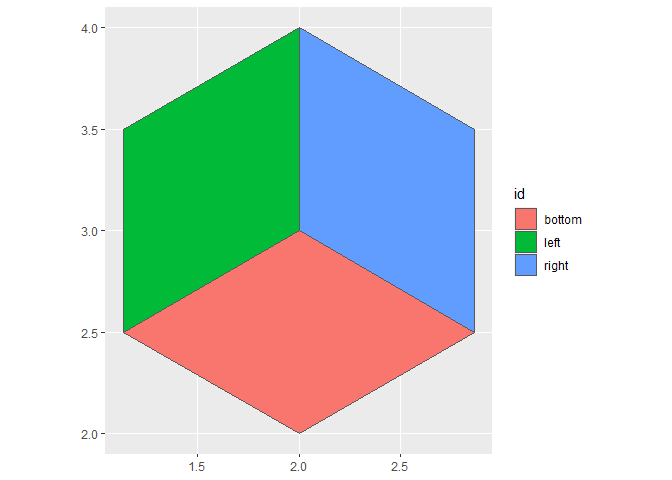
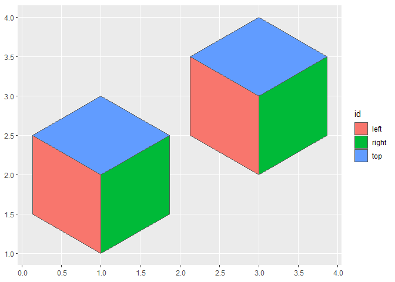
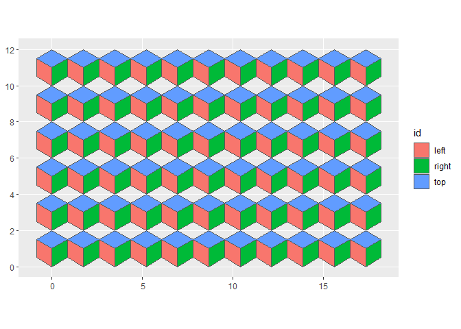
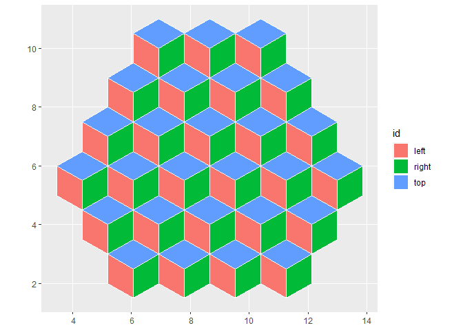
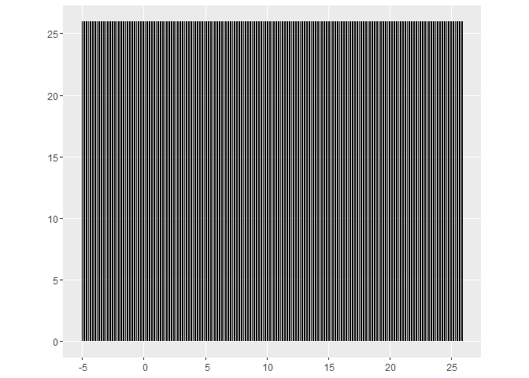
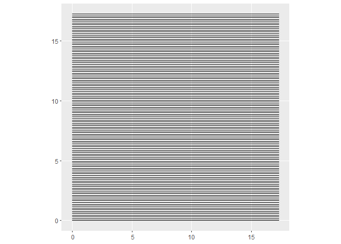
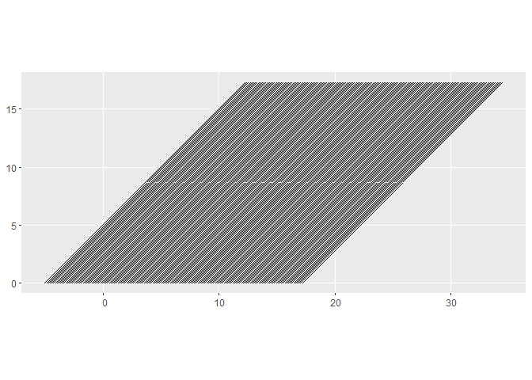
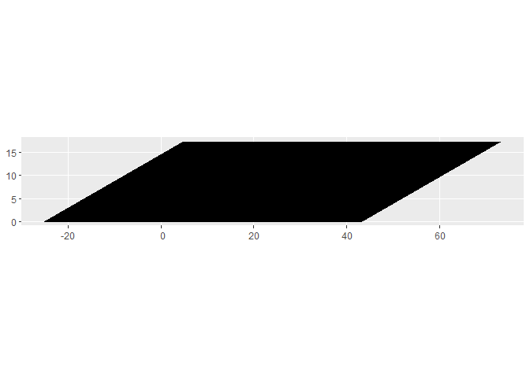
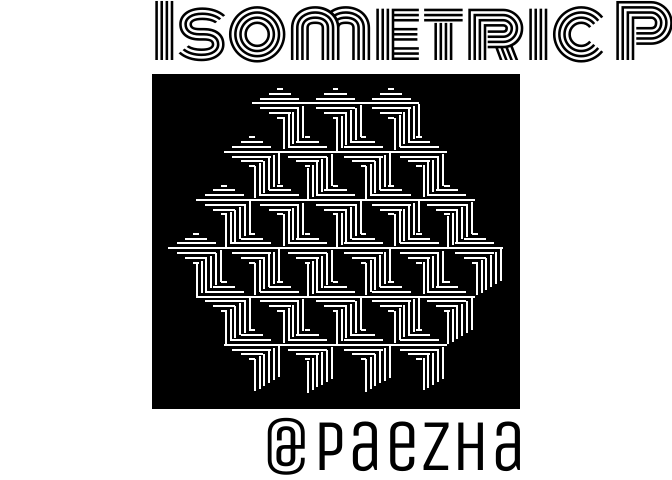
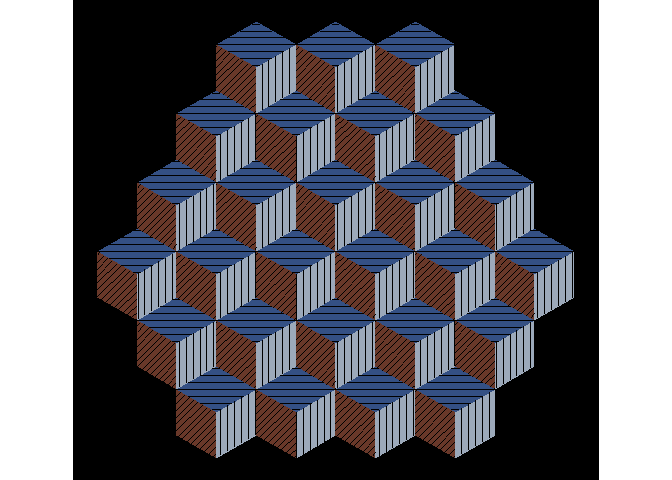

<!-- README.md is generated from README.Rmd. Please edit that file -->

# Isometric Perspective

<!-- badges: start -->
<!-- badges: end -->

This will be a quick experiment with isometric perspective.

I use these package:

``` r
library(MexBrewer)
library(purrr)
library(sf)
#> Linking to GEOS 3.9.1, GDAL 3.2.1, PROJ 7.2.1; sf_use_s2() is TRUE
library(showtext)
#> Loading required package: sysfonts
#> Loading required package: showtextdb
library(tidyverse)
#> -- Attaching packages --------------------------------------- tidyverse 1.3.1 --
#> v ggplot2 3.3.5     v dplyr   1.0.7
#> v tibble  3.1.6     v stringr 1.4.0
#> v tidyr   1.1.4     v forcats 0.5.1
#> v readr   2.1.1
#> -- Conflicts ------------------------------------------ tidyverse_conflicts() --
#> x dplyr::filter() masks stats::filter()
#> x dplyr::lag()    masks stats::lag()
```

Create a function to generate the faces of an isometric cube “up”
direction:

``` r
cube_up <- function(x, y){
  face_1 <- matrix(c(x, y, 
                     x-sqrt(3)/2, y + 1/2,
                     x -sqrt(3)/2, y + 1 + 1/2,
                     x, y + 1,
                     x, y),
                   ncol = 2,
                   byrow = TRUE)
  
  # Convert coordinates to polygons and then to simple features
  face_1 <- data.frame(id = "left",
                       geometry = st_polygon(list(face_1)) %>% 
                         st_sfc()) %>% 
    st_as_sf()
  
  # Face 2
  face_2 <- matrix(c(x, y,
                     x, y + 1,
                     x + sqrt(3)/2, y + 1 + 1/2,
                     x + sqrt(3)/2, y + 1/2,
                     x, y),
                   ncol = 2,
                   byrow = TRUE)
  
  # Convert coordinates to polygons and then to simple features
  face_2 <- data.frame(id = "right",
                       geometry = st_polygon(list(face_2)) %>% 
                         st_sfc()) %>% 
    st_as_sf()
  
  # Face 3
  face_3 <- matrix(c(x, y + 1,
                     x - sqrt(3)/2, y + 1 + 1/2,
                     x, y + 2,
                     x + sqrt(3)/2, y + 1 + 1/2,
                     x, y + 1),
                   ncol = 2,
                   byrow = TRUE)
  
  # Convert coordinates to polygons and then to simple features
  face_3 <- data.frame(id = "top",
                       geometry = st_polygon(list(face_3)) %>% 
                         st_sfc()) %>% 
    st_as_sf()
  
  rbind(face_1,
        face_2,
        face_3)
}
```

Create a function to generate the faces of an isometric cube “down”
direction:

``` r
cube_down <- function(x, y){
  
  face_1 <- matrix(c(x, y + 1, 
                     x - sqrt(3)/2, y + 1/2,
                     x - sqrt(3)/2, y + 1 + 1/2,
                     x, y + 2,
                     x, y + 1),
                   ncol = 2,
                   byrow = TRUE)
  
  # Convert coordinates to polygons and then to simple features
  face_1 <- data.frame(id = "left",
                       geometry = st_polygon(list(face_1)) %>% 
                         st_sfc()) %>% 
    st_as_sf()
  
  # Face 2
  face_2 <- matrix(c(x, y + 1,
                     x, y + 2,
                     x + sqrt(3)/2, y + 1 + 1/2,
                     x + sqrt(3)/2, y + 1/2,
                     x, y + 1),
                   ncol = 2,
                   byrow = TRUE)
  
  # Convert coordinates to polygons and then to simple features
  face_2 <- data.frame(id = "right",
                       geometry = st_polygon(list(face_2)) %>% 
                         st_sfc()) %>% 
    st_as_sf()
  
  # Face 3
  face_3 <- matrix(c(x, y,
                     x - sqrt(3)/2, y + 1/2,
                     x, y + 1,
                     x+ sqrt(3)/2, y + 1/2,
                     x, y),
                   ncol = 2,
                   byrow = TRUE)
  
  # Convert coordinates to polygons and then to simple features
  face_3 <- data.frame(id = "bottom",
                       geometry = st_polygon(list(face_3)) %>% 
                         st_sfc()) %>% 
    st_as_sf()
  
  rbind(face_1,
        face_2,
        face_3)
}
```

Test functions:

``` r
ggplot() +
  geom_sf(data = cube_down(2, 2),
          aes(fill = id))
```

<!-- -->

Simple example assembling tiles:

``` r
x_c <- c(1, 3)
y_c <- c(1, 2)

map2_dfr(.x = x_c, .y = y_c, ~cube_up(.x, .y)) %>% 
  ggplot() +
  geom_sf(aes(fill = id))
```

<!-- -->

Create a mosaic - note the use of {purrr} functions:

``` r
coords <-  expand.grid(x = seq(0, 10 * sqrt(3), sqrt(3)),
                       y = seq(0, 10, 2))

x_c <- coords$x
y_c <- coords$y

map2_dfr(.x = x_c, .y = y_c, ~cube_up(.x, .y)) %>% 
  ggplot() +
  geom_sf(aes(fill = id))
```

<!-- -->

The coordinats of the tiles are not quite what I wanted. Recreate
mosaic:

``` r
coords <-  expand.grid(x = seq(0, 10 * sqrt(3), sqrt(3)),
                       y = seq(0, 10, 3)) %>%
  rbind(expand.grid(x = seq(sqrt(3)/2, 10 * sqrt(3), sqrt(3)),
                    y = seq(1 + 1/2, 10, 3))) %>%
  filter(sqrt((x - 5 * sqrt(3))^2 + (y - 5)^2) <= 4.5)

x_c <- coords$x
y_c <- coords$y

mosaic <- map2_dfr(.x = x_c, .y = y_c, ~cube_up(.x, .y)) 

mosaic %>% 
  ggplot() +
  geom_sf(aes(fill = id),
          color = "white")
```

<!-- --> Create a
function to make lines:

``` r
make_lines <- function(xmin, xmax, ymin, ymax){
  pts <- matrix(c(xmin, 
                  xmax, 
                  ymin, 
                  ymax), 
                ncol = 2, 
                byrow = FALSE)
    st_sf(st_geometry(st_linestring(pts)))
}
```

Make vertical lines:

``` r
line_space <- 0.15

x_min <- seq(0, 10 * sqrt(3), line_space)
y_min <- rep(0, length(x_min))
y_max <- rep(10 * sqrt(3), length(x_min))

lines_v <- pmap_dfr(list(x_min, x_min, y_min, y_max), make_lines)

lines_v %>% 
  ggplot() +
  geom_sf(color = "black")
```

<!-- -->

Make horizontal lines:

``` r
y_min <- seq(0, 10 * sqrt(3), line_space)
x_min <- rep(0, length(y_min))
x_max <- rep(10 * sqrt(3), length(x_min))

lines_h <- pmap_dfr(list(x_min, x_max, y_min, y_min), make_lines)

lines_h %>% 
  ggplot() +
  geom_sf(color = "black")
```

<!-- -->

Make diagonal lines:

``` r
x_min <- seq(-5, 10 * sqrt(3), line_space)
x_max <- x_min + 10 * sqrt(3)
y_min <- rep(0, length(x_min))
y_max <- rep(10 * sqrt(3), length(x_min))

lines_d <- pmap_dfr(list(x_min, x_max, y_min, y_max), make_lines)

lines_d %>% 
  ggplot() +
  geom_sf(color = "black")
```

<!-- -->

Intersect the lines with faces of the polygons:

``` r
lines_v_intersect <- lines_v %>%
  st_intersection(mosaic %>%
                    filter(id == "right"))
#> Warning: attribute variables are assumed to be spatially constant throughout all
#> geometries

lines_h_intersect <- lines_h %>%
  st_intersection(mosaic %>%
                    filter(id == "top"))
#> Warning: attribute variables are assumed to be spatially constant throughout all
#> geometries

lines_d_intersect <- lines_d %>%
  st_intersection(mosaic %>%
                    filter(id == "left"))
#> Warning: attribute variables are assumed to be spatially constant throughout all
#> geometries

lines_intersect <- rbind(lines_v_intersect,
                         lines_h_intersect,
                         lines_d_intersect)

ggplot() +
  geom_sf(data = lines_intersect,
          aes(color = id))
```

<!-- -->

Add fonts:

``` r
font_add_google("Monoton", "monoton")
font_add_google("Unica One", "unica")
showtext_auto()
```

Make pretty:

``` r
ggplot() +
  geom_sf(data = lines_intersect %>%
            filter(id != "left"),
          color = "white",
          size = 1) +
  scale_color_manual(values = mex.brewer("Alacena")[c(1, 6, 10)]) +
  labs(title = "Isometric Perspective", caption = "@paezha") +
  theme_void() +
  theme(legend.position = "none",
        panel.background = element_rect(fill = "black"),
        plot.title = element_text(
      size = rel(5), margin = margin(0, 0, 5, 0, unit = "pt"),
      family = "monoton", face = "bold"),
    plot.subtitle = element_text(
      size = rel(8), margin = margin(0, 0, 10, 0, unit = "pt"),
      family = "unica"),
    plot.caption = element_text(
      size = rel(5), margin = margin(10, 0, 0, 0, unit = "pt"),
      family = "unica"))
```

<!-- -->

``` r
ggsave("isometric-bw.png")
#> Saving 7 x 5 in image
```

Make pretty:

``` r
ggplot() +
  geom_sf(data = mosaic,
          aes(fill = id),
          color = NA) +
  geom_sf(data = lines_intersect,
          color = "black",
          size = 0.5) +
  scale_fill_manual(values = mex.brewer("Alacena")[c(1, 6, 10)]) +
  theme_void() +
  theme(legend.position = "none",
        panel.background = element_rect(fill = "black"))
```

<!-- -->
