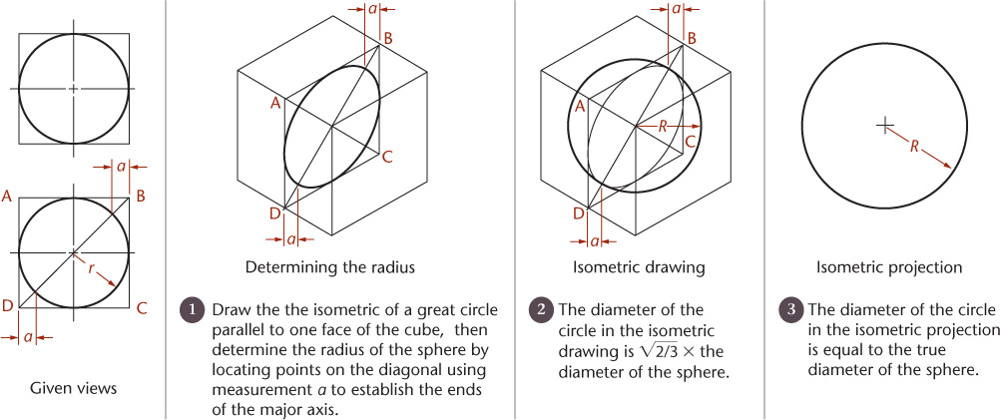

## Experiments plotting a sphere in isometric projection

For this piece I use the following package:
```{r setup}
library(gganimate)
library(glue)
library(MexBrewer)
library(purrr)
#library(sf)
#library(showtext)
library(tidyverse)
```


See this (from: ):



Ok, the isometric projection needs ellipses and I guess I need to understand circles better first.

# Spheres, not isometric

These are the parameters for the coordinates of a sphere. The first angle $\theta$ is with respect to the plane passing through the center of the sphere. The second angle $\alpha$ is with respect to the center of the circular section defined by the angle. $R$ is the radius of the sphere:
```{r}
# Radius of sphere
R <- 1

# Sequence of angles to take slices of sphere
theta <- seq(0, pi, by = pi/16)

# Sequence of angles to points in the circumference of the circular slice of sphere at theta
a <- seq(0, 2 * pi, by = 2 * pi/ 180)
```

The radius of the circular slice of sphere is given by:
```{r}
r <- R * sin(theta)
```

Calculate the coordinates of points on the circumference of the circular slices of sphere for a given value of r:
```{r}
df <- data.frame(x = max(r) * sin(a), y = max(r) * cos(a))
```

Now for all values of r in parallel:
```{r}
x_0 <- 0
y_0 <- 0
starting_time <- sample.int(length(r), 1)

df <- map2_dfr(r, 
                 starting_time:(length(r) + starting_time - 1) %% length(r),
                 .f = function(r, t, x0 = x_0, y0 = y_0){
                   data.frame(x = x0 + r * cos(a), 
                              y = y0 + r * sin(a),
                              t = t,
                              r = r,
                              id = (t:(length(a) + t - 1)) %% length(a))}) 
```


Define a color palette:
```{r}
# This seems to work best for diverging palettes
#col_palette_name <- "Frida"
#col_palette <- c(mex.brewer(col_palette_name), rev(mex.brewer(col_palette_name)))

# This seems to work best for sequential palettes
col_palette_name <- "Aurora"
col_palette <- c(rev(mex.brewer(col_palette_name)), mex.brewer(col_palette_name))
```

Plot:
```{r}
ggplot(df, aes(x, y, color = factor(t))) + 
  geom_point() + 
  coord_equal()
```

Animate:
```{r eval = FALSE}
ggplot(df,
       aes(x, 
           y, 
           group = id)) + 
  geom_point(aes(color = id)) + 
  coord_equal(expand = FALSE) +
  scale_color_gradientn(colors = col_palette) +
  theme_void() +
  theme(legend.position = "none",
        plot.background = element_rect(color = NA,
                                       fill = "white")) +
  transition_time(t) +
  shadow_wake(wake_length = 0.4)
```

Make a second sphere:
```{r}
# Radius of sphere
R <- runif(1, 0.25, 0.75)

# Sequence of angles to take slices of sphere
theta <- seq(0, pi, by = pi/16)

# Sequence of angles to points in the circumference of the circular slice of sphere at theta
a <- seq(0, 2 * pi, by = 2 * pi/ 90)
```

The radius of the circular slice of sphere is given by:
```{r}
r <- R * sin(theta)
```

Calculate the coordinates of points on the circumference of the circular slices of sphere for given r:
```{r}
#random angle to place inner circle
ra <- runif(1, 0, 2 * pi)
x_0 <- (max(df$r) - R) * cos(ra)
y_0 <- (max(df$r) - R) * sin(ra)
starting_time <- sample.int(length(r), 1)

df_2 <- map2_dfr(r, 
                 starting_time:(length(r) + starting_time - 1) %% length(r),
                 .f = function(r, t, x0 = x_0, y0 = y_0){
                   data.frame(x = x0 + r * cos(a), 
                              y = y0 + r * sin(a),
                              t = t,
                              r = r,
                              id = (t:(length(a) + t - 1)) %% length(a))}) %>%
  mutate(id = id + max(df$id))
```

Animate:
```{r eval = FALSE}
ggplot() + 
  geom_point(data = df,
             aes(x, 
                 y, 
                 group = id,
                 color = id)) +
  geom_point(data = df_2,
             aes(x, 
                 y, 
                 group = id,
                 color = id)) +
  coord_equal(expand = FALSE) +
  scale_color_gradientn(colors = col_palette) +
  theme_void() +
  theme(legend.position = "none",
        plot.background = element_rect(color = NA,
                                       fill = "white")) +
  transition_time(t) +
  shadow_wake(wake_length = 0.4)
```

Add a third sphere:
```{r}
# Radius of sphere
R <- runif(1, 0, R)

# Sequence of angles to take slices of sphere
theta <- seq(0, pi, by = pi/16)

# Sequence of angles to points in the circumference of the circular slice of sphere at theta
a <- seq(0, 2 * pi, by = 2 * pi/ 45)
```

The radius of the circular slice of sphere is given by:
```{r}
r <- R * sin(theta)
```

Calculate the coordinates of points on the circumference of the circular slices of sphere for given r:
```{r}
#random angle to place inner circle
ra <- runif(1, 0, 2 * pi)
x_0 <- x_0 + (max(df_2$r) - R) * cos(ra)
y_0 <- y_0 + (max(df_2$r) - R) * sin(ra)
starting_time <- sample.int(length(r), 1)

df_3 <- map2_dfr(r, 
                 starting_time:(length(r) + starting_time - 1) %% length(r),
                 .f = function(r, t, x0 = x_0, y0 = y_0){
                   data.frame(x = x0 + r * cos(a), 
                              y = y0 + r * sin(a),
                              t = t,
                              r = r,
                              id = (t:(length(a) + t - 1)) %% length(a))}) %>%
  mutate(id = id + max(df_2$id))
```

Create plot for animation (the colors depend on the id or t - the animations after coloring by t are indicated in the names of the file)(after trying colors by id and by t I think I like the latter better; notice that r is a function of t, but likely changes at a different rate, might be interesting to try):
```{r}
p <- ggplot() + 
  geom_point(data = rbind(df, 
                          df_2, 
                          df_3) %>%
               mutate(t = t + 1),
             aes(x, 
                 y, 
                 group = id,
                 color = t),
             size = 0.01) +
  coord_equal(expand = FALSE) +
  scale_color_gradientn(colors = col_palette) +
  lims(x = c(min(df$x) - 0.1, 
                max(df$x) + 0.1),
       y = c(min(df$y) - 0.1, 
                max(df$y) + 0.1)) +
  theme_void() +
  theme(legend.position = "none",
        plot.background = element_rect(color = NA,
                                       fill = "black")) +
  transition_time(t) +
  shadow_wake(wake_length = 0.4)
```

Render animation:
```{r}
animate(p, 
        rewind = FALSE,
        fps = 10,
        duration = 7,
        res = 300,
        height = 2, 
        width = 2, 
        units = "in")
```

Save animation:
```{r}
anim_save(glue::glue("rotating-spheres-{col_palette_name}-t.gif"))
```

