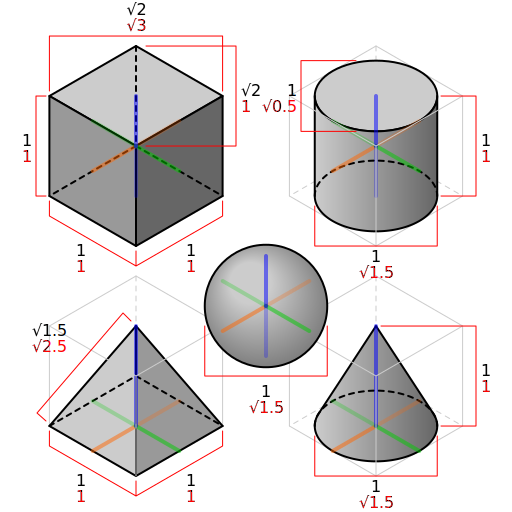
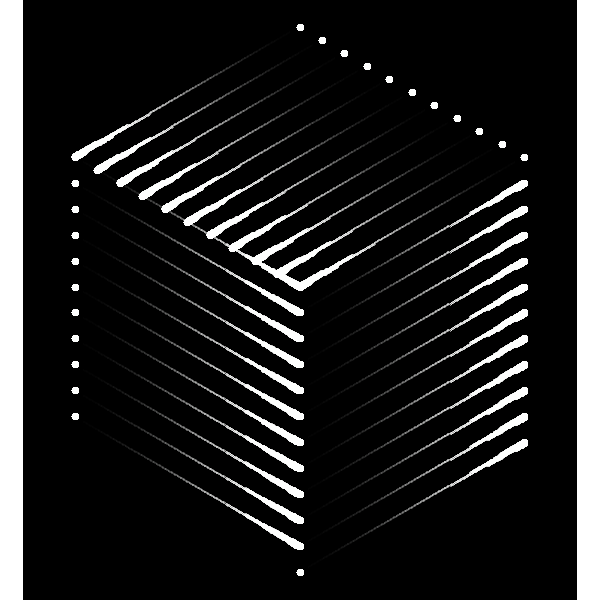

<!-- README.md is generated from README.Rmd. Please edit that file -->

# Negative space

<!-- badges: start -->
<!-- badges: end -->

I wanted to do something with the isometric perspectives, reveal a cube
using negative space. I had to drastically adjust my ambitions since my
ability to animate stuff combined with my ability to do trigonometry
collided with lack of time.

For this piece I use the following package:

``` r
library(gganimate)
#> Loading required package: ggplot2
library(MexBrewer)
library(purrr)
library(sf)
#> Linking to GEOS 3.9.1, GDAL 3.2.1, PROJ 7.2.1; sf_use_s2() is TRUE
library(showtext)
#> Loading required package: sysfonts
#> Loading required package: showtextdb
library(tidyverse)
#> -- Attaching packages --------------------------------------- tidyverse 1.3.1 --
#> v tibble  3.1.6     v dplyr   1.0.7
#> v tidyr   1.1.4     v stringr 1.4.0
#> v readr   2.1.1     v forcats 0.5.1
#> -- Conflicts ------------------------------------------ tidyverse_conflicts() --
#> x dplyr::filter() masks stats::filter()
#> x dplyr::lag()    masks stats::lag()
```

Ok, so the idea is to create paths that “trace” the faces of a cube in
isometric projection. First I need to create the points that define the
paths.

This is the geometry of the thing:
 The black dimensions are the
true lengths of the object. The red dimensions correspond to the drawing
in isometric projection.

The first set of points are for the left face of the cube. If the length
of the side of the cube is l, these paths are supposed to begin at x =
-l \* sqrt(3)/2 which is the coordinate of the left edge of the cube,
and end at x = 0, which is the edge in the middle. The y coordinates of
the bottom edge are at -l/2 and 0. Creating a single line is easy, but
how to create a sequence of lines? I ended up using lots of `rep()`.

These are the parameters for making a cube:

``` r
# Length of side of cube
l <- 1

# Number of lines
steps <- 10
```

These are the steps for creating the line corresponding to the left face
of the cube:

``` r
# Start and end coordinates of the points for the original line
x_start <- -l * sqrt(3)/2
y_start <- l * 1/2
x_end <- 0
y_end <- 0

# Shifts in the y coordinate to replicate the lines
x_shift <- 0
y_shift <- rep(seq(0, l, l/steps), each = 2)

# Direction of line (from left to right: "r", opposite: "l", from bottom to top: "t", from top to bottom: "b" )
h_direction <- "r"
v_direction <- "t"

# Assemble data about lines without the shifts
left_face <- data.frame(pos_x = c(x_start, x_end), 
                        pos_y = c(y_start, y_end),
                        x_shift = x_shift,
                        y_shift = y_shift,
                        time = c(0, 1),
                        pos_type = c("start", "end"))

# At this point I basically have a bunch of points replicated, but I also have the required coordiante shifts (x_shift = 0 in this case) 
left_face <- left_face %>%
  mutate(plot_group = rep(c(1:(n()/2)), each = 2),
         pos_x = pos_x + x_shift,
         pos_y = pos_y + y_shift) %>%
  select(-ends_with("shift"))
```

This is now the right face:

``` r
# Start and end coordinates of the points for the original line
x_start <- 0
y_start <- 0
x_end <- l * sqrt(3)/2
y_end <- l * 1/2

# Shifts in the y coordinate to replicate the lines
x_shift <- 0
y_shift <- rep(seq(-l/steps, l - l/steps, l/steps), each = 2)

# Direction of line (from left to right: "r", opposite: "l", from bottom to top: "t", from top to bottom: "b" )
h_direction <- "r"
v_direction <- "t"

# Assemble data about lines without the shifts
right_face <- data.frame(pos_x = c(x_start, x_end), 
                        pos_y = c(y_start, y_end),
                        x_shift = x_shift,
                        y_shift = y_shift,
                        time = c(0, 1),
                        pos_type = c("start", "end"))

# At this point I basically have a bunch of points replicated, but I also have the required coordiante shifts (x_shift = 0 in this case) 
right_face <- right_face %>%
  mutate(plot_group = rep(c(1:(n()/2)) + max(left_face$plot_group), each = 2),
         pos_x = pos_x + x_shift,
         pos_y = pos_y + y_shift) %>%
  select(-ends_with("shift"))
```

Now the top face, which is trickier because it requires a shift of the x
and y coordinates to make parallel lines that begin an an inclined edge,
and also I want the lines to begin on the right and end on the left.

``` r
# Start and end coordinates of the points for the original line
x_start <- l * sqrt(3)/2
y_start <- l * (1 + 1/2)
x_end <- 0
y_end <- l

# Shifts in the y coordinate to replicate the lines
x_shift <- rep(seq(0, l * sqrt(3)/2, l * sqrt(3)/(2 * steps)), each = 2)
y_shift <- rep(seq(0, l/2, l/(2 * steps)), each = 2)

# Direction of line (from left to right: "r", opposite: "l", from bottom to top: "t", from top to bottom: "b" )
h_direction <- "r"
v_direction <- "t"

# Assemble data about lines without the shifts
top_face <- data.frame(pos_x = c(x_start, x_end), 
                        pos_y = c(y_start, y_end),
                        x_shift = x_shift,
                        y_shift = y_shift,
                        time = c(0, 1),
                        pos_type = c("start", "end"))

# At this point I basically have a bunch of points replicated, but I also have the required coordiante shifts (x_shift = 0 in this case) 
top_face <- top_face %>%
  mutate(plot_group = rep(c(1:(n()/2)) + max(right_face$plot_group), each = 2),
         pos_x = pos_x - x_shift,
         pos_y = pos_y + y_shift) %>%
  select(-ends_with("shift"))
```

Put together all the faces:

``` r
faces <- rbind(left_face,
               right_face,
               top_face)
```

I hacked this post to plot trajectories over time:
<https://stackoverflow.com/questions/52671755/gganimate-animate-multiple-paths-based-on-time>

``` r
dist_per_time = 50

df2 <- faces %>% 
  # Add reference to first coordinates for each plot_group
  left_join(by = "plot_group",
            faces %>% 
              group_by(plot_group) %>%
              filter(pos_type == "start") %>%
              mutate(pos_x1 = pos_x, pos_y1 = pos_y) %>%
              select(plot_group, pos_x1, pos_y1)
  ) %>%
  left_join(by = c("plot_group", "pos_type"),
            faces %>%
              group_by(plot_group) %>%
              mutate(x_d = (range(pos_x)[1] - range(pos_x)[2]),
                     y_d = (range(pos_y)[1] - range(pos_y)[2]),
                     dist = sqrt(x_d^2 + y_d^2),
                     event_time = time - if_else(pos_type == "start", 
                                                 dist / dist_per_time, 
                                                 0),
                     event_time = round(event_time, 1)) %>%
              select(plot_group, pos_type, dist, event_time)
  ) %>%
  group_by(plot_group) %>%
  mutate(event_time_per_grp = event_time - first(event_time)) %>%
  mutate(event_time_cuml = cumsum(event_time)) %>%
  ungroup()
```

Plot:

``` r
p <- ggplot(df2, aes(pos_x, pos_y, group = plot_group)) +
  #scale_x_continuous(expand = c(0,0)) + # ,limits = c(0,w)) +
  geom_point(color = "white", size = 0.5) +
  # geom_segment(color = "white", 
  #              aes(xend = pos_x1, 
  #                  yend  = pos_y1),
  #              size  = 0.75) +
  xlim(c(-l * sqrt(3)/2 - 0.1, l * sqrt(3)/2 + 0.1)) +
  coord_equal() +
  theme_void() + 
  theme(panel.background = element_rect(fill = "black")) +
  transition_time(event_time) +
  #transition_reveal(event_time) + ### EDIT, see above
  shadow_wake(wake_length = 1.1)
```

Animate:

``` r
animate(p, 
        rewind = FALSE,
        fps = 60,
        duration = 5,
        res = 300,
        height = 2, 
        width = 2, 
        units = "in")
```

<!-- -->

Save animation:

``` r
anim_save("animated-negative-space.gif")
```
