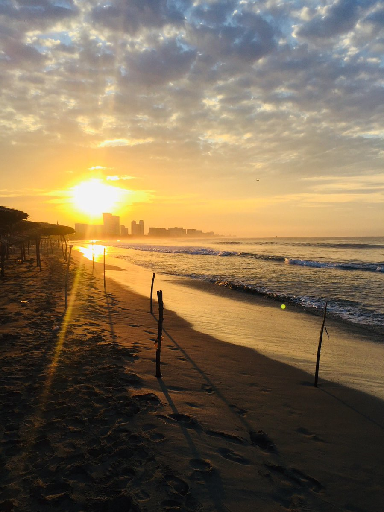
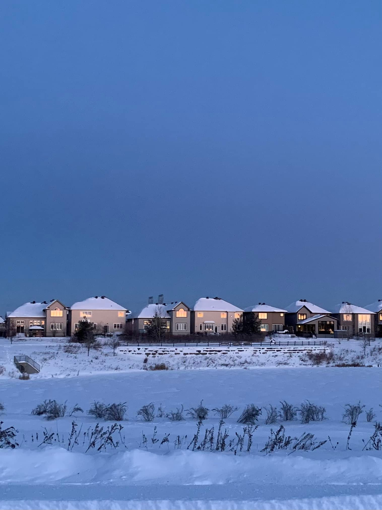

Here I experiment with combining flow fields with images (dithering).

Load packages:
```{r}
library(ggnewscale)
library(imager)
library(sf)
library(tidyverse)
```

## Process image - snowscape

Read the image using `imager::load.image()`:
```{r}
#melville <- image_read("melville_lg.jpg")
snowscape <- load.image("snowscape.jpg")
```

Check the size of the image: 
```{r}
summary(snowscape)
```

Convert image to data frame (still working with {imager}):
```{r}
snowscape_df <- snowscape %>%
  as.data.frame(wide="c") %>% 
  mutate(color = rgb(c.1,
                     c.2,
                     c.3))
```

Convert to grayscale and to data frame:
```{r}
snowscape_df_grayscale <- snowscape %>%
  grayscale() %>% 
  as.data.frame()
```

Join data frames with color and grayscale values:
```{r}
snowscape_df <- snowscape_df %>%
  left_join(snowscape_df_grayscale,
            by = c("x", "y"))
```

Retrieve every nth row/column from image:
```{r}
nx <- 10
ny <- 20

snowscape_sampled <- snowscape_df %>%
  filter(x %% nx == 1,
         y %% ny == 1) 
```

Plot:
```{r}
snowscape_sampled %>%
  ggplot(aes(x, 
             y, 
             color = color)) + 
  geom_point(aes(size = value)) + 
  scale_color_identity() +
  scale_y_reverse() + 
  scale_size(range = c(1, 6)) +
  coord_equal(expand = FALSE) +
  theme_void() +
  theme(legend.position = "none")

ggsave("snowscape-circles.png")
```

Plot with different shape:
```{r}
snowscape_sampled %>%
  ggplot(aes(x, 
             y, 
             color = color)) + 
  geom_point(aes(size = value),
             shape = 17) +
  geom_point(size = 0.1,
             color = "black",
             shape = 20) +
  scale_color_identity() +
  scale_size(range = c(1, 5)) +
  scale_y_reverse() + 
  coord_equal(expand = FALSE) +
  theme_void() +
  theme(legend.position = "none")

ggsave("snowscape-dotted-diamonds.png")
```


Retrieve every nth row/column from image:
```{r}
nx <- 10
ny <- 20

snowscape_sampled <- snowscape_df %>%
  filter(x %% nx == 1,
         y %% ny == 1) 
```

Define length of segments:
```{r}
l <- 15 # Experiment with the length
```

Create and plot the flow field:
```{r}

n_min <- min(snowscape_sampled$x)
n_max <- max(snowscape_sampled$x)

# Offsets
x_o <- -max(snowscape_sampled$x)/2 # Experiment with the sign and the fraction
y_o <- 0 #max(snowscape_sampled$y)

df <- snowscape_sampled %>%
  mutate(angle = 1 * pi/6 * (1 -(x - x_o)/(n_max - n_min)),
         xend = (x + l * cos(angle)),
         yend = (y + l * sin(angle)))

df %>%
  ggplot() +
  geom_segment(aes(x = x,
                   y = y,
                   xend = xend,
                   yend = yend,
                   size = value,
                   color = color)) +
  scale_size(range = c(1, 8)) + # Experiment with the range
  scale_color_identity() +
  scale_y_reverse() +
  coord_equal(expand = FALSE) +
  theme_void() +
  theme(legend.position = "none")

ggsave("snowscape-flow-field.png")
```

## Process image - Meghan

Read the image using `imager::load.image()`:
```{r}
meghan <- load.image("meghan.jpg")
```

Check the size of the image: 
```{r}
summary(meghan)
```

Convert image to data frame (still working with {imager}):
```{r}
meghan_df <- meghan %>%
  as.data.frame(wide="c") %>% 
  mutate(color = rgb(c.1,
                     c.2,
                     c.3))
```

Convert to grayscale and to data frame:
```{r}
meghan_df_grayscale <- meghan %>%
  grayscale() %>% 
  as.data.frame()
```

Join data frames with color and grayscale values:
```{r}
meghan_df <- meghan_df %>%
  left_join(meghan_df_grayscale,
            by = c("x", "y"))
```

Crop image:
```{r}
meghan_df <- meghan_df %>%
  filter(x <= 1250, y <= 1250)
```

Retrieve every nth row/column from image:
```{r}
nx <- 20
ny <- 20

meghan_sampled <- meghan_df %>%
  filter(x %% nx == 1,
         y %% ny == 1) 
```

Plot:
```{r}
meghan_sampled %>%
  ggplot() + 
  geom_point(aes(x, 
                 y,
                 color = value),
             shape = 15,
             size = 6) +
  scale_color_fermenter(palette = "greens") +
  new_scale_color() +
  geom_point(aes(x, 
                 y, 
                 color = color,
                 size = value)) + 
  scale_color_identity() +
  scale_y_reverse() + 
  scale_size(range = c(0.1, 3)) +
  coord_equal(expand = FALSE) +
  theme_void() +
  theme(legend.position = "none")

ggsave("meghan-circles.png",
       height = 8,
       width = 8,
       units = "in")
```

Plot with different shape:
```{r}
meghan_sampled %>%
  ggplot() + 
  geom_point(aes(x,
                 y),
             color = "black",
             shape = 15,
             size = 6) +
  geom_point(aes(x, 
                 y,
                 color = color,
                 size = value),
             shape = 17) +
  # geom_point(aes(x, 
  #            y),
  #            size = 0.1,
  #            color = "black",
  #            shape = 20) +
  scale_color_identity() +
  scale_size(range = c(1, 4)) +
  scale_y_reverse() + 
  coord_equal(expand = FALSE) +
  theme_void() +
  theme(legend.position = "none")

ggsave("meghan-diamonds.png",
       height = 8,
       width = 8,
       units = "in")
```

Retrieve every nth row/column from image:
```{r}
nx <- 25
ny <- 25

meghan_sampled <- meghan_df %>%
  filter(x %% nx == 1,
         y %% ny == 1) 
```

Define length of segments:
```{r}
l <- 25 # Experiment with the length
```

Create and plot the flow field:
```{r}
n_min <- min(meghan_sampled$x)
n_max <- max(meghan_sampled$x)

# Offsets
x_o <- 0 #max(meghan_sampled$x)/2 # Experiment with the sign and the fraction
y_o <- 0 #max(meghan_sampled$y)
# Initial rotation
init_r <- 1/8


df <- meghan_sampled %>%
  mutate(angle = ((x - x_o) * (y - y_o)) /(n_max - n_min)^2 * 2 * pi + init_r * pi,
         xend = (x + l * cos(angle)),
         yend = (y + l * sin(angle)))

df %>%
  ggplot() +
  geom_point(aes(x,
                 y, 
                 color = value),
             #color = "black",
             shape = 15,
             size = 6) +
  scale_color_fermenter(palette = "Greys") +
  new_scale_color() +
  geom_segment(aes(x = x,
                   y = y,
                   xend = xend,
                   yend = yend,
                   size = value,
                   color = color)) +
  scale_size(range = c(0.5, 3)) + # Experiment with the range
  scale_color_identity() +
  scale_y_reverse() +
  coord_equal(expand = FALSE) +
  theme_void() +
  theme(legend.position = "none")

ggsave("meghan-flow-field.png",
       height = 8,
       width = 8,
       units = "in")
```

## Process image - Mariana

Read the image using `imager::load.image()`:
```{r}
mariana <- load.image("mariana-gato.jpg")
```

Check the size of the image: 
```{r}
summary(mariana)
```

Convert image to data frame (still working with {imager}):
```{r}
mariana_df <- mariana %>%
  as.data.frame(wide="c") %>% 
  mutate(color = rgb(c.1,
                     c.2,
                     c.3))
```

Convert to grayscale and to data frame:
```{r}
mariana_df_grayscale <- mariana %>%
  grayscale() %>% 
  as.data.frame()
```

Join data frames with color and grayscale values:
```{r}
mariana_df <- mariana_df %>%
  left_join(mariana_df_grayscale,
            by = c("x", "y"))
```

Crop image:
```{r}
#mariana_df <- mariana_df %>%
#  filter(x <= 1250, y <= 1250)
```

Retrieve every nth row/column from image:
```{r}
nx <- 30
ny <- 30

mariana_sampled <- mariana_df %>%
  filter(x %% nx == 1,
         y %% ny == 1) 
```

Plot:
```{r}
mariana_sampled %>%
  ggplot() + 
  geom_point(aes(x, 
                 y,
                 color = value),
             shape = 15,
             size = 6) +
  scale_color_fermenter(palette = "Greys") +
  new_scale_color() +
  geom_point(aes(x, 
                 y, 
                 color = color,
                 size = value)) + 
  scale_color_identity() +
  scale_y_reverse() + 
  scale_size(range = c(0.1, 3)) +
  coord_equal(expand = FALSE) +
  theme_void() +
  theme(legend.position = "none")

# ggsave("meghan-circles.png",
#        height = 8,
#        width = 8,
#        units = "in")
```

Plot with different shape:
```{r}
mariana_sampled %>%
  ggplot() + 
  geom_point(aes(x,
                 y),
             color = "black",
             shape = 15,
             size = 6) +
  geom_point(aes(x, 
                 y,
                 color = color,
                 size = value),
             shape = 17) +
  # geom_point(aes(x, 
  #            y),
  #            size = 0.1,
  #            color = "black",
  #            shape = 20) +
  scale_color_identity() +
  scale_size(range = c(1, 4)) +
  scale_y_reverse() + 
  coord_equal(expand = FALSE) +
  theme_void() +
  theme(legend.position = "none")

# ggsave("meghan-diamonds.png",
#        height = 8,
#        width = 8,
#        units = "in")
```

Retrieve every nth row/column from image:
```{r}
nx <- 25
ny <- 25

mariana_sampled <- mariana_df %>%
  filter(x %% nx == 1,
         y %% ny == 1) 
```

Define length of segments:
```{r}
l <- 25 # Experiment with the length
```

Create and plot the flow field:
```{r}
n_min <- min(meghan_sampled$x)
n_max <- max(meghan_sampled$x)

# Offsets
x_o <- 0 #max(meghan_sampled$x)/2 # Experiment with the sign and the fraction
y_o <- 0 #max(meghan_sampled$y)
# Initial rotation
init_r <- 1/8


df <- mariana_sampled %>%
  mutate(angle = ((x - x_o) * (y - y_o)) /(n_max - n_min)^2 * 2 * pi + init_r * pi,
         xend = (x + l * cos(angle)),
         yend = (y + l * sin(angle)))

df %>%
  ggplot() +
  geom_point(aes(x,
                 y, 
                 color = value),
             color = "black",
             shape = 15,
             size = 6) +
  scale_color_distiller(palette = "Greys") +
  new_scale_color() +
  geom_segment(aes(x = x,
                   y = y,
                   xend = xend,
                   yend = yend,
                   size = value,
                   color = color)) +
  scale_size(range = c(0.5, 3)) + # Experiment with the range
  scale_color_identity() +
  scale_y_reverse() +
  coord_equal(expand = FALSE) +
  theme_void() +
  theme(legend.position = "none")

ggsave("mariana-flow-field.png",
       height = 8,
       width = 8,
       units = "in")
```

## Process image - Oregon

Read the image using `imager::load.image()`:
```{r}
oregon <- load.image("oregon.jpg")
```

Check the size of the image: 
```{r}
summary(oregon)
```

Convert image to data frame (still working with {imager}):
```{r}
oregon_df <- oregon %>%
  as.data.frame(wide="c") %>% 
  mutate(color = rgb(c.1,
                     c.2,
                     c.3))
```

Convert to grayscale and to data frame:
```{r}
oregon_df_grayscale <- oregon %>%
  grayscale() %>% 
  as.data.frame()
```

Join data frames with color and grayscale values:
```{r}
oregon_df <- oregon_df %>%
  left_join(oregon_df_grayscale,
            by = c("x", "y"))
```

Retrieve every nth row/column from image:
```{r}
nx <- 10
ny <- 10

oregon_sampled <- oregon_df %>%
  filter(x %% nx == 1,
         y %% ny == 1) 
```

Create and plot the flow field:
```{r}
# Offsets
x_o <- 560
y_o <- 140


df <- oregon_sampled %>%
  #length of segments depends on position, and the angle is constant from x_o, y_o
  mutate(xend = (x + (x - x_o)/30 * pi/4),
         yend = (y + (y - y_o)/30 * pi/4))

df %>%
  ggplot() +
  geom_point(aes(x,
                 y,
                 color = value),
             shape = 15,
             size = 6) +
  scale_color_distiller(palette = "Greys") +
  new_scale_color() +
  geom_segment(aes(x = x,
                   y = y,
                   xend = xend,
                   yend = yend,
                   size = value,
                   color = color)) +
  scale_size(range = c(0.1, 2)) + # Experiment with the range
  scale_color_identity() +
  scale_y_reverse() +
  coord_equal(expand = FALSE) +
  theme_void() +
  theme(legend.position = "none")

ggsave("oregon-flow-field.png",
       height = 8,
       width = 8,
       units = "in")
```

## Waldport

See https://twitter.com/mark_lawler/status/1490467641676337154/photo/2 for this image:


Read the image using `imager::load.image()`:
```{r}
waldport <- load.image("waldport.jpg")
```

Check the size of the image: 
```{r}
summary(waldport)
```

Convert image to data frame (still working with {imager}):
```{r}
waldport_df <- waldport %>%
  as.data.frame(wide="c") %>% 
  mutate(color = rgb(c.1,
                     c.2,
                     c.3))
```

Convert to grayscale and to data frame:
```{r}
waldport_df_grayscale <- waldport %>%
  grayscale() %>% 
  as.data.frame()
```

Join data frames with color and grayscale values:
```{r}
waldport_df <- waldport_df %>%
  left_join(waldport_df_grayscale,
            by = c("x", "y"))
```

Retrieve every nth row/column from image:
```{r}
nx <- 20
ny <- 20

waldport_sampled <- waldport_df %>%
  filter(x %% nx == 1,
         y %% ny == 1) 
```

Create and plot the flow field:
```{r}
# Offsets
x_o <- -1000
y_o <- 770


df <- waldport_sampled %>%
  #length of segments depends on position, and the angle is constant from x_o, y_o
  mutate(xend = (x + (x - x_o)/20 * pi/8),
         yend = (y + (y - y_o)/20 * pi/8))

df %>%
  ggplot() +
  geom_point(aes(x,
                 y,
                 color = rev(y)),
             shape = 15,
             size = 6) +
  scale_color_gradientn(colors = MexBrewer::mex.brewer("Atentado")) +
  new_scale_color() +
  geom_segment(aes(x = x,
                   y = y,
                   xend = xend,
                   yend = yend,
                   size = value,
                   color = color)) +
  scale_size(range = c(0.01, 0.75)) + # Experiment with the range
  scale_color_identity() +
  scale_y_reverse() +
  coord_equal(expand = FALSE) +
  theme_void() +
  theme(legend.position = "none")

ggsave("waldport-flow-field.png",
       height = 8,
       width = 8,
       units = "in")
```

## One more of another beach! Check this: https://twitter.com/GiuIianoDMedici/status/1490715140051947521



Read the image using `imager::load.image()`:
```{r}
beach <- load.image("beach.jpg")
```

Check the size of the image: 
```{r}
beach
```

Convert image to data frame (still working with {imager}):
```{r}
beach_df <- beach %>%
  as.data.frame(wide="c") %>% 
  mutate(color = rgb(c.1,
                     c.2,
                     c.3))
```

Convert to grayscale and to data frame:
```{r}
beach_df_grayscale <- beach %>%
  grayscale() %>% 
  as.data.frame()
```

Join data frames with color and grayscale values:
```{r}
beach_df <- beach_df %>%
  left_join(beach_df_grayscale,
            by = c("x", "y"))
```

Retrieve every nth row/column from image:
```{r}
nx <- 10
ny <- 10

beach_sampled <- beach_df %>%
  filter(x %% nx == 1,
         y %% ny == 1) 
```

Create and plot the flow field:
```{r}
# Offsets
x_o <- 200
y_o <- 480


df <- beach_sampled %>%
  #length of segments depends on position, and the angle is constant from x_o, y_o
  mutate(xend = (x + (x - x_o)/20 * pi/4),
         yend = (y + (y - y_o)/20 * pi/4))

df %>%
  ggplot() +
  geom_point(aes(x,
                 y,
                 color = rev(y)),
             shape = 15,
             size = 6) +
  scale_color_gradientn(colors = MexBrewer::mex.brewer("Atentado")) +
  new_scale_color() +
  geom_segment(aes(x = x,
                   y = y,
                   xend = xend,
                   yend = yend,
                   size = sqrt((x - x_o)^2 + (y - y_o)^2),
                   color = color)) +
  scale_size(range = c(0.5, 1.5)) + # Experiment with the range
  scale_color_identity() +
  scale_y_reverse() +
  coord_equal(expand = FALSE) +
  theme_void() +
  theme(legend.position = "none")

ggsave("beach-flow-field.png",
       height = 8,
       width = 8,
       units = "in")
```

## Flower 1 and spirals


Read the image using `imager::load.image()`:
```{r}
flower <- load.image("flower.jpg")
```

Check the size of the image: 
```{r}
flower
```

Convert image to data frame (still working with {imager}):
```{r}
flower_df <- flower %>%
  as.data.frame(wide="c") %>% 
  mutate(color = rgb(c.1,
                     c.2,
                     c.3))
```

Convert to grayscale and to data frame:
```{r}
flower_df_grayscale <- flower %>%
  grayscale() %>% 
  as.data.frame()
```

Join data frames with color and grayscale values:
```{r}
flower_df <- flower_df %>%
  left_join(flower_df_grayscale,
            by = c("x", "y"))
```

Convert the image to sf to use sf functions to find nearest features to borrow colors:
```{r}
flower_sf <- flower_df %>%
    st_as_sf(coords = c("x", "y"))

```

Golden spiral:
```{r}
#points <- 500

# Defining the Golden Angle
angle <- pi * (3 - sqrt(5))

#t_o <- seq(1, 10, 1) 

gs <- data.frame(t_o = seq(1, 750, 0.1) * angle) %>%
  mutate(x_o = 300 + t_o * sin(t_o),
         y_o = 300 + t_o * cos(t_o),
         x_end = x_o + 20 * sin(t_o),
         y_end = y_o + 20 * cos(t_o))
```

Convert to sf to borrow the colors from the image:
```{r}
gs <- gs %>%
  mutate(x = x_o,
         y = y_o) %>%
  st_as_sf(coords = c("x", "y"))
```


Find the nearest feature in the original image to borrow the colors:
```{r}
flower_colors <- flower_df[gs %>%
                                   st_nearest_feature(flower_sf),]
```

Bind the colors to the packed circles:
```{r}
gs <- gs %>%
  mutate(color = flower_colors$color,
         value = flower_colors$value)
```

Plot:
```{r}
# Make a scatter plot of points in a spiral
ggplot() +
  geom_point(data= flower_df,
             aes(x,
                 y,
                 color = value),
             #color = "black",
             shape = 15,
             size = 6) +
  scale_color_gradientn(colors = MexBrewer::mex.brewer("Atentado")) +
  #scale_color_distiller(palette = "Blues") +
  new_scale_color() +
  geom_segment(data = gs %>%
                 filter(x_o > 10 & x_o < 710,
                        y_o > 10 & y_o < 950),
               aes(x = x_o,
                   xend = x_end,
                   y = y_o,
                   yend = y_end,
                   size = t_o,
                   color = color)) +
  scale_y_reverse() +
  scale_color_identity() +
  scale_size(range = c(0.1, 3)) +
  coord_equal() +
  theme_void() +
  theme(legend.position = "none")

ggsave("flower-flow-field.png",
       height = 8,
       width = 8,
       units = "in")
```

## Flower 2 and spirals


Read the image using `imager::load.image()`:
```{r}
flower <- load.image("flower-2.jpg")
```

Check the size of the image: 
```{r}
flower
```

Convert image to data frame (still working with {imager}):
```{r}
flower_df <- flower %>%
  as.data.frame(wide="c") %>% 
  mutate(color = rgb(c.1,
                     c.2,
                     c.3))
```

Convert to grayscale and to data frame:
```{r}
flower_df_grayscale <- flower %>%
  grayscale() %>% 
  as.data.frame()
```

Join data frames with color and grayscale values:
```{r}
flower_df <- flower_df %>%
  left_join(flower_df_grayscale,
            by = c("x", "y"))
```

Convert the image to sf to use sf functions to find nearest features to borrow colors:
```{r}
flower_sf <- flower_df %>%
    st_as_sf(coords = c("x", "y"))
```

Golden spiral:
```{r}
#points <- 500

# Defining the Golden Angle
angle <- pi * (3 - sqrt(5))

#t_o <- seq(1, 10, 1) 

gs <- data.frame(t_o = seq(1, 750, 0.1) * angle) %>%
  mutate(x_o = 160 + t_o * sin(t_o),
         y_o = 310 + t_o * cos(t_o),
         x_end = x_o + 20 * sin(t_o),
         y_end = y_o + 20 * cos(t_o))
```

Convert to sf to borrow the colors from the image:
```{r}
gs <- gs %>%
  mutate(x = x_o,
         y = y_o) %>%
  st_as_sf(coords = c("x", "y"))
```

Find the nearest feature in the original image to borrow the colors:
```{r}
flower_colors <- flower_df[gs %>%
                                   st_nearest_feature(flower_sf),]
```

Bind the colors to the spiral:
```{r}
gs <- gs %>%
  mutate(color = flower_colors$color,
         value = flower_colors$value)
```

Plot:
```{r}
# Make a scatter plot of points in a spiral
ggplot() +
  # geom_point(data= flower_df,
  #            aes(x,
  #                y,
  #                color = value),
  #            #color = "black",
  #            shape = 15,
  #            size = 6) +
  # scale_color_gradientn(colors = MexBrewer::mex.brewer("Atentado")) +
  # scale_color_distiller(palette = "Blues") +
  # new_scale_color() +
  geom_segment(data = gs %>%
                 filter(x_o > 10 & x_o < 710,
                        y_o > 10 & y_o < 950),
               aes(x = x_o,
                   xend = x_end,
                   y = y_o,
                   yend = y_end,
                   size = t_o,
                   color = color)) +
  scale_y_reverse() +
  scale_color_identity() +
  scale_size(range = c(0.1, 3)) +
  coord_equal() +
  theme_void() +
  theme(legend.position = "none")

ggsave("flower-2-flow-field.png",
       height = 8,
       width = 8,
       units = "in")
```

## Knots (nodal curves): see https://mathcurve.com/courbes2d.gb/noeud/noeud.shtml 

Polar equation:
$$
\rho = a \tan(n\theta)
$$
or:
$$
\rho = a \cot(n\theta)
$$
with $n>0$. Each curve is obtained for:
$$
-\frac{\pi}{2n} < \theta < \frac{\pi}{2n}
$$

Create a data frame to calculate the values of the knot function with parameters $a$ and $n$. If $n$ is a rational number $p/q$, the number of branches is $2p$ if $q$ is odd, and $p$ if $q$ is even. Each rotation of a branch is by an angle of $\pi/n$:
```{r}
# Scale factor
a <- 1
#Extent of values: larger ext means that fewer angles theta will be used in the calculation. If ext == 1 then the whole domain -pi/(2n) to pi/(2n) is used
ext <- 10 # Must be greater than 1
p <- 6
q <- 5
n <- p/q
# Number of branches
nb <- ifelse(q %% 2 == 1, 2 * p, p)

# Initialize data frame
df <- data.frame(t = seq(-pi/(ext * 2 * n), 
                         pi/(ext * 2 * n), 
                         length.out = 180)) %>%
  slice(3:178)

df <- df %>%
  # Rotation of branches is between 0 and 2 * pi (which replicates zero); the step increments are the 2 * pi divided by number of branches
  cbind(k = rep(seq(0, 2 * pi * (1 - 1/nb), by = 2 * pi/nb), each = nrow(df))) %>%
  # Calculate polar coordinates and then convert to cartesian coordinates
  mutate(r = a * tan(n * (t + k)),
         x = r * cos(t + k),
         y = r * sin(t + k)) #%>%
  # # Rotation
  # mutate(x = x * cos(k) - y * sin(k),
  #        y = x * sin(k) + y * cos(k))
  
```

Plot:
```{r}
ggplot() +
  geom_point(data = df,
             aes(x,
                 y,
                 color = factor(k))) + 
  coord_equal()
```


## Dopler spiral: see https://mathcurve.com/courbes2d.gb/doppler/doppler.htm

Parametric equations:
$$
x = a(t\cos(t) + kt)
$$
and:
$$
y = at\sin(t)
$$

Create a data frame to calculate the values of the spiral with parameters $a$ and $k$:
```{r}
# Scale factor
a <- 3
k <- 0.5

# Initialize data frame
df <- data.frame(t = seq(0, 
                         150, 
                         length.out = 300)) %>%
  # Calculate polar coordinates and then convert to cartesian coordinates
  mutate(x = a * (t * cos(t) + k * t),
         y = a * t * sin(t),
         x_end = x - 20 * cos(t),
         y_end = y + 20 * sin(t))
```

Plot:
```{r}
ggplot() +
  geom_point(data = df,
             aes(x,
                 y,
                 color = t)) + 
  geom_segment(data = df,
             aes(x,
                 y,
                 xend = x_end,
                 yend = y_end)) +
  coord_equal()
```

## Flowers and spirals


Read the image using `imager::load.image()`:
```{r}
flower <- load.image("flowers-titi.jpg")
```

Check the size of the image: 
```{r}
flower
```

Convert image to data frame (still working with {imager}):
```{r}
flower_df <- flower %>%
  as.data.frame(wide="c") %>% 
  mutate(color = rgb(c.1,
                     c.2,
                     c.3))
```

Convert to grayscale and to data frame:
```{r}
flower_df_grayscale <- flower %>%
  grayscale() %>% 
  as.data.frame()
```

Join data frames with color and grayscale values:
```{r}
flower_df <- flower_df %>%
  left_join(flower_df_grayscale,
            by = c("x", "y"))
```

Convert the image to sf to use sf functions to find nearest features to borrow colors:
```{r}
flower_sf <- flower_df %>%
    st_as_sf(coords = c("x", "y"))
```

Create a data frame to calculate the values of the spiral with parameters $a$ and $k$:
```{r}
# Scale factor
a <- 0.25
k <- 0.1

# Initialize data frame
ds <- data.frame(t = seq(0, 
                         3500, 
                         length.out = 8000)) %>%
  # Calculate polar coordinates and then convert to cartesian coordinates
  mutate(x_o = 220 + a * (t * cos(t) + k * t),
         y_o = 460 + a * t * sin(t),
         x_end = x_o - t/200 * cos(t),
         y_end = y_o + t/200 * sin(t))
```

Convert to sf to borrow the colors from the image:
```{r}
ds <- ds %>%
  mutate(x = x_o,
         y = y_o) %>%
  st_as_sf(coords = c("x", "y"))
```

Find the nearest feature in the original image to borrow the colors:
```{r}
flower_colors <- flower_df[ds %>%
                                   st_nearest_feature(flower_sf),]
```

Bind the colors to the spiral:
```{r}
ds <- ds %>%
  mutate(color = flower_colors$color,
         value = flower_colors$value)
```

Plot:
```{r}
# Make a scatter plot of points in a spiral
ggplot() +
  geom_point(data= flower_df,
             aes(x,
                 y,
                 color = value),
             #color = "black",
             shape = 15,
             size = 6) +
  scale_color_gradientn(colors = MexBrewer::mex.brewer("Atentado")) +
  #scale_color_distiller(palette = "Blues") +
  new_scale_color() +
  geom_segment(data = ds %>%
                 filter(x_o > -10 & x_o < 970,
                        y_o > -10 & y_o < 650),
               aes(x = x_o,
                   xend = x_end,
                   y = y_o,
                   yend = y_end,
                   size = t,
                   color = color)) +
  scale_y_reverse() +
  scale_color_identity() +
  scale_size(range = c(1, 4)) +
  coord_equal() +
  theme_void() +
  theme(legend.position = "none")

ggsave("flower-titi-flow-field-atentado.png",
       height = 8,
       width = 8,
       units = "in")
```

Try this (see: https://www.facebook.com/mhernandezarrese/posts/10158652605032825):




And this by Mike Kukucska:


