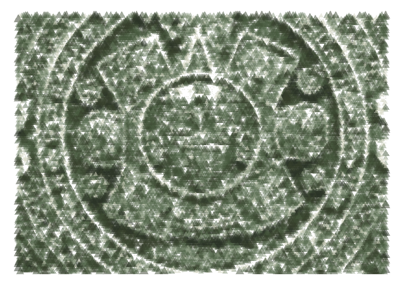
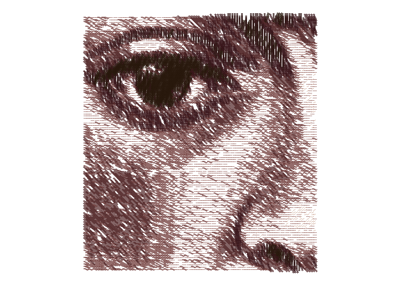
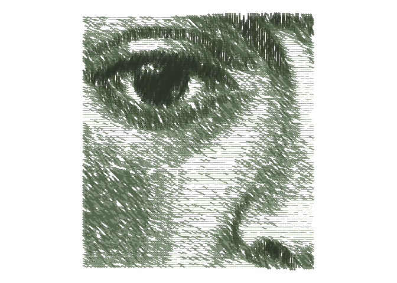
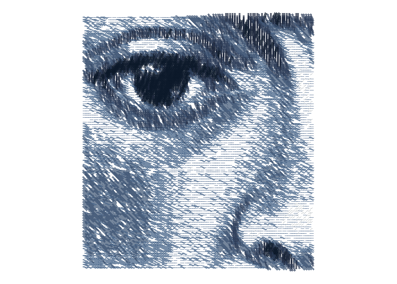
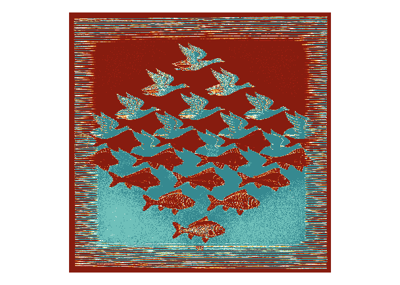
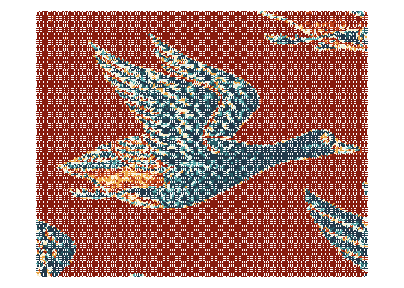
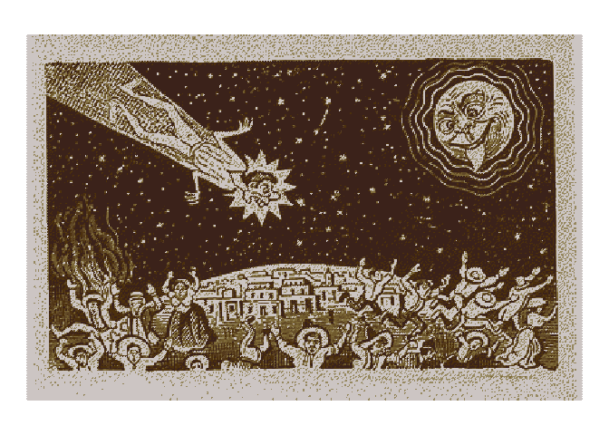

<!-- README.md is generated from README.Rmd. Please edit that file -->

```{r, include = FALSE}
knitr::opts_chunk$set(
  collapse = TRUE,
  comment = "#>"
)
```

# genuary2022

<!-- badges: start -->
<!-- badges: end -->

This repository is for my first [genuary](), a month of generative art. A great opportunity to learn something new coding-wise, while indulging in some artsy activities. I also want to test my [{MexBrewer}](https://paezha.github.io/MexBrewer/) color palettes.

## Day 1: Draw 10,000 of something

5,000 horizontal lines and 5,000 vertical lines.


## Day 2: Dithering

Dithering the Aztec calendar.



Bonus Fridas!







## Day 3: Space

Negative space: Escher mosaics that use the dithering I learned on Day 2.



Detail:



Bonus José Guadalupe Posada!



## Day 4: The next next Fidenza

Learning about flow fields with this one.


## Day 5: Destroy a square

I decided to try something minimalist exploiting an effect that I accidentally discovered while learning the Fidenza algorithm.


