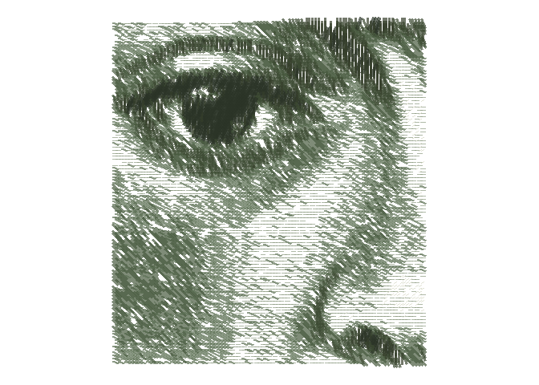

<!-- README.md is generated from README.Rmd. Please edit that file -->

# genuary2022

<!-- badges: start -->
<!-- badges: end -->

This repository is for my first [genuary](https://genuary.art/), a month
of generative art. A great opportunity to learn something new
coding-wise, while indulging in some artsy activities. I also want to
test my [{MexBrewer}](https://paezha.github.io/MexBrewer/) color
palettes.

## Day 1: Draw 10,000 of something

5,000 horizontal lines and 5,000 vertical lines.

## Day 2: Dithering

Dithering the Aztec calendar.

Bonus Fridas!

## Day 3: Space

Negative space: Escher mosaics that use the dithering I learned on Day
2.

Detail:

Bonus José Guadalupe Posada!

## Day 4: The next next Fidenza

Learning about flow fields with this one.

## Day 5: Destroy a square

I decided to try something minimalist exploiting an effect that I
accidentally discovered while learning the Fidenza algorithm.

## Day 6: Trading styles

Not really a trade, more like shamelessly copying some code from
[Georgios
Karamanis](https://github.com/gkaramanis/aRtist/tree/main/genuary) whose
generative art I like (plus, he is generous enough to make his code
[public](https://github.com/gkaramanis/aRtist/tree/main/genuary/2021/2021-3)).

This is Frida using the `Frida` palette from
[{MexBrewer}](https://paezha.github.io/MexBrewer/).

## Day 7: Sol LeWitt Wall Painting

I did not know Sol LeWitt or his art. He did not believe that the hand
that painted was the real artist, but the mind that conceived the
painting. He gave instructions and hired drafters to put
pencil/brush/whatever to the wall. So this was generative art in analog
format: LeWitt gave the algorithm (that was the art) and someone did the
painting.
[These](https://observer.com/2012/10/here-are-the-instructions-for-sol-lewitts-1971-wall-drawing-for-the-school-of-the-mfa-boston/)
are an example of the kind of instructions he used:

> “On a wall surface, any  
> continuous stretch of wall,  
> using a hard pencil, place  
> fifty points at random.  
> The points should be evenly  
> distributed over the area  
> of the wall. All of the  
> points should be connected  
> by straight lines.”

For this day I took a number of random points from a planar network and
then connected them using, not straight lines, but shortest paths on the
network.

